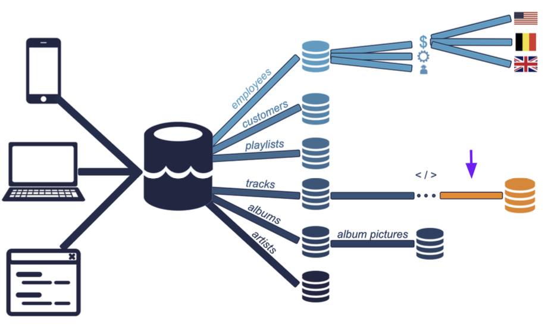
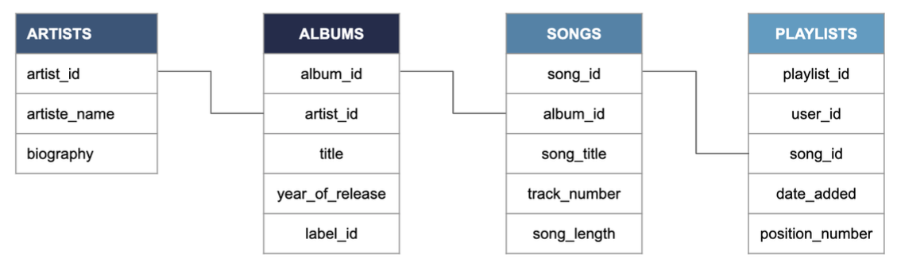
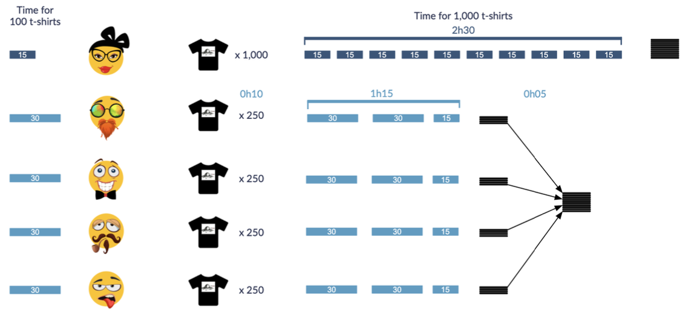
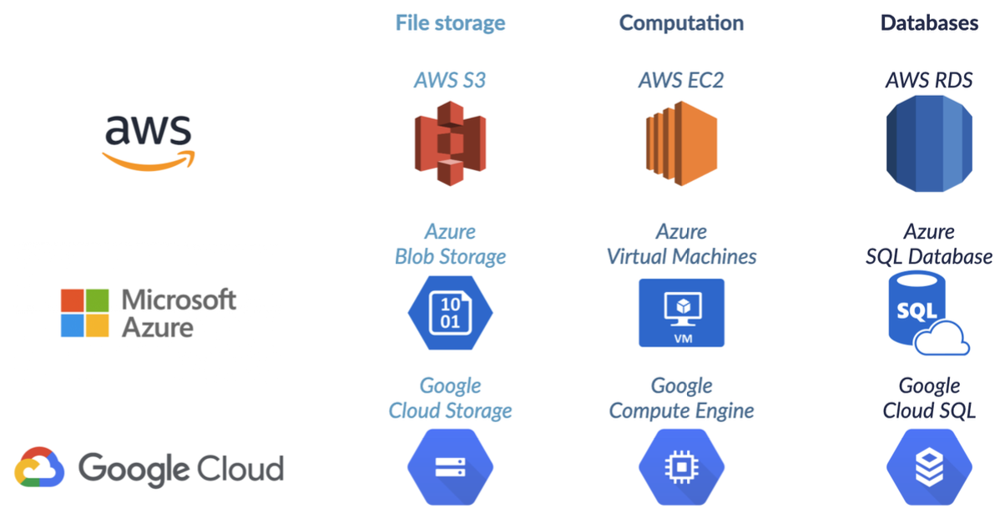

# 데이터 엔지니어링이란
{: .no_toc }

  

    목차
  

  {: .text-delta }
1. TOC
{:toc}

## 데이터 워크플로우
데이터 수집 및 저장 $\rightarrow$ 데이터 준비 $\rightarrow$ 관찰 및 시각화 $\rightarrow$ 실험 및 예측

### 데이터 엔지니어
`정확한 데이터`를 `올바른 형태`로 `요청자`에게 `효율적으로` 보낸다
1. 여러 소스로부터 데이터를 수집한다
2. 분석을 위한 데이터베이스를 최적화한다
3. corrupted data는 제거한다
4. 데이터 아키텍처를 개발, 설계, 테스트한다

빅데이터
- 센서 및 기기 데이터, 소셜미디어, 기업 데이터, VoIP 데이터 등
- 데이터의 용량을 고려해야하기 때문에, 기존 방식과 다르게 데이터를 처리해야 한다.

5가지의 V
1. Volume (얼마나 많은 데이터?)
2. Variety (어떤 종류의 데이터?)
3. Velocity (얼마나 자주 데이터를 수집 및 저장?)
4. Veracity (데이터가 얼마나 정확한가?)
5. Value (얼마나 유용한 데이터인가?)

### 데이터 파이프라인
데이터를 한 시스템에서 다른 시스템으로 전송
- ETL 방식이 널리 쓰이지만 다른 방식으로도 적용할 수 있다 
  - (ELT) 데이터가 앱으로 직접 로드된 뒤 변환되어 활용
- 데이터 추출, 변환, 결합, 유효성 확인, 로드를 자동화
- 인간의 개입 감소, 오류 감소, 데이터 전송 시간 단축

ETL (Extract, Transform, Load)  
데이터 파이프라인 설계에 활용되는 프레임워크
1. 데이터 추출
2. 추출된 데이터 변환
3. 다른 DB로 변환된 데이터 로드

예 - 음악 스트리밍 서비스

{:style="display:block; margin-left:auto; margin-right:auto; width: 500px"}

## 데이터 저장 방식
정형 데이터 (Structured)
- 검색 및 조직화가 간편하며, 일관된 모델 및 행/열을 갖고 데이터 타입이 정해져있다.
- Relation (Table)을 형성하도록 그룹화할 수 있으며 관계형 DB에 저장된다.
- 전체 데이터 중 약 20%는 정형 데이터이다.
- SQL을 활용하여 생성되거나 추출할 수 있다.

반정형 데이터 (Semi-structured)
- 상대적으로 검색이나 조직화가 쉽고 일관된 모델을 갖지만 데이터는 각각 다른 크기를 갖고 데이터 타입도 다르다
- 그룹화될 수 있지만, 더 많은 작업이 필요하다
- NoSQL 데이터베이스 (JSON, XML, YAML)

비정형 데이터 (Unstructured)
- 모델을 따르지 않고 행/열에 포함될 수 없어 검색 및 조직화가 어렵다
- 주로 텍스트, 음성, 그림 및 비디오 데이터이다
- 데이터 웨어하우스나 데이터 레이크에 저장된다
- 검색 및 조직화에 AI가 활용될 수 있다.

### SQL (Structured Query Language)
관계형 DB 시스템 (RDBMS)를 위한 산업 표준으로 많은 레코드를 한번에 접근하며, 데이터를 그룹핑, 필터링 및 집계할 수 있다.
- 데이터 엔지니어는 DB를 생성하고 유지하기 위해 SQL을 사용
- 데이터 과학자는 DB에 쿼리 요청하기 위해 SQL을 사용
- SQLite, MySQL, PostgreSQL, Oracle SQL, SQL Server

데이터베이스 스키마
- DB는 여러 개의 테이블로 구성된다
- 스키마는 테이블 간의 관계를 관리한다

{:style="display:block; margin-left:auto; margin-right:auto; width: 500px"}

### 데이터 웨어하우스와 데이터 레이크
데이터 카탈로그
- 데이터의 소스는 어디인가
- 어디서 이 데이터를 사용하는가
- 데이터의 소유자는 누구인가
- 데이터가 얼마나 자주 업데이트되는가

데이터 거버넌스 측면에서 필요하며, 카탈로그가 없는 경우는 Data swamp (접근할 수 없는 데이터 레이크)가 될 수 있다

데이터 레이크
- 모든 RAW 데이터와 데이터 구조를 저장하므로 Petabyte 단위로 크다
- 비용면에서 경제적이다
- 데이터 분석이 어렵다
- 데이터 소스를 검색하기 위해 최신 데이터 카탈로그를 필요로 한다
- 빅데이터 및 실시간 분석

데이터 웨어하우스
- 특정 방식의 사용을 위한 특정 타입의 데이터를 가지며, 규모가 상대적으로 작다.
- 주로 정형 데이터를 저장하며, 업데이트 비용이 크다
- 데이터 분석을 위해 최적화되어있다
- Ad-hoc, read-only 쿼리

## 데이터 이동 및 처리 방식
### 데이터 프로세싱
데이터 프로세싱: RAW 데이터를 의미있는 정보로 변환하는 것
- 필요없는 데이터를 제거하여 메모리, 프로세스 및 네트워크 비용 최적화
- 데이터를 다른 타입의 데이터로 변환하여 데이터를 조직화
- 스키마/구조에 맞추어 생산성을 향상

예 - 음악 스트리밍 서비스
- `.flac` 파일을 `.ogg` 파일로 변환
- 데이터 레이크의 RAW 데이터를 데이터 웨어하우스로 재조직화

데이터 처리 과정
1. Manipulation, cleaning, tidying
  - corrupt된 음악 파일 제거
  - 공백인 메타데이터를 어떻게 처리할 것인지 결정
  - 아티스트 테이블과 앨범 테이블을 분리
2. 구조화된 데이터베이스에 데이터 저장

### 데이터 스케줄링
- 데이터 프로세싱에 포함된 태스크에 적용할 수 있음
- 분할된 데이터들을 어떻게 처리할지 조직화
- 태스크를 특정 순서로 실행하고 모든 의존성들을 해결
- Apache Airflow, Luigi 등

스케줄링 방식
1. 수동 스케줄링 (수작업으로 직원 테이블 업데이트)
2. 시간 스케줄링 (매일 새벽 6시마다 업데이트 설정)
  - 특정 시간에 자동 실행
3. 센서 스케줄링 (새로운 직원이 추가되는 경우 부서 테이블을 업데이트)
  - 특정 조건이 충족되는 경우 자동 실행

배치와 스트림
- 배치: 간격 (Interval)에 따라 레코드들을 그룹핑하며, 작업 비용이 낮다
- 스트림: 개별적인 레코드들을 바로 전송한다

### 병렬 컴퓨팅
오늘날 데이터 프로세싱 툴의 기본적 개념
- 태스크를 여러 개의 작은 서브태스크로 분할한다.
- 서브태스크들을 여러 컴퓨터에 분산시킨다.

{:style="display:block; margin-left:auto; margin-right:auto; width: 500px"}

병렬 컴퓨팅의 장단점
- 장점
  1. 여분의 프로세싱 파워를 활용할 수 있다
  2. 메모리 사용 공간 (Memory footprint)을 줄일 수 있다
- 단점
  1. 데이터 이동에 비용이 소모된다
  2. 이동 간에 Communication time이 필요하다

### 클라우드 컴퓨팅
온프레미스 서버
- 서버를 직접 구매 (물리적 공간, 전기 비용, 유지 비용)
- 사용량이 정점을 찍을 때도 충분한 컴퓨팅 파워로 처리 가능
- 사용량이 적을 시점에는 프로세싱 파워를 활용하지 못함

클라우드 서버
- 서버를 임대 (물리적 공간 필요없음)
- 필요한 만큼만, 필요할 때 사용할 수 있다
- 사용자와 물리적으로 가까울수록 좋은 성능을 보인다

클라우드에서의 데이터 저장
- 데이터 복제 (Data replication)를 통해 DB의 reliability가 보장된다.
- 그러나 민감한 데이터에 대해서는 리스크가 존재한다.

Cloud Provider

{:style="display:block; margin-left:auto; margin-right:auto; width: 500px"}

멀티-클라우드 (Multicloud)
- 여러 클라우드 제공자의 서비스를 활용하는 것
  - Storage (AWS), Processing (Azure), DB (Google)
- 장점
  1. 단일 제공자에 대한 의존성을 줄일 수 있다.
  2. 비용 측면에서 효율적이다
  3. 천재지변의 피해를 완화할 수 있음
- 단점
  1. 호환성이 떨어짐
  2. 보안과 관리 문제 발생

