# 머신러닝이란
{: .no_toc }

  

    목차
  

  {: .text-delta }
1. TOC
{:toc}

인공지능 (AI, Artificial Intelligence)
- 컴퓨터가 지능적으로 동작하도록 하는 도구의 집합

머신러닝 (ML, Machine Learning)
- 데이터로부터 추론 및 예측을 수행하는 도구의 집합
- $ML\subset AI$

데이터 과학 (Data Science)
- 데이터로부터 인사이트를 찾아내는 과정
- ML은 데이터 과학에 중요한 도구

ML의 수행 역할
1. 미래 이벤트를 예측: 내일 비가 올 것인가?
    - YES (75%의 확률로)
2. 이벤트와 행동의 원인을 추론: 비가 오는 이유는?
    - 습도, 온도, 지역, 연중 시간 등
3. 패턴을 추론: 기상 상태의 종류는?
    - 비, 맑음, 흐림, 안개 등

ML의 작동 원리
- 통계학과 컴퓨터공학의 혼합 (Interdisciplinary mix)
- 명시적으로 프로그래밍하지 않고 학습하는 능력 (Without being explicitly programmed)
- 기존 데이터로부터 학습한 패턴을 새로운 데이터에 적용
- 고품질의 학습 데이터가 모델의 성능을 좌우함

ML의 종류
1. 강화학습 (Reinforcement Learning)
2. 지도학습 (Supervised Learning)
3. 비지도학습 (Unsupervised Learning)

ML Workflow
1. 데이터로부터 `feature` 추출
    - 사용할 `feature`를 결정하고 데이터 전처리
2. 데이터셋 분할
    - 모델 학습을 위한 Training dataset
    - 모델 성능 평가를 위한 Test dataset
    - 두 dataset은 disjoint
3. 모델 학습
    - Input (Training dataset)
    - Output (학습된 모델)
4. 평가
    - Input (Test dataset, `unseen data`)
    - Output (Performance - accuracy, ...)
    - Performance가 충분히 나왔다면 사용하지만 
    - Otherwise, 모델을 tuning하고 다시 학습시킨다

## ML 모델
---
데이터를 기반으로 한 실제 프로세스의 통계적 표현  
`New Input` (미래 일자, 트윗, ...) $\rightarrow$ `Model` $\rightarrow$ `Outcome` (교통 상황, 가짜 트윗 확률, ...)
- 학습 데이터: 모델 학습에 사용되는 기존 데이터
- 모델 학습 (Training): 학습 데이터로부터 생성(학습)된 결과

지도학습과 비지도학습
- 지도학습: 학습 데이터는 `label과 feature`을 가지고 있다.
- 비지도학습: 학습 데이터는 `feature`만 가지고 있다.
    - 이상 감지 (Anomaly detection), 클러스터링 (Clustering) 등에 활용된다.

### 지도학습
`label`을 갖는 학습 데이터로 모델을 학습하고, 새로운 데이터에 대한 target variable의 label을 예측한다.

학습 데이터
- `심장병`: Target variable
    - `O, X`: Labels
- 각 행 (row): Observations (Examples)
- `나이, 성별, 콜레스테롤, 하루 흡연 수, 가족력, 혈당`: Features

|나이|성별|콜레스테롤|하루 흡연 수|가족력|혈당|심장병|
|---|---|---|---|---|---|---|
|55|남|221|5|Y|118|O|
|50|여|196|0|N|98|X|
|53|여|215|0|Y|110|O|
|62|남|245|3|N|126|O|
|48|남|190|5|Y|99|X|
|70|남|201|5|Y|105|X|

테스트 데이터
- 해당 row의 feature는 학습 데이터로 생성된 model의 input이다.
- model의 output은 심장병 여부 (`O 또는 X`)이다.

|나이|성별|콜레스테롤|하루 흡연 수|가족력|혈당|심장병|
|---|---|---|---|---|---|---|
|65|여|208|2|N|105|**O**|

#### 분류 (Classification)
`discrete`한 카테고리를 결정하기
- 소비자가 구독을 `해지 또는 유지할 것인가`
- 이 반점은 `암 유발 인자인가 아닌가`
- 이 와인의 종류는 `레드, 화이트, 로제` 중 무엇인가
- 이 꽃은 `장미, 튤립, 카네이션, 백합` 중 무엇인가

학습 데이터 (GPA와 시험 성적에 따른 합격 여부)
- Features (`GPA, Result`) / Target (`Accepted`)

|ID|GPA|Result|Accepted|
|---|---|---|---|
|0|3.5|2.4|False|
|1|4|2.2|False|
|2|4.2|4.3|True|
|3|4.8|2.9|False|
|...|...|...|...|

학습 데이터 (graph plot)

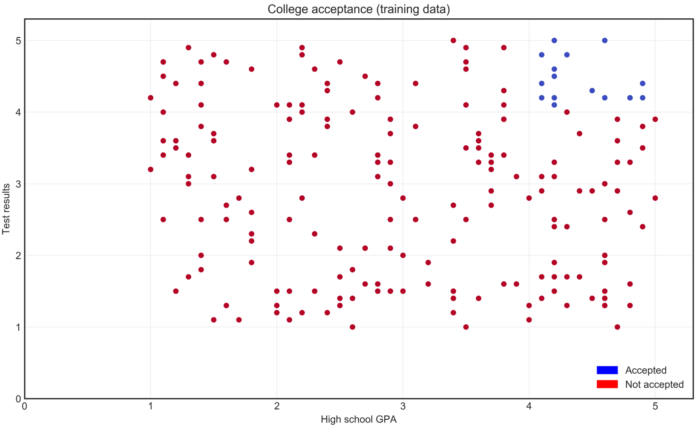

테스트 데이터 (SVM, linear classifier)

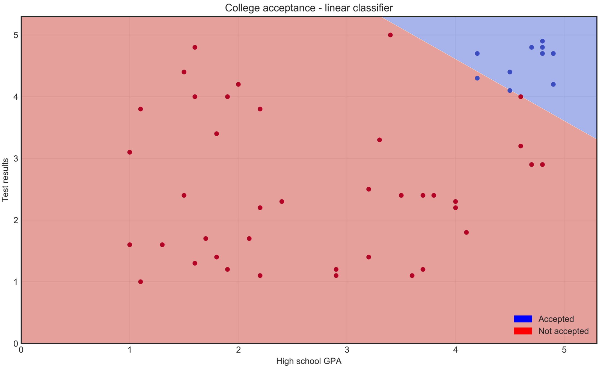

#### 회귀 (Regression)
`continuous`한 변수값 부여하기
- 해당 주식의 가격은 얼마인가?
- 외계 행성의 질량은?
- 이 아이가 성인이 되었을 때의 키는 얼마일까?

학습 데이터 (습도와 온도의 관계)

|ID|Humidity|Temp|
|---|---|---|
|0|0.89|7.39|
|1|0.86|7.23|
|2|0.89|9.38|
|3|0.83|5.94|
|...|...|...|

학습 데이터 (graph plot and regression)

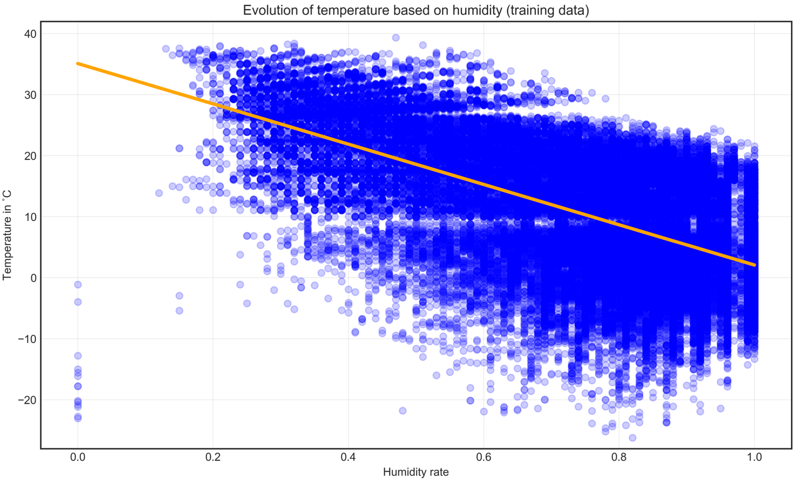

테스트 데이터

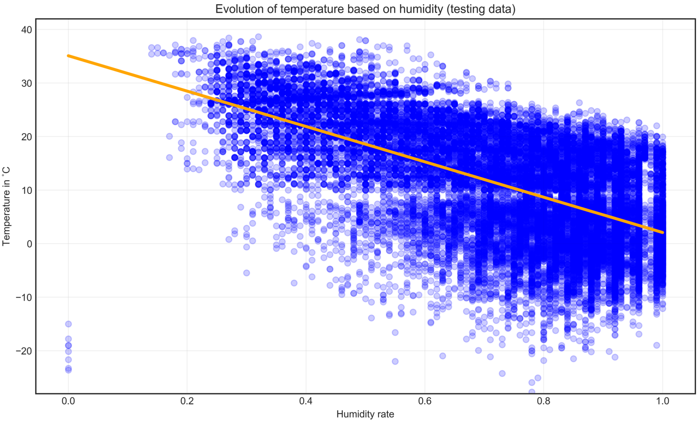

### 비지도학습
실제 데이터는 `label`이 없을 수 있기 때문에, 전체 데이터의 `feature`로부터 패턴을 발견한다.
1. data labeling에는 많은 비용이 소모된다.
2. label을 정의하기 어려울 수 있다.

클러스터링 (Clustering)
- K-means
    - 클러스터 갯수를 미리 특정하고 클러스터링을 수행
- DBSCAN (Density-based spatial clustering of applications with noise)
    - 클러스터의 구성 조건 ($n$개 이상의 data points)을 미리 특정하고 클러스터링을 수행

전체 데이터 (꽃잎 길이와 너비)

||꽃잎 길이|꽃잎 너비|
|---|---|---|
|0|1.4|0.2|
|1|1.4|0.2|
|2|1.3|0.2|
|3|5.1|1.9|
|...|...|...|

전체 데이터 (graph plot and clustering result)

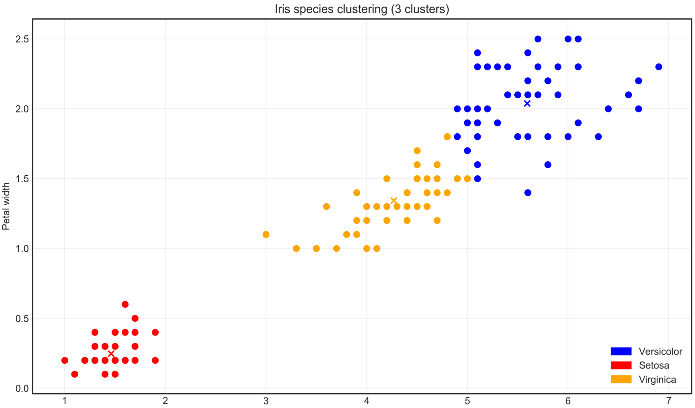

이상 감지 (Anomaly detection)
- 나머지 데이터와 다른 `Outlier`를 감지한다.
- 오래 지속되는 (또는 일찍 고장나는) 기기 감지하기
- 시스템을 해킹하려는 사용자 감지하기

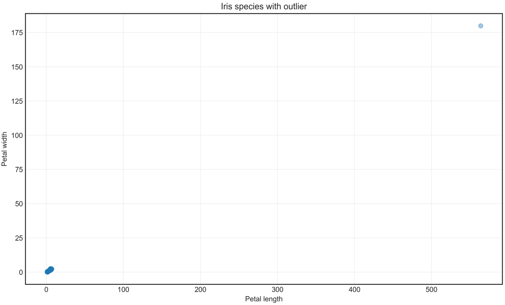

연관 (Association)

## 모델 성능 평가
---
### 과적합 (Overfitting)
학습 데이터에 대해서는 좋은 성능, 그러나 테스트 데이터에 대해서는 안 좋은 성능
- 모델이 학습 데이터 특성을 `암기` (memorize) 해버림
- 새로운 데이터에 대해서는 학습 효과를 일반화할 수 없음

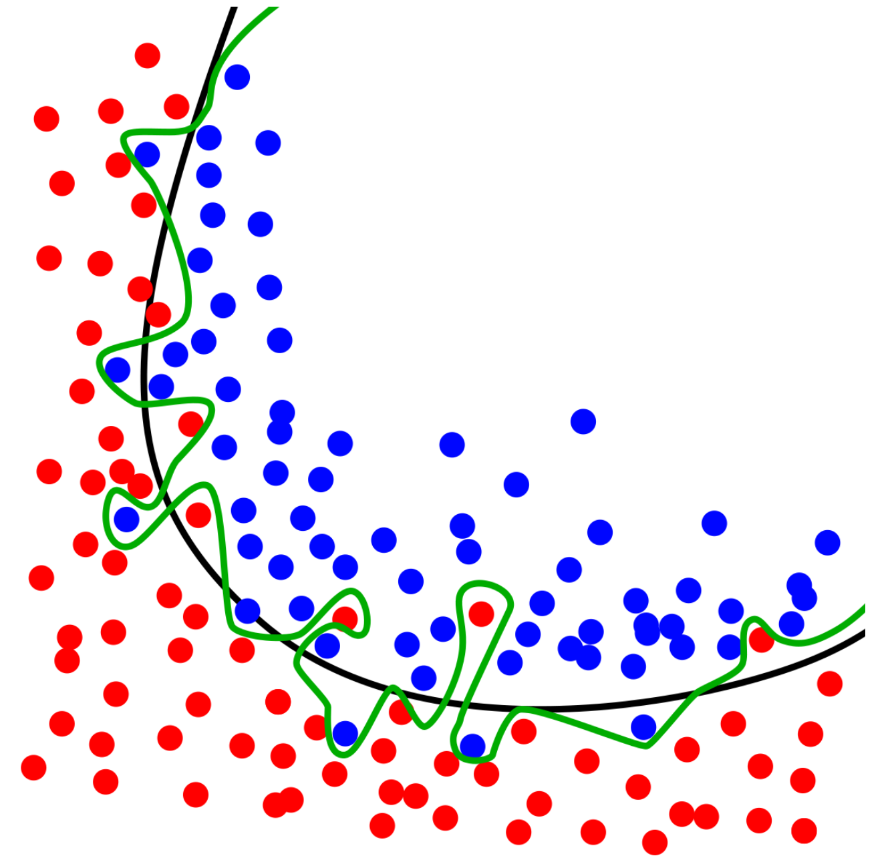
- `black curve`: 잘 학습된 분류기 (Classifier)
- `green curve`: 과적합된 분류기

정확도 (Accuracy)
- $acc= \frac{\text{올바르게 분류된 데이터 수}}{\text{전체 데이터 수}}$

정확도의 한계

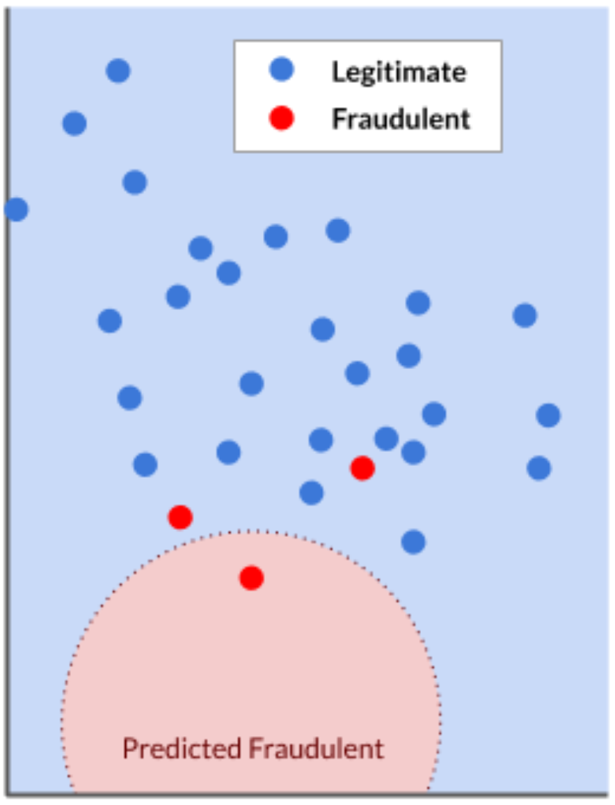
- 해당 모델의 정확도 = $\frac{28}{30} = 93.3\%$
    - 적법 케이스 판별 정확도 = $\frac{27}{27} =100\%$
    - 불법 케이스 판별 정확도 = $\frac{1}{3} = 33\%$
- 정확도는 불법 케이스에 대한 성능을 제대로 보여주지 못함!

Confusion matrix

||실제 불법|실제 적법|
|---|---|---|
|예측 불법|1 (True Positive)|0 (False Positive)|
|예측 적법|2 (False Negative)|27 (True Negative)|

- Sensitivity (불법 거래에 대한 분류 정확성) = $\frac{\text{TP}}{\text{TP}+\text{FN}}=\frac{1}{1+2}=33.3\%$
- Specificity (적법 거래에 대한 분류 정확성) = $\frac{\text{TN}}{\text{TN}+\text{FP}}=\frac{27}{27}=100\%$

회귀 모델 성능 평가

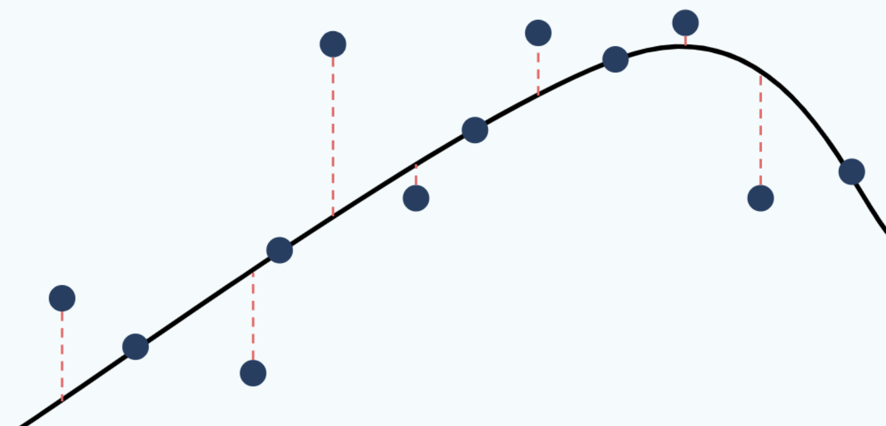

`Error` = point (실제 값)와 line (예측 값)사이의 거리
- `RMSE` (Root mean square error)

## 성능 향상
---
### 차원 축소 (Dimensionality reduction)
`feature`의 수를 줄인다.
1. 무관성 (Irrelevance): 몇몇 feature는 중요한 정보를 갖고 있지 않다.
2. 상관관계 (Correlation): 몇몇 feature는 서로 유사한 정보를 담는다.
    - 한 feature만 선택하기 (`키와 신발 사이즈` 둘 중 하나)
    - 여러 feature를 하나로 통합 (`키와 몸무게` 대신 BMI)
### Hyperparameter tuning
예 - `Support Vector Machine`
- `kernel, C, degree, gamma`

### 앙상블 방식 (Ensemble methods)
여러 ML 모델들의 결과를 활용하여 최종 결과를 만듦

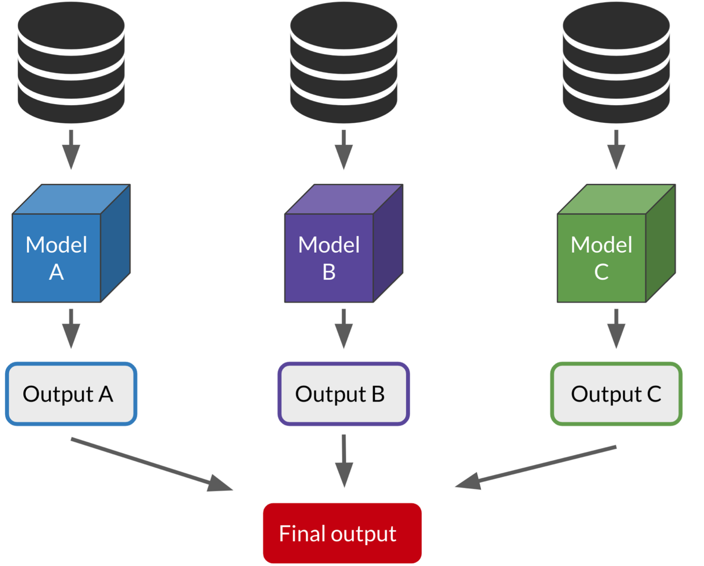

## 딥러닝 (DL, Deep Learning)
---
가장 작은 단위인 `neuron`으로 구성된 `neural network` 기반의 모델을 활용하는 방법론
- $DL\subset ML$
- 입력 데이터가 이미지 또는 텍스트일 때 주로 활용됨

DL 활용 조건
1. `label`을 갖는 데이터가 많아야 한다.
2. 데이터 처리 능력이 충분해야 한다.
3. 문제 해결에 있어 Domain knowledge가 충분치 않다.
4. 복잡한 문제 (컴퓨터 비전 또는 자연 언어 처리)

### 컴퓨터 비전 (CV, Computer Vision)
컴퓨터가 디지털 이미지의 컨텐츠를 보고 이해할 수 있도록 하는 기술
- 이미지를 픽셀 집합으로 해석
    - 각 픽셀은 0~255 사이 값을 가짐
    - RGB 이미지의 경우 3개의 채널이 있음
- 사용 분야: 얼굴 인식, 자율 주행, CT 스캔을 통한 종양 감지, 딥페이크 등

### 자연 언어 처리 (NLP, Natural Language Processing)
컴퓨터가 인간 언어의 의미를 이해할 수 있도록 하는 기술
- 언어 번역, 챗봇, 개인 비서, 감정 분석 등

Bag of words
- 텍스트를 단어 단위로 분할하고 각 단어의 빈도를 나타냄
- 1-gram: 단일 단어를 하나의 word로 간주
    - 
    |단어|빈도|
    |---|---|
    |That|1|
    |book|1|
    |is|1|
    |not|1|
    |great|1|
- 2-gram: 2개의 단어를 하나의 word로 간주
    - 
    |단어|빈도|
    |---|---|
    |That book|1|
    |book is|1|
    |is not|1|
    |not great|1|
- 한계: 동음이의어 (synonym)를 고려하지 못한다.
    - `blue`: `sky-blue, aqua, cerulean`
    - 비슷한 feature끼리 그룹을 만들 수는 없을까?

Word embeddings
- 유사한 단어끼리 그룹을 만드는 feature를 생성하는 방식으로, 수학적 의미를 갖는다.
- `king - man + woman = queen`

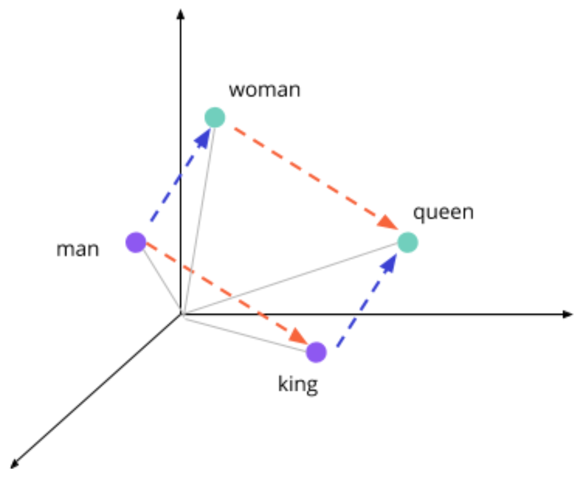

### DL의 한계
Data quality
- 입력 데이터의 퀄리티가 저질이면 학습 모델의 예측 결과도 부정확할 것이다
- Amazon에서 개발한 이력서 검토 모델이 남성 편향적인 검토 결과를 보임
- MS에서 개발한 챗봇이 부적절한 언행을 보임

Explainability
- 학습 모델이 왜 이런 결과를 생성했는지 충분히 설명하지 못한다 

Black box
- `어떻게 하면 모델의 성능을 높일까?`에 초점을 맞춘 딥러닝에 적합하다

Explainable AI
- `왜 좋은 성능을 보일 수 있었을까?`에 초점을 맞춘 전통적 ML에 적합하다

