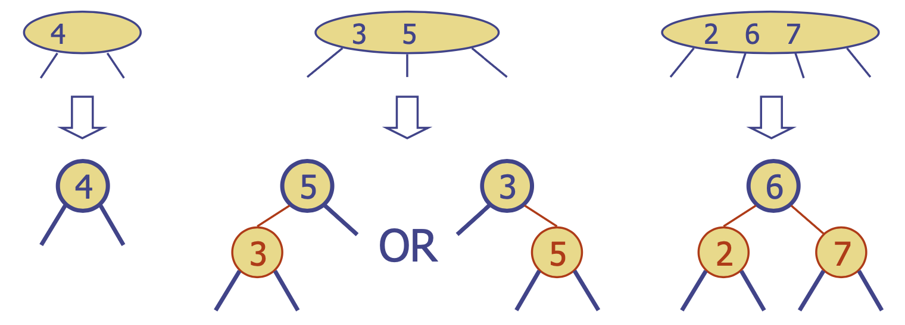
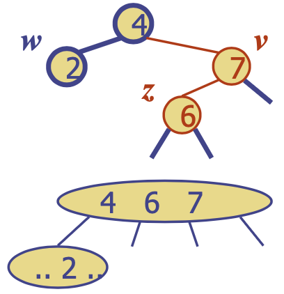
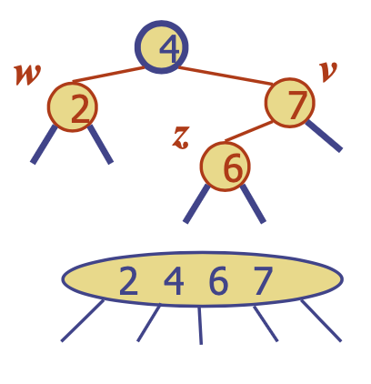
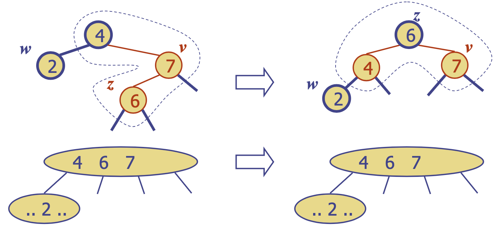
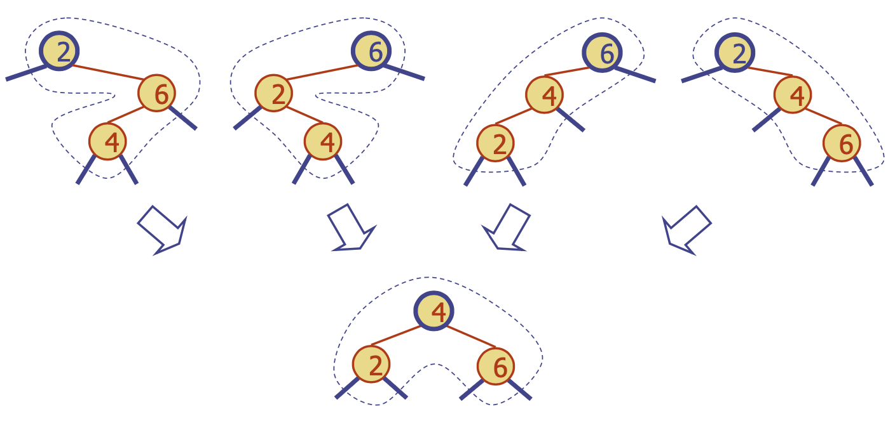

# 레드-블랙 트리
{: .no_toc }

<details open markdown="block">
  <summary>
    목차
  </summary>
  {: .text-delta }
1. TOC
{:toc}
</details>

{:style="display:block; margin-left:auto; margin-right:auto"}

노드가 `레드` 혹은 `블랙`인 이진 트리를 활용하여 (2, 4) 트리를 표현한 이진 탐색 트리로, (2, 4) 트리와 같은 $O(\log n)$ 시간복잡도를 가지며 단일 노드로 간단히 표현할 수 있다.
- `Root property`: 루트 노드는 블랙
- `External property`: 모든 리프 노드는 블랙
- `Internal property` (Red Rule): 레드 노드의 자식은 블랙
- `Depth property` (Black Rule): 모든 리프 노드들은 모두 같은 블랙 depth를 갖는다.

{:style="display:block; margin-left:auto; margin-right:auto"}

1. 레드 노드가 자식이 있는 경우, 반드시 자식은 두 개여야 하며 블랙 노드이다.
2. 블랙 노드가 한 개의 자식 노드를 갖는 경우, 자식 노드는 **마지막** 레드 노드이다.

### Rough balancing
최장 경로 $\leq$ 2* 최단 경로 $\rightarrow O(\log n)$의 높이가 보장됨
- 최단 경로 = 오직 블랙 노드만으로 구성
- 최장 경로 = 두 블랙 노드 사이에 레드 노드 삽입
- 레드-블랙 트리에서 탐색은 $O(\log n)$의 시간복잡도가 요구됨

### 삽입
`put(k, o)`를 수행하기 위해서 이진 탐색 트리에 대한 삽입 알고리즘을 수행하고, (루트 노드가 아닌 경우) 새로 삽입된 노드 $z$를 레드 노드로 만든다.
- `root, external, depth property`를 유지한다.
- $z$의 부모 $v$가 블랙 노드라면, `internal property`를 유지하며 완료.
- Otherwise ($v$가 레드 노드), **더블 레드** (~~`internal property`~~ 위반)가 발생하게 되고 트리의 재구성이 필요하다.
- 목표: `depth property`를 위반하지 않고 더블 레드를 해결한다.

예 - 4의 삽입이 더블 레드를 유발하는 경우

{:style="display:block; margin-left:auto; margin-right:auto"}

### 더블 레드 해결하기
부모 노드 $v$와 자식 노드 $z$가 더블 레드이고 $w$가 $v$의 sibling이라 하자.
1. $w$가 블랙 노드일 때: 더블 레드는 4-node의 잘못된 배치 $\rightarrow$ 재구성 (재배치)

{:style="display:block; margin-left:auto; margin-right:auto; width: 250px"}

2. $w$가 레드 노드일 때: 더블 레드는 오버플로우 $\rightarrow$ 재색칠 (분할)

{:style="display:block; margin-left:auto; margin-right:auto; width: 250px"}

#### 재구성 (Reconstruction)
부모 노드가 레드이고 블랙 sibling을 가졌을 때, 부모-자식 간 더블 레드를 해결한다.
- 4-node에서 올바른 배치를 하는 것과 동일
- `internal property`가 복구되고 나머지 특성들은 유지된다.
- 더블 레드 노드가 왼쪽 또는 오른쪽 자식을 갖는지에 따라 총 4가지 경우를 재구성한다.

{:style="display:block; margin-left:auto; margin-right:auto; width: 250px"}

{:style="display:block; margin-left:auto; margin-right:auto; width: 250px"}

#### 재색칠 (Recoloring)
부모 노드가 레드이고 레드 sibling을 가졌을 때 부모-자식 간 더블 레드를 해결한다.
- 5-node에서 분할을 수행하는 것과 동일
- 부모 $v$와 sibling $w$는 블랙 노드가 되며, 조부모 $u$는 (루트가 아닌 경우) 레드 노드가 된다.
- 더블 레드가 조부모 $u$에서도 발생할 수 있다.

{:style="display:block; margin-left:auto; margin-right:auto; width: 250px"}

#### 분석
```python
def put(k, o):
    삽입 노드 z를 찾기 위해 key k에 대한 탐색 # Step 1
    노드 z에 (k, o)를 추가하고 레드 노드로 만듬 # Step 2
    while doubleRed(z): # Step 3
        if isBlack(sibling(parent(z))):
            z = restructure(z)
            return
        else: # sibling(parent(z)) is red
            z = recolor(z)
```
레드 블랙 트리는 $O(\log n)$의 높이를 갖는다.
1. Step 1은 $O(\log n)$개의 노드를 방문하므로 $O(\log n)$
2. Step 2는 $O(1)$
3. Step 3는 $O(\log n)$
    - $O(\log n)$번 재색칠하며, 각 횟수마다 $O(1)$
    - 최대 한번의 재구성이 발생할 수 있고 $O(1)$

$\therefore$ 레드 블랙 트리의 삽입 작업은 $O(\log n)$의 시간복잡도를 요한다.

### 삭제
`erase(k)`를 수행하기 위해 이진 탐색 트리의 삭제 알고리즘을 수행한다.
- external child를 갖는 노드에서의 엔트리 삭제
- $v$: 삭제된 internal node (자기 자신)
    - $w$: 삭제된 external node
    - $r$: $w$의 sibling
- $x$: $v$의 부모

0. $v, w$를 제거하고 $r$을 $x$의 자식으로 만든다.
    - 삭제 후 $y$는 $r$의 sibling, $z$는 $y$의 자식
1. $v$ 또는 $r$이 레드일 때, $r$을 블랙 노드로 만들면 끝.
2. $v$ 또는 $r$이 둘 다 블랙일 때, ~~`internal property`~~ <br>
$\rightarrow$ **트리의 재구성 필요**

#### 더블 블랙 노드를 어떻게 해결할 것인가?
1. $r$의 sibling $y$가 `블랙이며 y는 레드 자식 z을 갖는다`: 재구성 (완료)
2. $r$의 sibling $y$가 `블랙이며 y의 자식이 모두 블랙이다`: 재색칠 (더블 블랙이 다른 노드로 이어질 수 있다)
    1. $r$의 부모 $x$가 레드
    2. $r$의 부모 $x$가 블랙
3. $r$의 sibling $y$가 레드: 조절 (Adjustment)
    1. $y$가 $x$의 오른쪽 자식이면, $z$를 $y$의 왼쪽 자식이라 하자
    2. $y$가 $x$의 왼쪽 자식이면, $z$를 $y$의 오른쪽 자식이라 하자 

레드 블랙 트리의 삭제 작업은 $O(\log n)$의 시간복잡도가 요구된다.
