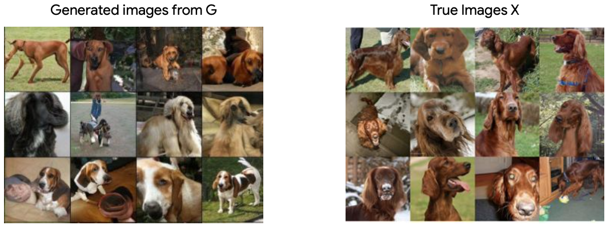
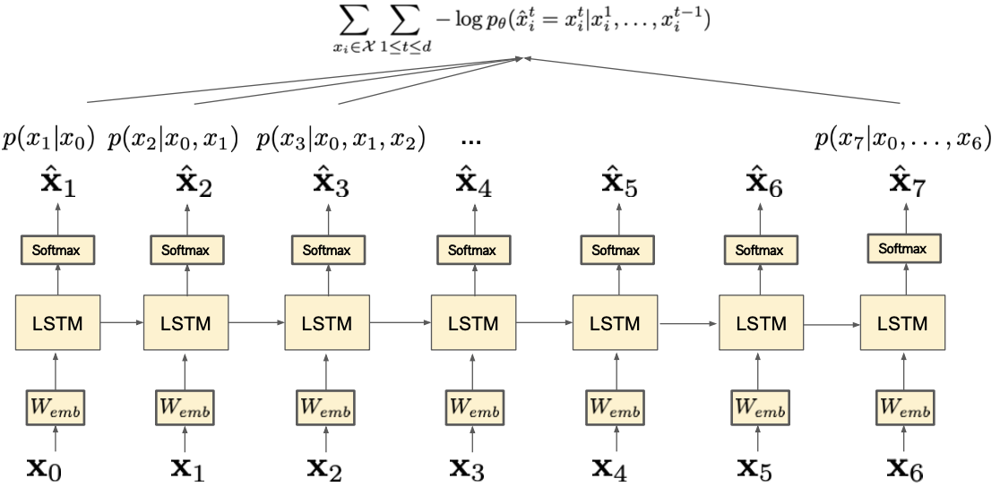

# 생성 모델
{: .no_toc }

  

    목차
  

  {: .text-delta }
1. TOC
{:toc}

## Introduction
---
Data를 이해하기 위한 머신러닝: data로부터 `인식`하고 `추론`하는 것을 학습한다
1. Concept: 사람, 코끼리, 들판, 하늘, 펜스
2. Concept 간 relationship: 한 사람이 다른 사람을 들고 있다, 두 사람은 펜스 옆에 서있다, 코끼리는 잔디 위에 서있다
3. Context: 아버지는 코끼리를 보고 있는 아들과 함께 동물원에 왔다.

### Understanding via categorization
- Input을 사전 정의된 특정 태스크와 연관짓는 것을 학습:   $\text{Input } x \rightarrow f_{\theta}(x) \rightarrow \text{Output } y$
    - Classification (concept, relationship), detection, segmentation, ...
- **Limitation**
    - Training을 위한 label (=human annotation)이 필요하다
    - 특정 태스크만을 해결하기 위한 `biased knowledge`를 학습할 수 있다

### Understanding via generation
- Data 그 자체를 합성/생성 (synthesize) 하는 것을 학습
- generation이 중요한 이유
    1. data의 underlying structure에 대한 implicit understanding
    2. label이 필요없는 비지도학습
    3. Downstream task (우리가 실제로 풀고 싶은 문제)에 유용한 정보를 학습
    4. 생성한 data를 활용할 수 있다

Generation task를 어떻게 정의할 수 있을까
1. **Generative modeling**이 무엇인가?
2. **Generative model을 학습시키기 위한 objective function**은 무엇인가?

## Building generative model
---
가지고 있는 data가 1d-points일 때, 
1. data가 Uniform distribution을 따르는 경우
    - $p(x) = \text{Uniform}(0, a)$
2. data가 1d Gaussian distribution을 따르는 경우
    - $p(x) = c\cdot\exp^{-\frac{(x-\mu)^2}{2\sigma^2}}$

$\therefore$ Data를 생성하는 `underlying function` $p(x)$를 알고 있다면, $p(x)$로부터 샘플링하여 new sample을 생성할 수 있다.

우리가 data의 ground-truth distribution을 알고 있다면, 새로운 data를 distribution으로부터 new data를 sampling할 수 있다.
- $\hat{x} \sim P(X)$

그러나 ground-truth distribution을 알 수 없기 때문에, **Neural network**를 사용하여 g.t. distribution에 근사하는 (approximate) distribution을 만든다.
- $G_{\theta} \approx P(X)$

**Deep generative models**
- Output이 true data distribution을 따르는 모델을 학습한다
- $G_{\theta}\sim P(X)$

{:style="display:block; margin-left:auto; margin-right:auto; width: 400px"}

**Recent applications**
- Image synthesis, Image upsampling, image compression, Video synthesis, Interactive drawing, 
- Drug discovery, Text generation, Music synthesis, TTS (Text-To-Speech) synthesis

## Autoregressive models
---
Generative model의 loss (learning objective)
- (generator의) Output이 target distribution을 따르는 `generator`를 학습: $G_{\theta}\approx P(X)$

**어떻게 loss를 정의해야할까?**
- $p_{\theta}(x):$ Generator가 생성하는 임의의 data $x$에 대한 probability measure 
- $p^{*}(x):$ True probability, **이미 알고 있다고 가정**하자

$\therefore$ 두 확률분포 $p_{\theta}(x), p^{*}(x)$ 사이의 discrepancy를 loss로 정의하자.
- 다양한 두 확률분포 간 distance measure가 존재한다.

### KL-divergence
$\min_{\theta} D_{KL}[p^{*}(x)\vert\vert p_{\theta}(x)] = \Epsilon_{p^{*}(x)}\Big[\log\frac{p^{*}(x)}{p_{\theta}(x)}\Big] \\ = \int p^{*}(x)\log\frac{p^{*}(x)}{p_{\theta}(x)} dx \\ = \int p^{*}(x)\log p^{*}(x) dx - \int p^{*}(x)\log p_{\theta}(x) dx \\ \leftrightarrow \min_{\theta}\Epsilon_{p^{*}(x)}[-\log p_{\theta}(x)]$ 

- $\int p^{*}(x)\log p^{*}(x) dx:$ Constant이므로 생략
- $- \int p^{*}(x)\log p_{\theta}(x) dx:$ Cross-entropy loss

**Issue**
- 우리는 True distribution을 모른다
- 엄청나게 많은 양의 data에 대한 integral을 취할 수 없고, 가능하다 하더라도 간단하게 계산할 수 없음

**Training data가 true distribution에 근사한다고 가정한다**  
$\min_{\theta}-\frac{1}{N}\sum_{I=1}^{N}\log{p_{\theta}(x_i)} = \Epsilon_{p^{*}(x)}[-\log p_{\theta}(x)] ~~\text{ if }N\rightarrow\infty$

### Maximum likelihood estimation (MLE)
$\hat{\theta}=\arg\max_{\theta\in\Theta}\sum_{x_i\in\chi}\log{p_{\theta}(x_i)} \\ \leftrightarrow \arg\max_{\theta\in\Theta}\Pi_{x_i\in\chi}~{p_{\theta}(x_i)} $

`training data를 sampling할 확률 (likelihood)`을 최대화하는 model parameter를 구한다.
- $\log{p_{\theta}(x_i)}:$ Log-likelihood
- $p_{\theta}(x_i):$ Likelihood

$\\ \leftrightarrow \arg\min_{\theta\in\Theta}\sum_{x_i\in\chi}-\log{p_{\theta}(x_i)}$

실제로는 gradient descent를 위해서, negative log-likelihood를 minimize하도록 설정한다.

**Challenges**  
$\hat{\theta}=\arg\min_{\theta\in\Theta}\sum_{x_i\in\chi}-\log{p_{\theta}(x_i)}$
- High-dimensional data의 경우, joint distribution을 한번에 최적화하기 어렵다
    - $x_{i}=[x_{i}^{1}, x_{i}^{2}, x_{i}^{3},..., x_{i}^{d}]\in R^{d}$
    - $p(x_i)=p(x_{i}^{1}, x_{i}^{2}, x_{i}^{3},..., x_{i}^{d})$
- Image ($d:$ 픽셀 수), sentence ($d:$ 문장 길이), ...

## Auto-Regressive model (AR)
---
`Chain rule`로 likelihood를 factorize 
- $p(a,b) = p(a\vert b)p(b)$
- $p_{\theta}(x)=p_{\theta}(x_1, x_2, ..., x_{T}) \\
= p_{\theta}(x_{T}\vert x_1, x_2, ..., x_{T-1})p_{\theta}(x_{1}, x_{2}, ..., x_{T-1}) \\
= \Pi_{t=1}^{T}p_{\theta}(x_{t}\vert x_1, ..., x_{t-1})$

{:style="display:block; margin-left:auto; margin-right:auto; width: 400px"}

**Factorized objective function**  
$\hat{\theta}=\arg\min_{\theta\in\Theta}\sum_{x_i\in\chi}-\log{p_{\theta}(x_i)} \\ 
= \arg\min_{\theta\in\Theta}\sum_{x_i\in\chi}\sum_{1\le t \le d}-\log{p_{\theta}(x_{i}^{t}\vert x_{i}^1, ..., x_{i}^{t-1})}$

예 - RNN revisited

{:style="display:block; margin-left:auto; margin-right:auto; width: 400px"}

**Summary**
- Factorized likelihood를 최대화
    - Previous outputs에 대한 condition을 가지고 1-by-1 방식으로 data 생성
- Sequential data를 다루는데 적합하다
    - 텍스트, 오디오, 비디오
- Fully-observable model
    - data에 대한 latent representation이 없다

**Challenges**
1. 시퀀스 데이터에서 나타나는 Long-term dependency를 modeling해야 한다.
2. Serial processing이기 때문에 parallelization을 적용하기 어렵다.

