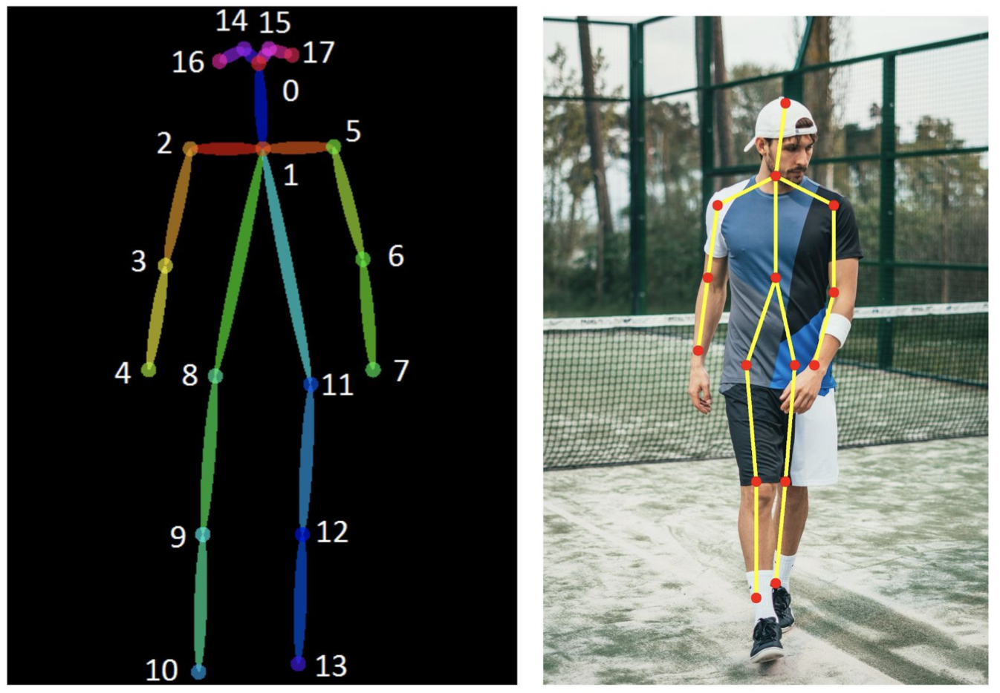
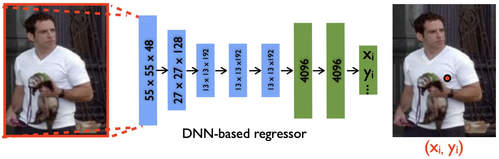
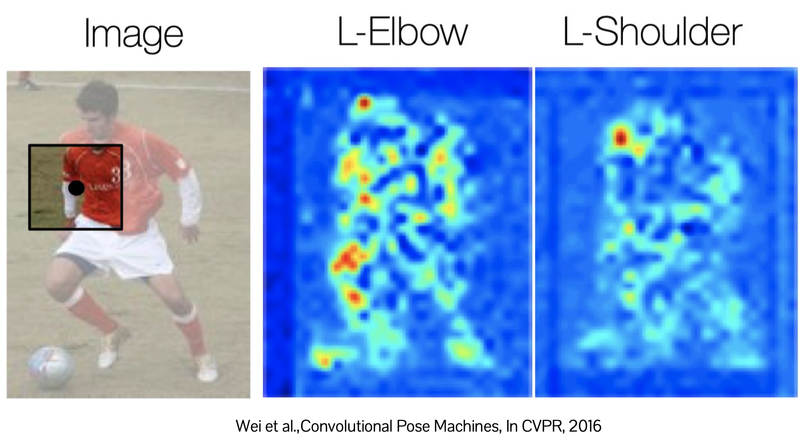
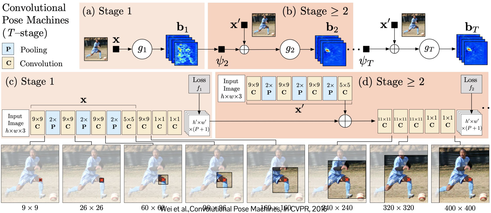
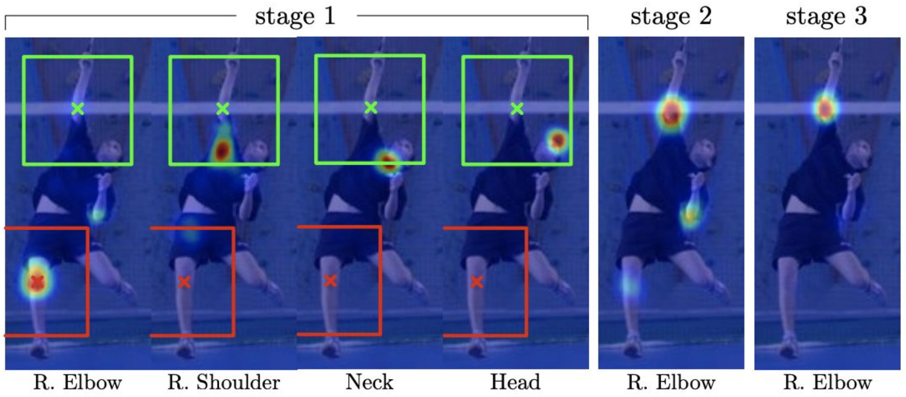
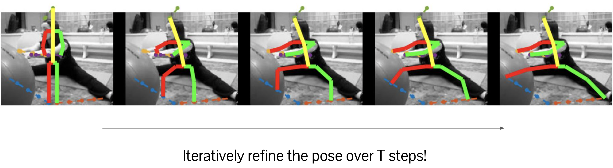
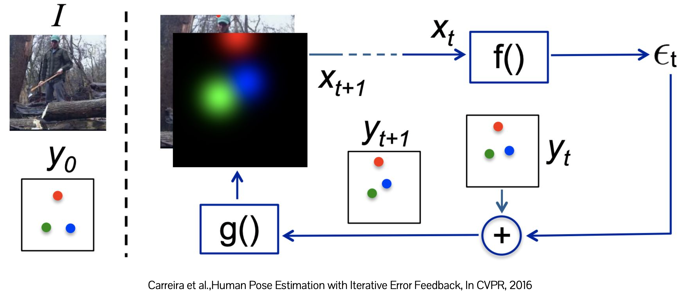

# Pose Estimation
{: .no_toc }

  

    목차
  

  {: .text-delta }
1. TOC
{:toc}

## Definition
---
(human) joint 또는 key-points를 찾고 위치를 파악하는 것

{:style="display:block; margin-left:auto; margin-right:auto; width: 300px"}

**Challenges**
1. 다양한 pose: 관절 (articulation), 변형 (deformation) 등
2. partial observation: occlusion (빛에 노출된 정도)
3. 사람마다 다른 body-part configuration

## DeepPose
---
{:style="display:block; margin-left:auto; margin-right:auto; width: 400px"}

CNN을 활용하여 이미지 전체에서 human joint를 추론 (holistic pose estimation)
- Input: $220\times 220$ image
- Output: 각 object joint의 $(x,y)$ 좌표
    - 총 $K\times 2$ outputs ($K:$ joint 수)
    - 각 joint coordinate은 $[0, 1]$로 normalized
- Loss function: ground-truth와 predicted joint 간의 L2 distance
    - $\arg\min_{\theta}\sum_{(x,y)\in D_{N}}\sum_{i=1}^{k}\vert\vert y_{i}-\psi_{i}(x;\theta)\vert\vert_{2}^{2}$
- Receptive field: 전체 이미지 영역 ($4096$-dimension)

**Limitation**: 전체 정보를 capture하는 과정에서 too much spatial abstraction
- $224\times224\times3 \rightarrow 1\times1\times4096$
- joint의 정확한 localization이 어려울 수 있음

## Multi-resolution heat map regressor
---
{:style="display:block; margin-left:auto; margin-right:auto; width: 500px"}

Image에서 $(x,y)$ 좌표로 변환하는 대신 joint에 대한 heat map (score map)을 예측
- spatial abstraction을 줄일 수 있음
- prediction task에서의 complexity를 줄여 overfitting을 방지할 수 있음

1. Input: multi-resolution images
    - 다양한 scale에서의 context를 encoding
2. Output: joints as heat maps
    - $K\times H\times W$ ($K$: joint 수)
    - Coarse resolution outputs ($256\times256 \rightarrow 32\times32$)

## Convolutional pose machine
---
local evidence의 한계
1. 때떄로 ambiguous하다
2. 일부 body parts는 다른 part에 비하여 detect하기 매우 어렵다
    - deformable parts (손목 같이 변형되기 쉬운 신체 부위)

{:style="display:block; margin-left:auto; margin-right:auto; width: 450px"}

larger context를 포함하기
- 다른 body part의 evidence를 활용하여 part-wise detection의 ambiguity를 감소시킨다.
- 어떻게 part localization에 larger context를 포함할 수 있을까?

$\therefore$ Receptive field를 증가시킨다!
1. pooling window를 증가시킨다 (또는 pooling 횟수)
2. convolutional filter size를 증가시킨다
3. Spatial pyramid pooling, multiple image resolution, etc.

$\rightarrow$ Receptive field를 증가시키면서 part localization을 반복적으로 refine한다.

---

{:style="display:block; margin-left:auto; margin-right:auto; width: 450px"}

Initial stage
- $g(x):$ body part의 heat map $b$을 만드는 CNN (predicted heat map은 ambiguous)

Next stage
- $g_{t}(x, b_{t-1}):$ input image $x$와 이전 단계의 predicted heat map $b_{1}$을 받는 CNN

{:style="display:block; margin-left:auto; margin-right:auto; width: 450px"}

결과 
- 반복적인 refinement는 noisy prediction을 제거하고 missed body part를 발견한다.
- larger receptive field는 localization의 정확도를 향상시킨다.

## Iterative prediction update
---

{:style="display:block; margin-left:auto; margin-right:auto; width: 500px"}

매 step마다 refine된 prediction를 생성한 Convolutional pose machine과 달리,  
**refinement procedure를 directly learn**

{:style="display:block; margin-left:auto; margin-right:auto; width: 500px"}

Initial stage
- $I:$ Input image
- $y_{0}:$ Initial body part predictions ($K=3$)

Iteration
1. Predicted pose와 image $I$를 concatenate $\rightarrow x_{t}$
    - $g(y_{t}):$ predicted pose $y_{t}$를 heat map으로 변환 
2. misprediction을 correct하는 joint displacement $\epsilon$을 예측
    - $f(x_{t}):$ 각 body part에 대한 error를 계산하는 함수
        - $\vert\vert y^{\ast}-y_{0}\vert\vert > \vert\vert y^{\ast}-(y_{0}+\epsilon)\vert\vert$
    - $y^{\ast}:$ ground-truth part locations
3. $y_{t+1}=y_{t}+\epsilon_{t}$
4. repeat 1-2

Issues
1. 너무 큰 receptive field는 오히려 localization 정확도를 하락시킬 수 있다.
2. Iterative update는 computationally expensive

$\rightarrow$ multi-scale prediction을 포함시킬 수 있는 다른 방법이 있는가?

## Stacked Hourglass
---
$\therefore$ global observation과 local observation을 모두 prediction에 포함시킨다.

{:style="display:block; margin-left:auto; margin-right:auto; width: 500px"}

Multi-scale encoding을 위한 hourglass module
- global pathway: global context를 large receptive field로 encoding
    - stacking poolings
- residual (skip) connections: 다양한 scale로 spatial information을 abstract