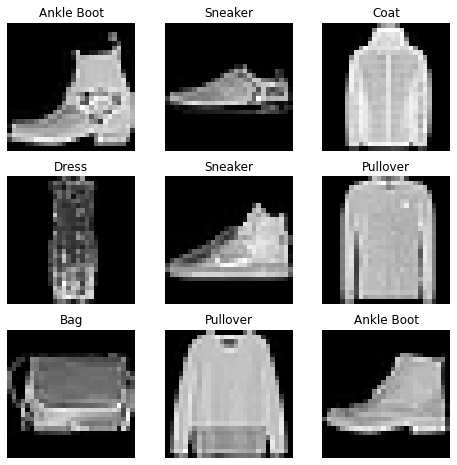
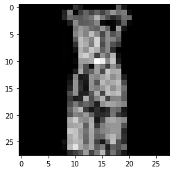

# Dataset
{: .no_toc }

<details open markdown="block">
  <summary>
    목차
  </summary>
  {: .text-delta }
1. TOC
{:toc}
</details>

```python
%matplotlib inline
```

## Dataset과 DataLoader
---
데이터 샘플을 처리하는 코드는 
- 지저분(messy)하고 
- 유지보수가 어려울 수 있기 때문에

더 나은 가독성(readability)과 모듈성(modularity)을 위해 
- 데이터셋 코드를 모델 학습 코드로부터 분리하는 것이 이상적입니다.

PyTorch는 두 가지 데이터 기본 요소를 제공하여, 미리 준비해된(pre-loaded) 데이터셋 뿐만 아니라 가지고 있는 데이터를 사용할 수 있도록 합니다.
- ``torch.utils.data.DataLoader`` 와 
  - ``DataLoader`` 는 ``Dataset`` 을 샘플에 쉽게 접근할 수 있도록 순회 가능한 객체(iterable)로 감쌉니다.
- ``torch.utils.data.Dataset``
  - ``Dataset`` 은 샘플과 정답(label)을 저장

PyTorch의 도메인 특화 라이브러리들은 (FashionMNIST와 같은) 다양한 미리 준비해둔(pre-loaded) 데이터셋을 제공합니다.
- 데이터셋은 ``torch.utils.data.Dataset`` 의 하위 클래스로 개별 데이터를 특정하는 함수가 구현되어 있습니다.
- 이러한 데이터셋은 모델을 만들어보고(prototype) 성능을 측정(benchmark)하는데 사용할 수 있습니다.
  - [이미지 데이터셋](https://pytorch.org/vision/stable/datasets.html)
  - [텍스트 데이터셋](https://pytorch.org/text/stable/datasets.html)
  - [오디오 데이터셋](https://pytorch.org/audio/stable/datasets.html)

## 데이터셋 불러오기
---
`TorchVision` 에서 [Fashion-MNIST](https://research.zalando.com/project/fashion_mnist/fashion_mnist/) 데이터셋을
불러오는 예제를 살펴보겠습니다. 
- Fashion-MNIST는 Zalando의 기사 이미지 데이터셋
- 60,000개의 학습 예제와 10,000개의 테스트 예제로 이루어져 있습니다.
- 각 예제는 
  - 흑백(grayscale)의 28x28 이미지와 
  - 10개 분류(class) 중 하나인 정답(label)으로 구성됩니다.

다음 매개변수들을 사용하여 [FashionMNIST 데이터셋](https://pytorch.org/vision/stable/datasets.html#fashion-mnist) 을 불러옵니다:
 - ``root`` 는 학습/테스트 데이터가 저장되는 경로입니다.
 - ``train`` 은 학습용 또는 테스트용 데이터셋 여부를 지정합니다.
 - ``download=True`` 는 ``root`` 에 데이터가 없는 경우 인터넷에서 다운로드합니다.
 - ``transform`` 과 ``target_transform`` 은 특징(feature)과 정답(label) 변형(transform)을 지정합니다.

```python
import torch
from torch.utils.data import Dataset
from torchvision import datasets
from torchvision.transforms import ToTensor
import matplotlib.pyplot as plt


training_data = datasets.FashionMNIST(
    root="data",
    train=True,
    download=True,
    transform=ToTensor()
)

test_data = datasets.FashionMNIST(
    root="data",
    train=False,
    download=True,
    transform=ToTensor()
)
```

    Downloading http://fashion-mnist.s3-website.eu-central-1.amazonaws.com/train-images-idx3-ubyte.gz
    Downloading http://fashion-mnist.s3-website.eu-central-1.amazonaws.com/train-images-idx3-ubyte.gz to data/FashionMNIST/raw/train-images-idx3-ubyte.gz


      0%|          | 0/26421880 [00:00<?, ?it/s]


    Extracting data/FashionMNIST/raw/train-images-idx3-ubyte.gz to data/FashionMNIST/raw
    
    Downloading http://fashion-mnist.s3-website.eu-central-1.amazonaws.com/train-labels-idx1-ubyte.gz
    Downloading http://fashion-mnist.s3-website.eu-central-1.amazonaws.com/train-labels-idx1-ubyte.gz to data/FashionMNIST/raw/train-labels-idx1-ubyte.gz


      0%|          | 0/29515 [00:00<?, ?it/s]


    Extracting data/FashionMNIST/raw/train-labels-idx1-ubyte.gz to data/FashionMNIST/raw
    
    Downloading http://fashion-mnist.s3-website.eu-central-1.amazonaws.com/t10k-images-idx3-ubyte.gz
    Downloading http://fashion-mnist.s3-website.eu-central-1.amazonaws.com/t10k-images-idx3-ubyte.gz to data/FashionMNIST/raw/t10k-images-idx3-ubyte.gz


      0%|          | 0/4422102 [00:00<?, ?it/s]


    Extracting data/FashionMNIST/raw/t10k-images-idx3-ubyte.gz to data/FashionMNIST/raw
    
    Downloading http://fashion-mnist.s3-website.eu-central-1.amazonaws.com/t10k-labels-idx1-ubyte.gz
    Downloading http://fashion-mnist.s3-website.eu-central-1.amazonaws.com/t10k-labels-idx1-ubyte.gz to data/FashionMNIST/raw/t10k-labels-idx1-ubyte.gz


      0%|          | 0/5148 [00:00<?, ?it/s]


    Extracting data/FashionMNIST/raw/t10k-labels-idx1-ubyte.gz to data/FashionMNIST/raw
    


## 데이터셋을 순회하고 시각화하기
---
``Dataset`` 에 리스트(list)처럼 직접 접근(index)할 수 있습니다
- ``training_data[index]`` 와 matplotlib 을 사용하여 학습 데이터의 일부를 시각화해보겠습니다.


```python
labels_map = {
    0: "T-Shirt",
    1: "Trouser",
    2: "Pullover",
    3: "Dress",
    4: "Coat",
    5: "Sandal",
    6: "Shirt",
    7: "Sneaker",
    8: "Bag",
    9: "Ankle Boot",
}
figure = plt.figure(figsize=(8, 8))
cols, rows = 3, 3
for i in range(1, cols * rows + 1):
    sample_idx = torch.randint(len(training_data), size=(1,)).item()
    img, label = training_data[sample_idx]
    figure.add_subplot(rows, cols, i)
    plt.title(labels_map[label])
    plt.axis("off")
    plt.imshow(img.squeeze(), cmap="gray")
plt.show()
```



## 파일에서 사용자 정의 데이터셋 만들기
---
사용자 정의 Dataset 클래스는 반드시 3개 함수를 구현해야 합니다: 
- `__init__`
- `__len__`
- `__getitem__`

아래 구현을 살펴보면 
- FashionMNIST 이미지들은 ``img_dir`` 디렉토리에 저장되고
- 정답은 ``annotations_file`` csv 파일에 별도로 저장

```python
import os
import pandas as pd
from torchvision.io import read_image

class CustomImageDataset(Dataset):
    def __init__(self, annotations_file, img_dir, transform=None, target_transform=None):
        self.img_labels = pd.read_csv(annotations_file, names=['file_name', 'label'])
        self.img_dir = img_dir
        self.transform = transform
        self.target_transform = target_transform

    def __len__(self):
        return len(self.img_labels)

    def __getitem__(self, idx):
        img_path = os.path.join(self.img_dir, self.img_labels.iloc[idx, 0])
        image = read_image(img_path)
        label = self.img_labels.iloc[idx, 1]
        if self.transform:
            image = self.transform(image)
        if self.target_transform:
            label = self.target_transform(label)
        return image, label
```

### ``__init__``
---
__init__ 함수는 Dataset 객체가 생성(instantiate)될 때 한 번만 실행됩니다.
- 이미지와 주석 파일(annotation_file)이 포함된 디렉토리와 
- (다음 장에서 자세히 살펴볼) 두 가지 변형(transform)을 초기화합니다.

labels.csv 파일은 다음과 같습니다:
```
tshirt1.jpg, 0
tshirt2.jpg, 0
......
ankleboot999.jpg, 9
```

```python
def __init__(self, annotations_file, img_dir, transform=None, target_transform=None):
    self.img_labels = pd.read_csv(annotations_file, names=['file_name', 'label']) # label 파일 로드
    self.img_dir = img_dir # 이미지 파일 디렉토리
    self.transform = transform # 변형 1
    self.target_transform = target_transform # 변형 2
```

### ``__len__``
---
__len__ 함수는 데이터셋의 샘플 개수를 반환합니다.

```python
def __len__(self):
    return len(self.img_labels)
```

### ``__getitem__``
---
__getitem__ 함수는 주어진 인덱스 ``idx`` 에 해당하는 샘플을 데이터셋에서 불러오고 반환합니다.
- 인덱스를 기반으로 디스크에서 이미지의 위치를 식별하고, 
- ``read_image`` 를 사용하여 이미지를 텐서로 변환하고, 
- ``self.img_labels`` 의 csv 데이터로부터 해당하는 정답(label)을 가져오고, 
- (해당하는 경우) 변형(transform) 함수들을 호출한 뒤, 
- 텐서 이미지와 라벨을 Python 사전(dict)형으로 반환합니다.

```python
def __getitem__(self, idx):
    img_path = os.path.join(self.img_dir, self.img_labels.iloc[idx, 0]) # 인덱스를 기반으로 이미지 파일 주소 확인
    image = read_image(img_path) # 이미지 불러오기
    label = self.img_labels.iloc[idx, 1] # 인덱스를 기반으로 label 얻기
    if self.transform: # 변형 1을 적용하는 경우 적용
        image = self.transform(image)
    if self.target_transform: # 변형 2를 적용하는 경우 적용
        label = self.target_transform(label)
    sample = {"image": image, "label": label} # 텐서 이미지를 dict 형으로 반환
    return sample
```

## DataLoader로 학습용 데이터 준비하기
---
``Dataset`` 은 다음 두 태스크를 한 번에 합니다.
- 데이터셋의 특징(feature)을 가져오고 
- 하나의 샘플에 정답(label)을 지정하기

모델을 학습할 때, 일반적으로 
1. 샘플들을 "미니배치(minibatch)"로 전달하고, 
2. 매 에폭(epoch)마다 데이터를 다시 섞어서 과적합(overfit)을 막고,
3. Python의 ``multiprocessing`` 을 사용하여 데이터 검색 속도를 높이려고 합니다.

``DataLoader`` 는 간단한 API로 이러한 복잡한 과정들을 추상화한 순회 가능한 객체(iterable)입니다.

### DataLoader를 통해 순회하기(iterate)
``DataLoader`` 에 데이터셋을 불러온 뒤에는 필요에 따라 데이터셋을 순회(iterate)할 수 있습니다.

아래의 각 순회(iteration)는 (각각 ``batch_size=64`` 의 특징(feature)과 정답(label)을 포함하는) ``train_features`` 와 ``train_labels`` 의 묶음(batch)을 반환합니다. 

``shuffle=True`` 로 지정했으므로, 모든 배치를 순회한 뒤 데이터가 섞입니다.

데이터 불러오기 순서를 보다 세밀하게(finer-grained) 제어하려면 [Samplers](https://pytorch.org/docs/stable/data.html#data-loading-order-and-sampler)
를 살펴보세요.


```python
from torch.utils.data import DataLoader

train_dataloader = DataLoader(training_data, batch_size=64, shuffle=True)
test_dataloader = DataLoader(test_data, batch_size=64, shuffle=True)
```


```python
# 이미지와 정답(label)을 표시합니다.
train_features, train_labels = next(iter(train_dataloader))
print(f"Feature batch shape: {train_features.size()}")
print(f"Labels batch shape: {train_labels.size()}")
img = train_features[0].squeeze()
label = train_labels[0]
plt.imshow(img, cmap="gray")
plt.show()
print(f"Label: {label}")
```

    Feature batch shape: torch.Size([64, 1, 28, 28])
    Labels batch shape: torch.Size([64])
    

    
    Label: 3

## 더 읽어보기 - [torch.utils.data API](https://pytorch.org/docs/stable/data.html)


