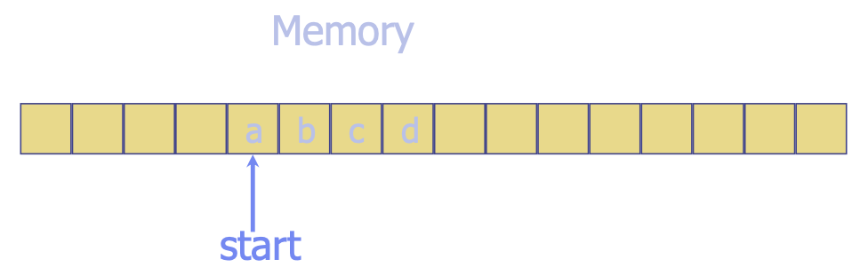
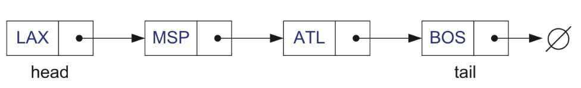
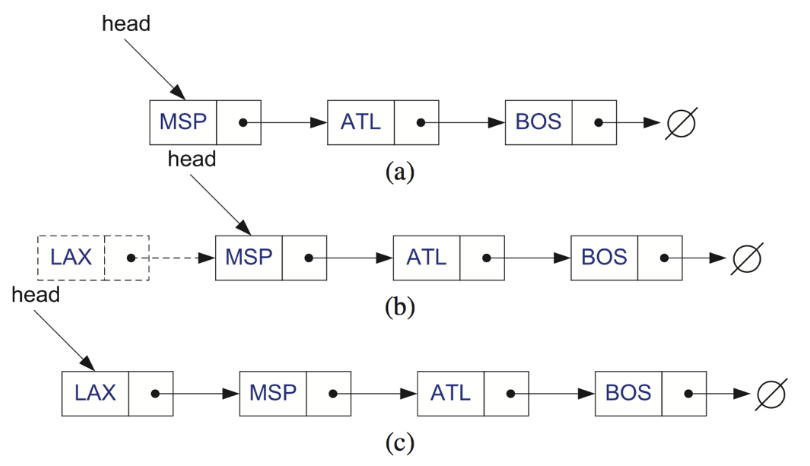
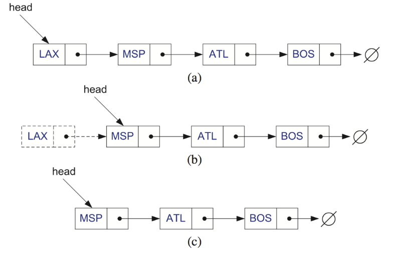
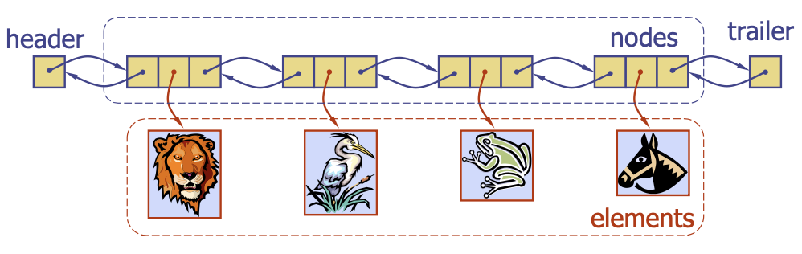
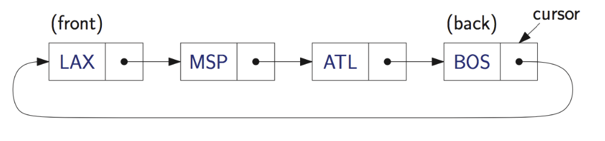

# Arrays and Linked Lists
{: .no_toc }

  

    목차
  

  {: .text-delta }
1. TOC
{:toc}

## 배열 (Array)
---

데이터를 순차적 메모리 위치에 저장하는 것으로, 정수 인덱스를 이용하여 각 요소에 접근한다.
- 새로운 요소의 삽입 또는 기존 요소의 제거가 어렵다.
    - 삽입의 경우 공간 확보를 위해 기존 요소들을 옮겨야 (shift) 한다.
    - 제거의 경우 빈 위치를 채워넣어야 한다.
- 모든 요소들을 `물리적으로` 연결하는 것이 아닌 `논리적으로` 연결하는 자료구조가 등장: 연결 리스트

## 단일 연결 리스트 (Singly Linked List)
---

노드들의 시퀀스로 구성된 자료구조로, 각 노드는 `요소`와 `다음 노드로의 링크`를 저장한다.

Head에 새로운 노드 삽입
1. 새로운 노드를 할당한다.
2. 새로운 요소를 삽입한다.
3. 새로운 노드에 기존 Head로 향하는 link를 저장한다.
4. Head를 가리키는 link를 새로운 노드로 업데이트 한다.

Head 노드 제거
1. Head를 가리키는 link를 다음 노드를 가리키도록 업데이트
2. 이전 Head 노드를 제거

Tail에 새로운 노드 삽입
1. 새로운 노드 할당
2. 새로운 요소 삽입
3. 새로운 노드의 link가 $\emptyset$을 가리키도록 함
4. 기존 Tail node의 link가 새로운 노드를 가리키도록 함
5. Tail을 가리키는 link가 새로운 노드를 가리키도록 함

Tail 노드 제거
1. Tail 직전 노드의 link가 $\emptyset$을 가리키도록 함.
2. Tail을 가리키는 link가 Tail 직전 노드를 가리키도록 함.
3. 이전 Tail 노드를 제거

## 이중 연결 리스트 (Doubly Linked List)
---

단일 연결 리스트의 경우 tail에 있는 요소를 제거하기 어려움.  
이중 연결 리스트의 각 노드는 `이전 노드와의 링크`, `요소`, `다음 노드와의 링크`로 구성되어 있다.

## 원형 연결 리스트 (Circular Linked List)
---

단일 연결 리스트와 유사하지만 Head나 Tail을 갖지 않고 Cycle을 형성함.
- 커서 (cursor): 가상의 시작 노드

