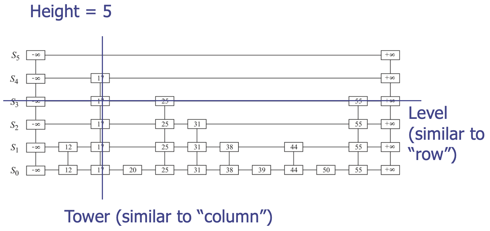

# Skip Lists
{: .no_toc }

  

    목차
  

  {: .text-delta }
1. TOC
{:toc}

## Ordered Map
---
기존 Map의 추상 데이터 타입 + 다음 메소드들
- `firstEntry()`: 가장 작은 키 값을 갖는 엔트리를 반환
- `lastEntry()`: 가장 큰 키 값을 갖는 엔트리를 반환
- `ceilingEntry(k)`: `k`보다 크거나 같은 키 값 중 가장 작은 값을 갖는 엔트리를 반환
- `floorEntry(k)`: `k`보다 작거나 같은 키 값 중 가장 큰 값을 갖는 엔트리를 반환
- `lowerEntry(k)`: `k`보다 작은 키 값 중 가장 큰 값을 갖는 엔트리 반환
- `higherEntry(k)`: `k`보다 큰 키 값 중 가장 작은 값을 갖는 엔트리 반환

$\rightarrow$ 스킵 리스트는 ordered map을 구현하기 위한 효율적인 방법 중 하나
1. 정렬된 리스트 기반: 검색, 삽입, 삭제에 $O(n)$의 시간복잡도
2. 해시 테이블: unordered map은 평균적으로 $O(1)$의 시간복잡도로 구현될 수 있음.

Ordered map에 대해서도 유사하게 구현할 수 있을까? `Skip List`

## 스킵 리스트 (Skip List)
---
{:style="display:block; margin-left:auto; margin-right:auto"}

`(key, value)` item의 집합 $S$의 스킵 리스트는 일련의 리스트들 $S_{0}, S_{1}, ..., S_{h}$이며 
1. 각 리스트 $S_{i}$는 특수 키 $+\infty, -\infty$를 포함한다.
2. 리스트 $S_{0}$는 $S$의 키를 감소하지 않는 순서로 포함한다.
3. 각 리스트는 이전 리스트의 서브시퀀스이다: $S_{0}\supseteq S_{1} \supseteq ... \supseteq S_{h} $
4. 리스트 $S_{h}$는 특수 키 $+\infty, -\infty$만 포함한다.

### 검색 (Search)
{:style="display:block; margin-left:auto; margin-right:auto"}

1. $S_{h}$의 첫 번째 위치에서 시작한다.
2. 현재 위치 $p$에서 target key $x$와 $y = key(next(p))$를 비교한다
    - $x=y$: $element(next(p))$를 반환
    - $x>y$: 현재 리스트에서 앞으로 이동 (Scan forward)
    - $x<y$: 다음 리스트에서 동일 키로 이동 (Drop down)
3. $S_{0}$에서 drop down을 하는 경우에는 `null` 반환

### 삽입 (Insertion)
{:style="display:block; margin-left:auto; margin-right:auto"}

($x$, $o$)을 넣기 위해 랜덤 알고리즘 (randomized algorithm)을 활용한다.
- 동전 뒷면이 나올 때까지 계속 던졌을 때, 앞면이 나온 횟수를 $i$라 하자.
- $i\geq h$이면 스킵 리스트에 새로운 리스트들 $S_{h+1}, ..., S_{i}$를 추가한다.
    - 각각의 리스트는 특수 키 $+\infty, -\infty$만 포함한다.
    - $i<h$이면 아무것도 하지 않는다.
- 스킵 리스트에서 $x$을 검색하고, 각 리스트 $S_{0}, ..., S_{i}$에서 $x$보다 작지만 가장 큰 item들의 위치 $p_{0}, ..., p_{i}$를 찾는다.
- $j \leftarrow 0, ..., i$에 대하여 리스트 $S_{j}$에서 $p_{j}$ 다음 위치에 ($x$, $o$)를 넣는다.

### 삭제 (Deletion)
{:style="display:block; margin-left:auto; margin-right:auto"}

키 $x$를 갖는 엔트리를 제거하기 위해,
1. 스킵 리스트에서 $x$를 검색하고 각 리스트 $S_{j}$에서의 위치 $p_{j}$를 찾는다.
2. 리스트 $S_{0}, ..., S_{i}$ 에서 $p_{0}, ..., p_{i}$를 제거한다.
3. 특수 키 $+\infty, -\infty$만 포함하는 하나의 리스트만 제외하고, (특수 키 제외) 키가 없는 리스트는 모두 제거한다.

### 구현 (Implementation)
`entry (k, o), prev node link, next node link, below node link, above node link`를 포함하는 quad-node를 활용하고, 특수 키 `PLUS_INF, MINUS_INF`를 정의한다.

### 성능
$n$ 개의 엔트리를 갖는 스킵 리스트가 있다고 하자.

#### 공간 복잡도
삽입 알고리즘이 호출될 때마다 사용되는 `random bits`에 따라 정해진다.

1. $i$번 연속으로 동전 앞면이 나올 확률은 $\frac{1}{2^{i}}$: $S_{i}$에 있는 엔트리를 $\frac{1}{2^{i}}$의 확률로 삽입
2. $n$개의 엔트리 각각이 확률 $p$의 집합으로 표현될 때, 집합의 기대 크기는 $np$: $S_{i}$의 기대 크기는 $\frac{n}{2^{i}}$ (이항 분포의 기댓값)

$\therefore$ 스킵 리스트에 의해 사용되는 기대 노드 수는
$\sum_{i=0}^{h}\frac{n}{2^{i}}=n\sum_{i=0}^{h}\frac{1}{2^{i}}<2n$. 따라서 공간복잡도는 $O(n)$

#### 시간 복잡도
스킵 리스트의 높이 $h$에 따라 정해지며, $n$ 개의 엔트리를 갖는 스킵 리스트는 `높은 확률`로 높이 $O(\log n)$을 갖는다.

1. $i$번 연속으로 동전 앞면이 나올 확률은 $\frac{1}{2^{i}}$: $S_{i}$에 있는 엔트리를 $\frac{1}{2^{i}}$의 확률로 삽입
2. $n$개의 이벤트 각각이 확률 $p$를 가질 때, 적어도 하나의 이벤트가 발생할 확률은 $np$ (union bound): $S_{i}$가 적어도 하나의 item을 가질 확률은 많아야 $\frac{n}{2^{i}}$ 

$i=3\log n$를 선택했을 때, $S_{i}$가 적어도 하나의 엔트리를 가질 확률은 많아야 $\frac{n}{2^{3\log n}}=\frac{n}{n^{3}}=\frac{1}{n^{2}}$

따라서 $n$ 개의 엔트리를 갖는 스킵 리스트가 (at most) $3\log n$의 높이를 가질 확률은 최소 $1-\frac{1}{n^{2}}$: 매우 높음!

|Operation|Time|
|---|---|
|`size, empty`|$O(1)$|
|`firstEntry, lastEntry`|$O(1)$|
|`find, insert, erase`|$O(\log n)$|
|`ceilingEntry, floorEntry, lowerEntry, higherEntry`|$O(\log n)$|

#### 검색 및 업데이트 시간
스킵 리스트의 검색 시간은 `drop-down` 횟수 + `scan-forward` 횟수에 비례한다.

`drop-down`: 스킵 리스트의 높이에 제한되므로, 높은 확률로 $O(\log n)$를 갖는다.

`scan-forward`: $O(\log n)$
- 시작 위치에서의 키 이후, $i$ 레벨에서 `scan-forward`에 의해 탐색된 `additional key`들은 $i+1$ 레벨에 속할 수 없다.
- 추가적으로 키가 탐색될 확률은 $\frac{1}{2}$ 일 때, 평균적으로 각 레벨 $i$에서 탐색되어야 할 `additional key`의 수는? 
- 동전 뒷면이 나오기 위해 던져야 할 기대 횟수는 2 = 각 리스트에서 `scan-forward` 기대 수행 횟수: $O(1)$

$\therefore$ 스킵 리스트에서 검색은 $O(\log n)$의 시간복잡도가 요구되며, 삽입과 삭제도 유사한 결과를 보인다.
