# Binary Search Trees
{: .no_toc }

<details open markdown="block">
  <summary>
    목차
  </summary>
  {: .text-delta }
1. TOC
{:toc}
</details>

## 이진 탐색
---
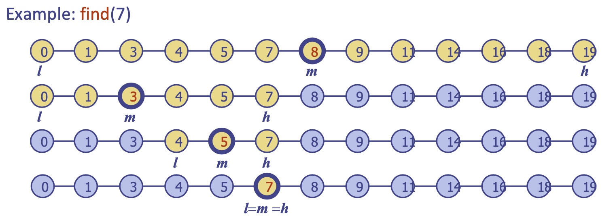{:style="display:block; margin-left:auto; margin-right:auto"}

key로 정렬된 배열 기반 시퀀스로 구현된 ordered map을 활용할 수 있다.
- `floorEntry(k)`: k보다 작거나 같은 키 중에서 가장 큰 키
- `ceilingEntry(k)`: k보다 크거나 같은 키 중에서 가장 작은 키
- `get`
- 단계마다 candidiate items의 수가 절반이 되기 때문에 $O(\log n)$ 번 이후에 종료된다.

### 탐색 테이블
정렬된 시퀀스로 구현된 ordered map
- key로 정렬된 배열 기반 시퀀스에 item을 저장한다
- 이진 탐색을 활용하여 `get, floorEntry, ceilingEntry`는 $O(\log n)$의 시간 복잡도를 갖는다.
- `get`은 최악의 경우 $O(n)$ (새로운 item을 위해 $\frac{n}{2}$개의 item을 shift하여 공간을 만든다)
- `erase`도 최악의 경우 $O(n)$ (제거 이후에 items을 줄이기 위해 $\frac{n}{2}$개의 item을 shift한다)

## 이진 탐색 트리
---
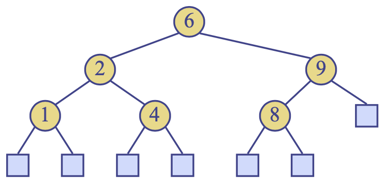{:style="display:block; margin-left:auto; margin-right:auto; width:250px"}

internal node에 key 또는 key-value 엔트리를 저장하는 이진 트리
- 다음과 같은 성질을 만족한다: 노드 $v$의 left subtree $u$와 right subtree $w$가 있을 때, $key(u)\leq key(v)\leq key(w)$
- external node에는 item을 저장하지 못한다.
- inorder 순회 방식은 이진 탐색 트리의 key가 증가하는 순서대로 노드를 방문한다.

### 탐색
key $k$를 찾기 위해 루트 노드부터 아래 경로로 내려가며, 다음에 방문할 노드는 $k$와 현재 노드의 key를 비교하여 결정된다.

```python
def tree_search(k, v):
    if v.isExternal():
        return v # leaf에 도달하는 경우 key가 존재하지 않는다.
    if k < v.key():
        return tree_search(k, v.left())
    elif k == v.key():
        return v
    else: # k > v.key()
        return tree_search(k, v.right())
```

### 삽입
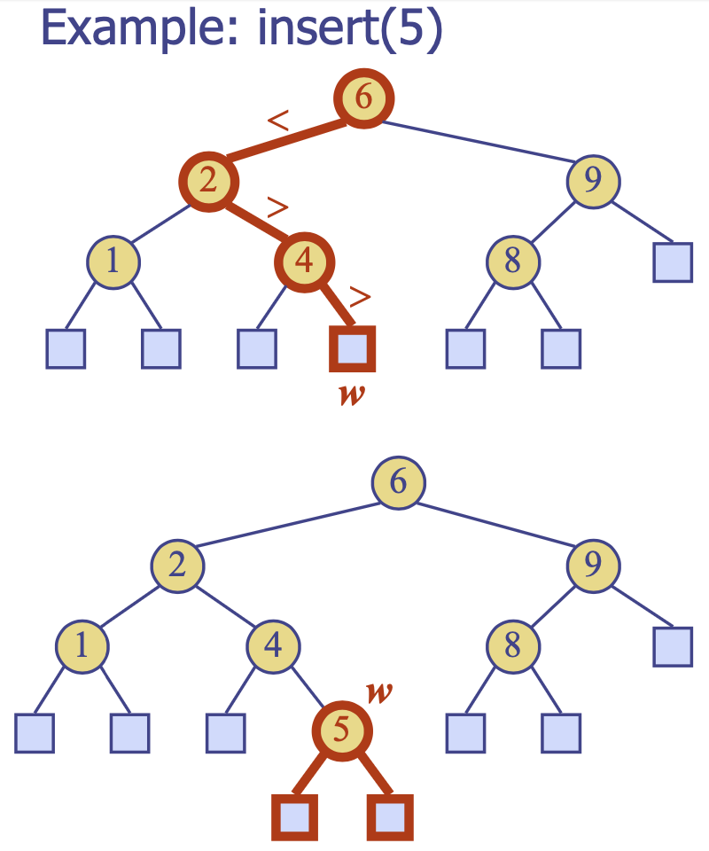
{:style="display:block; margin-left:auto; margin-right:auto; width:250px"}

$put(k, o)$를 수행하기 전에 key $k$를 탐색하며 $k$가 트리에 없는 경우, `탐색을 수행하여 도달한 leaf w`에 $k$를 삽입하여 internal node로 확장한다.

### 삭제
$erase(k)$를 수행하기 전에 key $k$를 탐색하며 노드 $v$가 $k$를 저장한 경우, 

1. 노드 $v$가 리프 노드 $w$를 갖는 경우
- $v, w$ 둘 다 트리에서 제거한다.

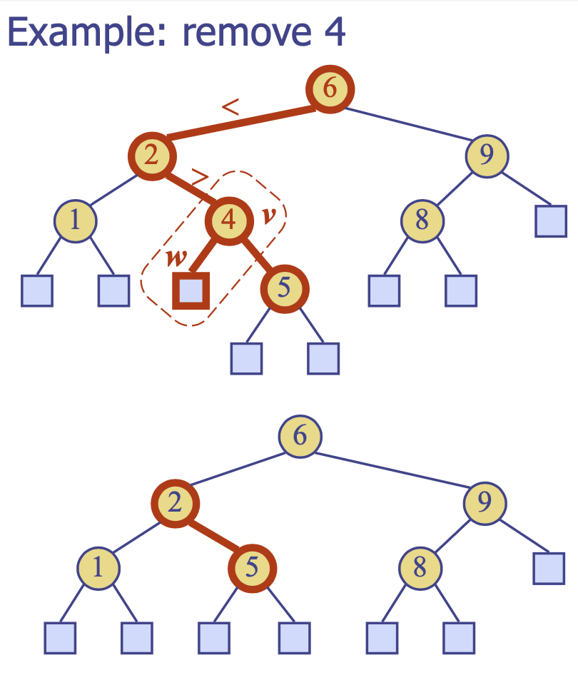{:style="display:block; margin-left:auto; margin-right:auto; width:250px"}

2. 노드 $v$의 자식이 둘 다 internal node인 경우
- inorder 순회 방식으로 $v$ 다음 순서인 internal node $w$를 찾는다: $v$보다 큰 것들 중에서 가장 작은 것
- $w$의 key를 노드 $v$에 복사한다.
- 노드 $w$와 왼쪽 자식 $z$를 제거한다.

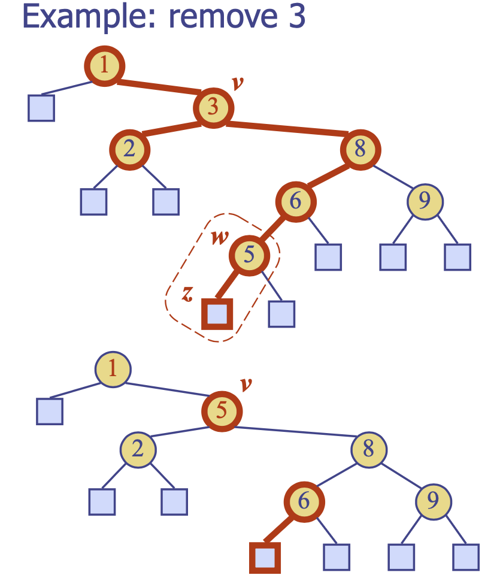
{:style="display:block; margin-left:auto; margin-right:auto; width:250px"}

### 성능
높이 $h$의 이진 탐색 트리로 구현된 $n$개의 item을 갖는 ordered map
- $O(n)$의 공간 복잡도
- `get, floorEntry, ceilingEntry, put, erase`는 $O(h)$의 시간 복잡도
- 높이 $h$는 최악의 경우 $O(n)$, 최선의 경우 $O(\log n)$
- **최악의 경우에도 $O(\log n)$ 가능?** $\rightarrow$ Balancing!

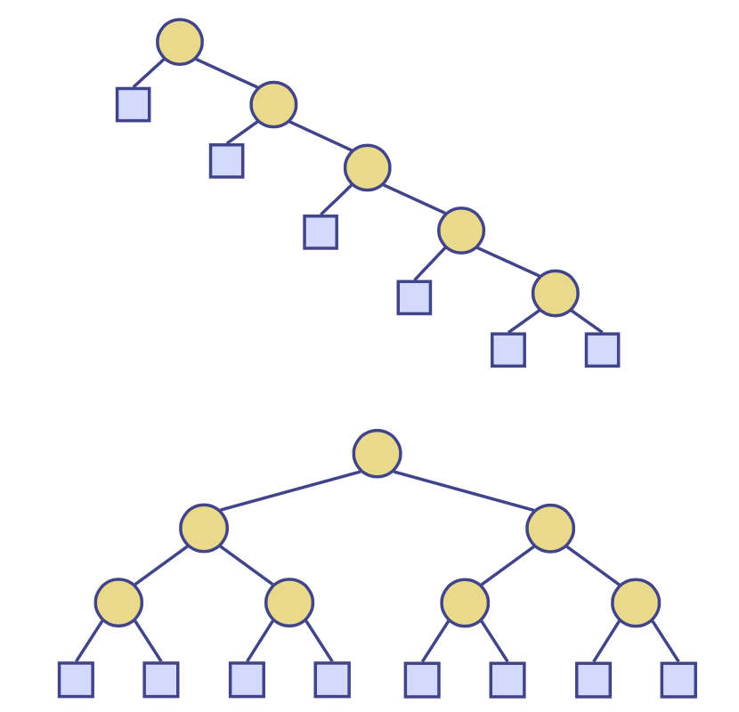
{:style="display:block; margin-left:auto; margin-right:auto; width:250px"}

## AVL 트리 (AVL Trees)
---
height-balance를 만족하는 이진 탐색 트리: 모든 internal node $v$에 대해, **자식들 간 높이 차이는 at most 1**
- 매우 균형잡힌 트리로 $O(\log n)$의 높이를 가짐 (증명은 생략)

### 삽입
height-balance 특성을 유지하기 위해 rebalancing이 요구된다:

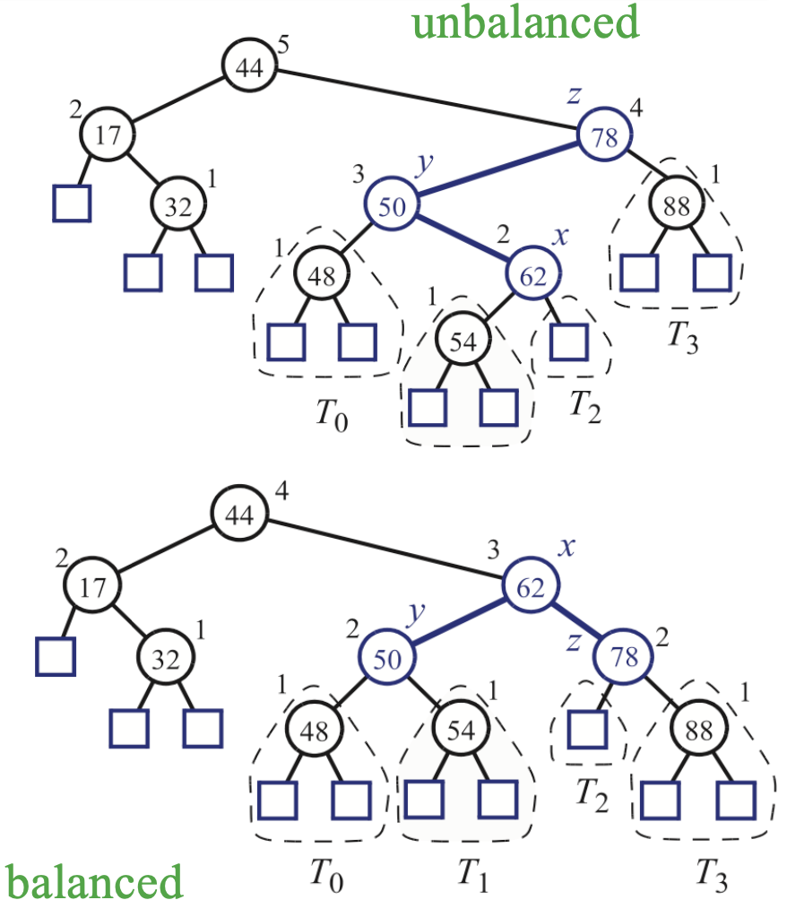
{:style="display:block; margin-left:auto; margin-right:auto; width:250px"}

### Search-and-Repair
- $z$: $w$에서 루트 노드로 향할 때 처음 마주하는 노드로, unbalanced한 노드
- $y$: $z$의 자식이자 $w$의 조상으로, $z$ 자식 중 더 높은 높이를 갖는다.
- $x$: $y$의 자식이자 $w$의 조상으로, $y$ 자식 중 더 높은 높이를 갖는다.
- inorder 순회 방식을 따르면 $x\rightarrow y\rightarrow z$

가능한 경우의 수는 총 4 가지:

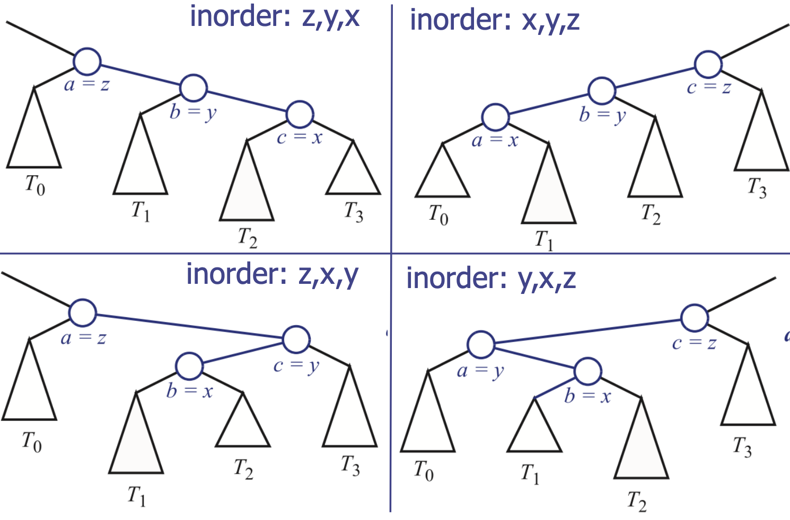
{:style="display:block; margin-left:auto; margin-right:auto; width:350px"}

#### Restructuring (Single Rotations)
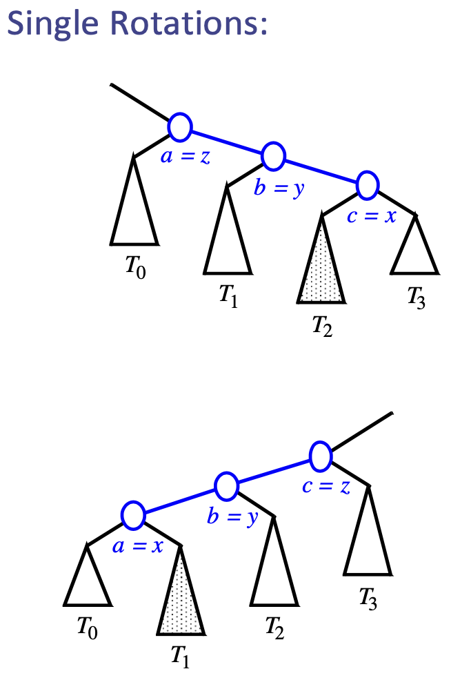
{:style="display:block; margin-left:auto; margin-right:auto; width:250px"}

#### Restructuring (Double Rotations)
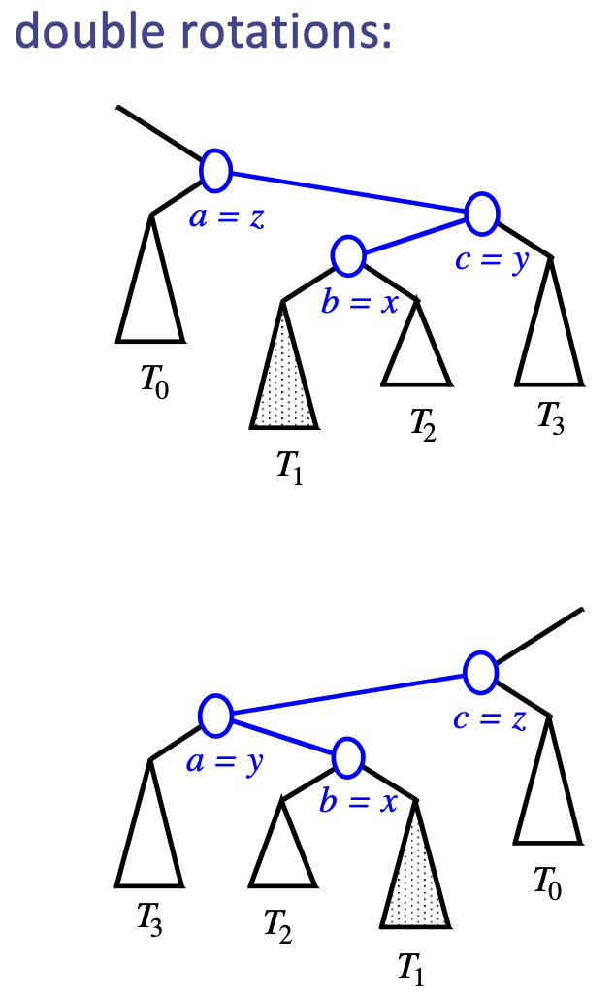
{:style="display:block; margin-left:auto; margin-right:auto; width:250px"}

### 제거
제거된 노드는 빈 external node가 되기 때문에 부모 노드인 $w$는 unbalanced 노드가 된다.

### 제거 이후 Rebalancing
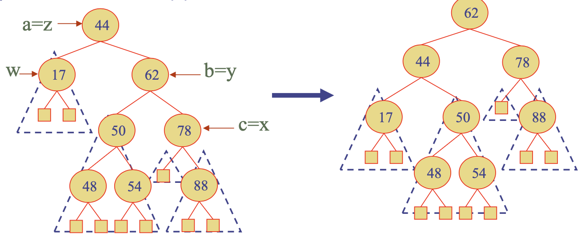
{:style="display:block; margin-left:auto; margin-right:auto; width:350px"}

$x$에 대하여 Restructuring을 수행한다: `restructure(x)`
- $z$: $w$에서 루트 노드로 향할 때 마주하는 첫 unbalanced 노드
- $y$: $z$의 자식들 중 가장 큰 높이를 갖는 노드
- $x$: $y$의 자식들 중 가장 큰 높이를 갖는 노드

Restructuring 과정에서 더 높은 높이를 갖는 다른 노드를 unbalanced하게 할 수 있으므로 루트 노드에 도달할 때까지 balance를 체크해야 한다.

### 성능
- single restructure는 $O(1)$의 시간복잡도: linked-structure binary tree
- `find`는 $O(\log n)$의 시간복잡도: 트리의 높이는 $O(\log n)$이며 restructure가 필요하지 않다.
- `put, erase`은 $O(\log n)$의 시간복잡도: 최초 `find`, restructuring, maintaining 모두 $O(\log n)$