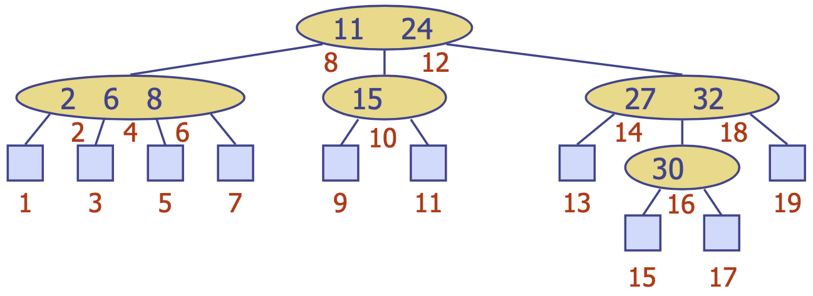
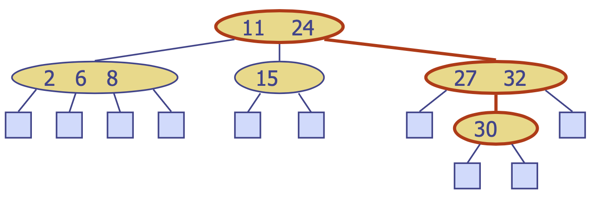
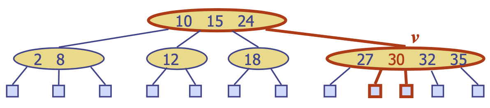
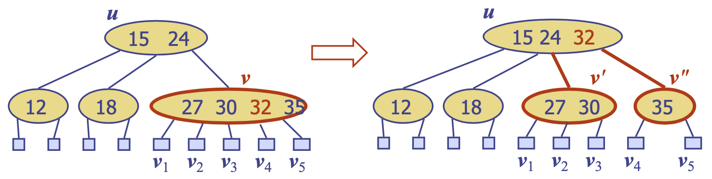
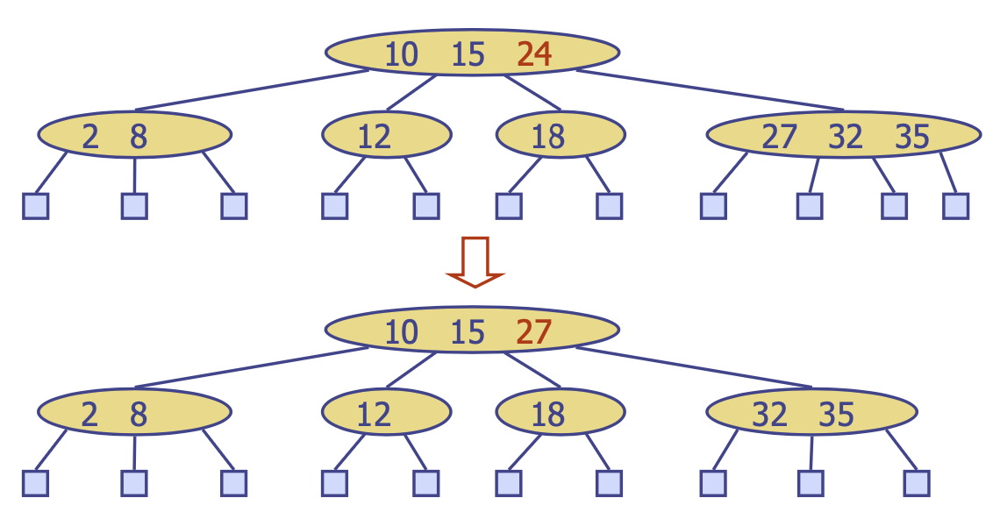
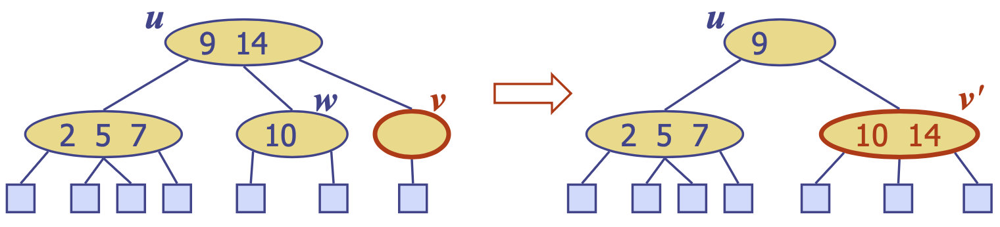

# (2, 4) Trees
{: .no_toc }

<details open markdown="block">
  <summary>
    목차
  </summary>
  {: .text-delta }
1. TOC
{:toc}
</details>

## Multi-Way Search Tree
---
{:style="display:block; margin-left:auto; margin-right:auto"}

Ordered tree이면서
1. 각 internal node는 최소 2개의 자식이 있고, $d$개의 자식이 있을 때 $d-1$개의 key-element items ($k_{i}, o_{i}$)를 저장한다.
2. key $k_{1}k_{2}...k_{d-1}$을 저장하는 자식 $v_{1}v_{2}...v_{d}$을 갖는 노드가 있을 때
    - $v_{1}$의 subtree의 keys $< k_{1}$
    - $k_{i-1} < v_{i}$의 subtree의 keys $< k_{i}$
    - $v_{d}$의 subtree의 keys $> k_{d-1}$
3. 리프 노드는 item을 갖지 않는다.

Inorder 순회
- 자식 $v_{i}, v_{i+1}$를 부모로 하는 노드 $v$의 subtree를 재귀적으로 순회하며 item $(k_{i}, o_{i})$를 방문한다.
- 방문 순서는 key가 증가하는 순서이다.

### Multi-Way Searching
key $k_{1}k_{2}...k_{d-1}$을 저장하는 자식 $v_{1}v_{2}...v_{d}$을 갖는 각 internal node에서
- $k=k_{i} (i=1,...,d-1)$: 탐색 종료
- $k<k_{1}$: 자식 $v_{1}$에서 탐색 진행
- $k_{i-1}<k<k_{i} (i=2,...,d-1)$: 자식 $v_{i}$에서 탐색 진행
- $k>k_{d-1}$: 자식 $v_{d}$에서 탐색 진행
- external node에 도달하는 경우 탐색이 종료되며 탐색에 실패함을 의미 (예 - `30` 찾기)

{:style="display:block; margin-left:auto; margin-right:auto"}

## (2, 4) Trees
---
다음 조건을 만족하는 multi-way search이며, $O(\log n)$의 높이를 갖는다.
1. `node-size property`: 모든 internal node는 최대 4개의 자식을 가질 수 있다 (3개의 key)
2. `depth property`: 모든 external node는 같은 depth를 갖는다

### 삽입
$k$를 탐색했을 때 도달하는 리프의 부모 $v$에 새로운 item $(k, o)$를 삽입한다.
- `depth`는 유지되지만 overflow ($v$의 자식이 4개 초과)가 발생할 수 있다.

{:style="display:block; margin-left:auto; margin-right:auto"}

#### 오버플로우와 분할
$v$의 자식 $v_1, ..., v_5$과 key $k_1, ..., k_4$가 있을 때 노드 $v$는 두 노드 $v', v''$로 대체된다.
1. $v'$는 3-node로 key $k_1, k_2$와 자식 $v_1, v_2, v_3$을 갖는다.
2. $v''$는 2-node로 key $k_4$와 자식 $v_4, v_5$를 갖는다.
3. key $k_3$은 $v$의 부모 $u$에 삽입된다: $u$에서도 오버플로우가 발생할 수 있다.

{:style="display:block; margin-left:auto; margin-right:auto"}

```python
def put(k, o):
    insertion node v를 찾기 위해 key k를 검색 # Step 1
    node v에 새로운 엔트리 (k, o)를 삽입 # Step 2
    while overflow(v): #Step 3
        if isRoot(v):
            v 위에 새로운 empty root를 생성한다.
        v = split(v)
```
$n$개의 item을 갖는 (2, 4) 트리의 높이는 $O(\log n)$
- Step 1은 $O(\log n)$: $O(\log n)$개의 노드 방문
- Step 2는 $O(1)$
- Step 3는 $O(\log n)$: split은 $O(1)$의 시간복잡도를 갖고, 총 $O(\log n)$번의 split을 시도
- 삽입에는 총 $O(\log n)$의 시간복잡도

### 제거
1. 리프 노드를 자식으로 갖는 노드의 경우에는 그냥 제거
2. internal node를 자식으로 갖는 노드의 경우에는 해당 엔트리를 `inorder successor`로 대체한 뒤 제거함 (예 - key `24`를 제거하기 위해 `27`과 교체함)

{:style="display:block; margin-left:auto; margin-right:auto"}

#### 언더플로우와 결합, 이전
노드 $v$의 엔트리를 제거하는 것은 언더플로우를 유발할 수 있다: $v$가 `key가 없고 하나의 자식만을 갖는 1-node`가 됨 <br>
두 가지 경우가 존재할 수 있다.
- $v$의 인접한 siblings (같은 height에 있는 노드)가 2-node이다
    - `결합`: $v$를 인접한 sibling $w$와 병합하고, $v$의 부모 $u$의 엔트리를 병합된 노드 $v'$로 옮긴다.
    - 결합 이후 $u$에서도 언더플로우가 발생할 수 있다.

{:style="display:block; margin-left:auto; margin-right:auto"}

- $v$의 인접한 sibling $w$가 3-node 또는 4-node이다
    - `이전`
        1. $w$의 자식을 $v$로 옮긴다.
        2. $u$의 item을 $v$로 옮긴다.
        3. $w$의 item을 $u$로 옮긴다.
    - 이전 이후에는 언더플로우가 발생하지 않는다.

{:style="display:block; margin-left:auto; margin-right:auto"}

$n$개의 item을 갖는 (2, 4) 트리의 높이는 $O(\log n)$
- 엔트리를 제거할 노드를 찾기 위해 $O(\log n)$의 노드를 방문
- $O(\log n)$의 `결합`을 수행한 뒤 언더플로우를 처리하기 위해, 최대 1번의 이전이 발생할 수 있음
- `결합`과 `이전`은 $O(1)$의 시간복잡도가 요구됨
- 제거에는 총 $O(\log n)$의 시간복잡도

## 맵 구현 비교
---

||Find|Put|Erase|
|---|---|---|---|
|해시 테이블|1|1|1|
|스킵 리스트|$\log n$|$\log n$|$\log n$|
|AVL과 (2,4)|$\log n$|$\log n$|$\log n$|