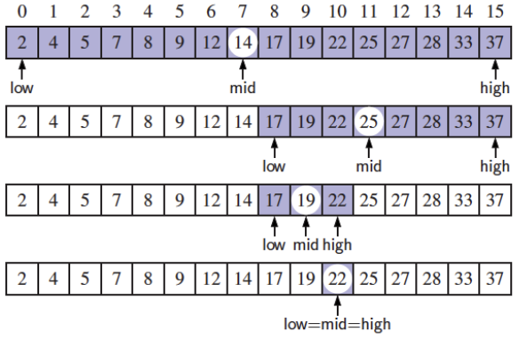
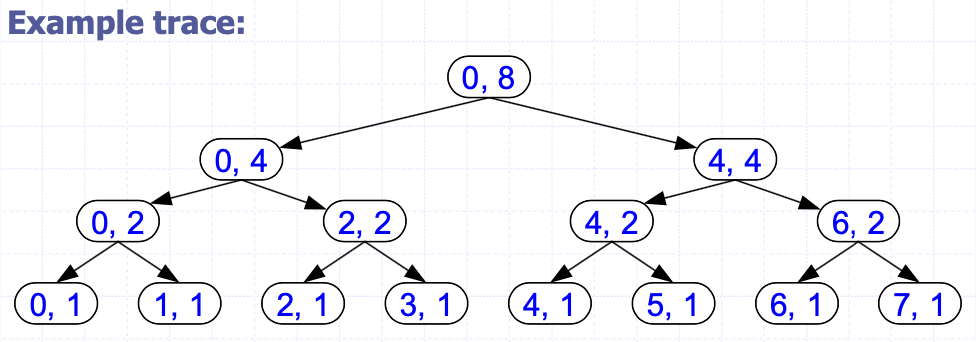

# Algorithms
{: .no_toc }

<details open markdown="block">
  <summary>
    목차
  </summary>
  {: .text-delta }
1. TOC
{:toc}
</details>

## Pseudocode
컴퓨터 언어 코드를 모방한 것으로, 문제 해결 단계를 정확히 묘사하기 위해 사용됨

```python
# 시퀀스 내 최댓값 찾기
Input: s, n
Output: large (시퀀스 s에서의 최댓값)

max(s, n) {
    large = s(1)
    for i = 2 to n:
        if s(i) > large:
            large = s(i)
    return large
}
```

## 알고리즘 (Algorithm)
문제 해결을 위한 단계적 방법론으로, 다음과 같은 특성을 갖는다.
- 입력 Input: 알고리즘이 입력받는 것
- 출력 Output: 알고리즘이 출력하는 것
- 단계의 정확성 Precision: 단계가 정확히 명시되어야 한다.
- 결정론 Determinism: 각 실행단계의 중간 결과값은 `unique`하고 `input과 이전 단계의 결과값`에 의해서만 결정되어야 한다.
- 유한성 Finiteness: 알고리즘은 유한히 많은 instruction을 수행한 후 종료되어야 한다.
- 결과의 정확성 Correctness: 알고리즘의 출력값은 문제를 올바르게 해결할 수 있도록 정확히 나와야 한다.
- 일반성 Generality: 알고리즘은 입력값의 집합에 적용해야 한다.

## 정렬 (Sorting)
정렬 알고리즘은 리스트의 원소들을 특정 순서로 두는 알고리즘이다.
- 가장 많이 사용되는 순서는 번호순 (numerical order)과 사전순 (lexicographical order)이다.
- 효율적인 정렬은 입력 데이터를 정렬된 리스트로 만들어야 하는 알고리즘 (e.g. 검색 및 병합 알고리즘)의 사용을 최적화하는데 중요하다.
- 입력값은 두 조건을 만족해야 한다.
1. 감소하지 않는 순서 (nondecreasing order)를 갖는다
2. 입력 데이터의 순열 (permutation), 재배열이다
- 주로 입력 데이터는 임의 접근 (random access)이 가능한 배열로 들어온다. 반면 리스트는 순차적 접근 (sequential access)만 허용된다.

정렬 알고리즘 (Sorting algorithm)
1. 삽입 정렬 (Insertion sort): 결과 리스트 내 적합한 위치에 원소를 삽입한.
2. 버블 정렬 (Bubble sort, Exchange sort): 인접한 원소들의 쌍을 비교하고, 잘못된 순서로 있으면 위치를 스왑 (swap)한다. 더 이상 스왑이 필요하지 않을 때까지 (리스트가 정렬될 때까지) 과정을 반복한다.
3. 선택 정렬 (Selection sort): 리스트 내 최솟값을 찾고, 가장 첫 번째로 위치한 값과 스왑한다. 두 번째 위치에서 시작해서 리스트 나머지 원소에 대해서도 반복 적용한다.
4. 합병 정렬 (Merge sort): 리스트의 원소 수가 0 또는 1인 경우 (이미 정렬됨) 를 제외하고, 정렬되지 않은 리스트를 두 개의 하위 리스트 (원래 리스트 길이의 절반)로 나눈다. 각각의 서브 리스트에 대해 합병 정렬을 다시 적용하여 재귀적으로 수행한다. 정렬된 두 하위 리스트를 하나의 정렬된 리스트로 합병한다.

### 삽입 정렬 (Insertion sort)

```python
Input: s, n
Output: s (sorted)

insertion_sort(s, n):
    for i = 2 to n:
        val = s(i)
        j = i - 1
        while j >= 1 and val < s(j):
            s(j+1) = s(j)
            j = j - 1
        s(j+1) = val
```

가장 간단한 구현 방법은 두 개의 리스트를 사용하는 것이다.
- `Source 리스트`와 `정렬된 원소들이 삽입될 리스트`
- 메모리 절약을 위해 `in-place sort` 방식으로 구현한다.
    - 이미 정렬된 원소들은 제외하고, 제자리에 위치할 때까지 현재 원소를 이전 원소와 반복적으로 스왑한다.
- 알고리즘 분석
    - for-loop는 항상 $n-1$번 반복된다.
    - 특정 값 $i$에 대한 while문의 반복 횟수는 입력값에 따라 다르다
- Best-case time: `val<s[j]`가 항상 `False`인 경우는 while문 실행이 없다.
- Worse-case time: `val<s[j]`가 항상 `True`가 되어 while문은 최대 횟수만큼 실행된다.
- 시간 및 공간 (Time and space requirement)

## 알고리즘 분석
컴퓨터 프로그램은 특정 종류의 입력값에 대하여 쓸모없을 수 있다
- 프로그램을 실행하는데 필요한 시간 또는 데이터나 프로그램 변수를 할당하기 위해 필요한 공간 등이 너무 큰 경우
- 알고리즘을 실행하기 위해 필요한 시간과 공간을 추정하는 프로세스
- 알고리즘 실행에 필요한 시간은 `입력값에 대한 함수`이다.
- 알고리즘의 기본적인, 중요한 단계를 센다.
    - 정렬에서 비교 과정, 루프에서 반복 횟수 등

### 점근적 (Asymptotic)
임의적으로 가깝게 (arbitrarily closely) 값 또는 곡선에 접근한다.

1. $f$는 $g$에 의해 상한 (bounded above)을 갖는다
- $g$는 $f$에 대한 점근적 상한 (asymptotic upper bound)
- 상수 $C_{1}$가 존재할 때 $n_{0}\leq n$에 대하여 $\vert f(n)\vert \leq C_{1}\vert g(n)\vert$
- $f(n) = O(g(n))$: big-oh of g(n), $f(n)$은 order at `most` g(n)

2. $f$는 $g$에 의해 하한 (bounded below)을 갖는다
- $g$는 $f$에 대한 점근적 하한 (asymptotic lower bound)
- 상수 $C_{2}$가 존재할 때 $n_{0}\leq n$에 대하여 $\vert f(n)\vert \geq C_{2}\vert g(n)\vert$
- $f(n) = \Omega(g(n))$: omega of g(n),  $f(n)$은 order at `least` g(n)

3. $f$는 $g$에 의해 상한과 하한 (bounded above and below)을 갖는다
- $g$는 $f$에 대한 점근적 상하한 (asymptotic tight bound)
- $f(n) = O(g(n))$ 이고 $f(n) = \Omega(g(n))$
    - $f(n) = \Theta(g(n))$: theta of g(n)
- $f(n)$은 order g(n)

점근적 분석에서는 `입력 크기`에 따른 `알고리즘의 성능 (실행 시간 또는 공간)`을 평가하는 것.
- Worst case, Average case, Best case

## 재귀 (Recursion)
---
재귀 함수는 자기 자신을 호출하는 함수이며, 재귀 알고리즘은 재귀 함수를 포함하는 알고리즘이다.
- 예 - factorial $n! = 1\cdot2...\cdot(n-1)\cdot n$
- $f(n) = 1 \text{ if }n = 0 \text{ else } n\cdot f(n-1)$

예 - 분할 정복
- 하나의 문제를 같은 타입의 문제들로 분할한다.
- 각각의 하위 문제들은 간단히 해결될 수 있을 문제가 될 때까지 계속 분할된다.
- 하위 문제들의 정답을 결합하여 원래 문제의 정답을 얻는다.

재귀 메소드 구성
1. Base case
- 재귀 호출을 수행하지 않을 때의 입력 변수의 값
- 반드시 적어도 하나의 base case가 존재해야 한다.
- 재귀 호출은 마지막 단계에서는 반드시 base case에 도달한다.
2. Recursive calls
- 현재 메소드에서 호출
- 각 재귀 호출은 base case를 향해 진행되도록 정의되어야 한다.

### 이진 검색 (Binary Search)


정렬된 리스트 (data)에서 특정 정수 값 (target = $22$)을 찾는 것, 다음의 세 가지 경우를 고려할 수 있다.
1. $target = data[mid]$: target을 찾았음
- 네 번째 그림에서 $target = data[mid] = 22$
2. $target < data[mid]$: data 시퀀스의 첫 번째 절반 서브시퀀스에 재귀 수행
- 두 번째 그림에서 $target < data[mid] = 25$
3. $target > data[mid]$: data 시퀀스의 두 번째 절반 서브시퀀스에 재귀 수행
- 첫 번째 그림에서 $target > data[mid] = 14$
- 세 번째 그림에서 $target > data[mid] = 19$

$O(\log n)$의 시간복잡도를 갖는다.
- 리스트의 길이 $high - low + 1$
- 비교를 한 번 수행한 이후,
  - (target < data[mid] 인 경우) $(mid - 1) - low + 1 = \lfloor\frac{low+high}{2}\rfloor - low \leq \frac{high-low+1}{2}$
  - (target > data[mid] 인 경우) $high - (mid+1) + 1 = high - \lfloor \frac{low+high}{2}\rfloor \leq\frac{high-low+1}{2}$
- 각 재귀 호출은 검색 영역을 반으로 줄이기 때문에 $\log n$ 으로 간주된다.

### 멱함수 (Power Function)
$p(x,n)=x^{n}$는 재귀적으로 정의할 수 있다: <br>
$p(x,n)=1 \text{ if }n=0 \text{ else }x\cdot p(x,n-1)$
- $O(n)$의 시간복잡도를 갖는다.

더 효율적으로 정의할 수 있다.
```python
def power(x, n):
  # Input: a number x and an integer n
  # Output: the value
  if n == 0:
    return 1
  if n%2 == 1:
    y = power(x, (n-1)/2)
    return x*y*y # 호출을 두 번하는 것이 아니라,
  else:
    y = power(x, n/2)
    return y*y # 동일 변수를 두 번 사용
```
- $p(x,n) = 1 \text{ if }x=0$ <br>
$p(x,n) = x\cdot p(x, (\frac{n-1}{2}))^{2} \text{ if }x>0 \wedge x\%2=1$ <br>
$p(x,n) = x\cdot p(x, (\frac{n}{2}))^{2} \text{ if }x>0 \wedge x\%2=0$
- 재귀 호출을 할 때마다 $n$의 값이 반이 되기 때문에 $\log n$번의 재귀 호출을 하게 된다.

### Tail Recursion
선형적인 재귀 메소드 (linearly recursive method)가 마지막 단계에서 재귀 호출을 할 때 발생하며, 재귀 방식이 아닌 메소드로 바꿀 수 있다 (리소스 저장 필요).
```python
def iterative_reverse_array(A, i, j):
  # Input: 배열 A, 음수가 아닌 정수 인덱스 i와 j
  # Output: 배열 A의 원소들의 역배열
  while i < j:
    swap(A[i], A[j])
    i = i + 1
    j = j - 1
  return
```

### Binary Recursion
각 non-base case에서 두 개의 재귀 호출이 존재하는 경우로, 정수 배열 $A$의 수를 전부 더한다고 하자.
```python
def binary_sum(A, i, n):
  # Input: 배열 $A$와 정수 i와 n
  # Output: 배열 $A$ 내 n개의 정수 합
  if n = 1:
    return A[i]
  return binary_sum(A, i, n/2) + binary_sum(A, i + n/2, n/2)
```



### 피보나치 수 (Fibonacci Numbers)
$F_{0}=0, F_{1}=1, F_{i}=F_{i-1}+F_{i-2} ~(i>1)$

첫 번째 재귀함수
```python
def binary_fib(k):
  # Input: 음수가 아닌 정수 k
  # Output: k번째 피보나치 수
  if k == 1:
    return k
  return binary_fib(k-1) + binary_fib(k-2)
```
* $n_{k}$를 binary_fib(k)의 재귀호출 수라고 했을 때, $n_{k}$는 k가 1씩 증가할 때마다 거의 두 배가 된다: $n_{k} > 2^{\frac{k}{2}}$이므로 exponential.

두 번째 재귀함수
```python
def linear_fibonacci(k):
  # Input: 음수가 아닌 정수 k
  # Output: 피보나치 수 쌍 (f(k), f(k-1))
  if k == 1:
    return (k, 0)
  i, j = linear_fibonacci(k-1)
  return (i+j, i)
```
* $k-1$번의 재귀호출이 발생한다.