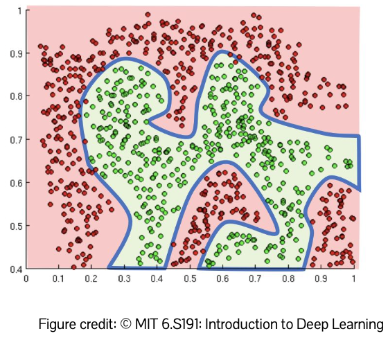
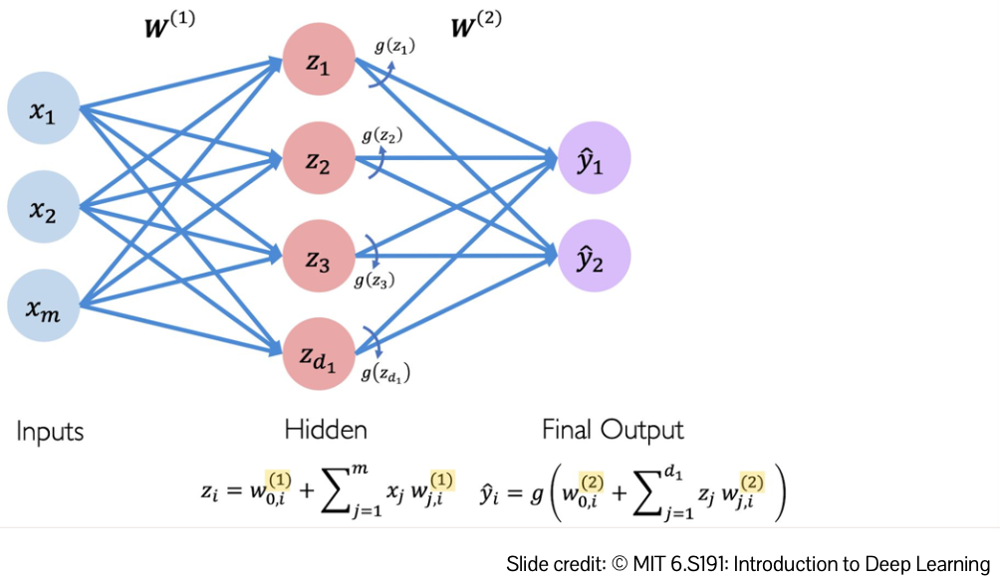
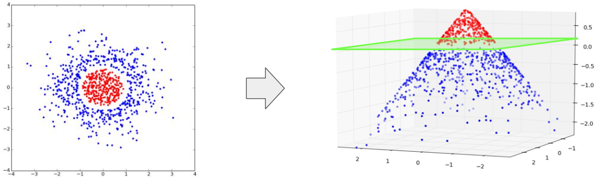
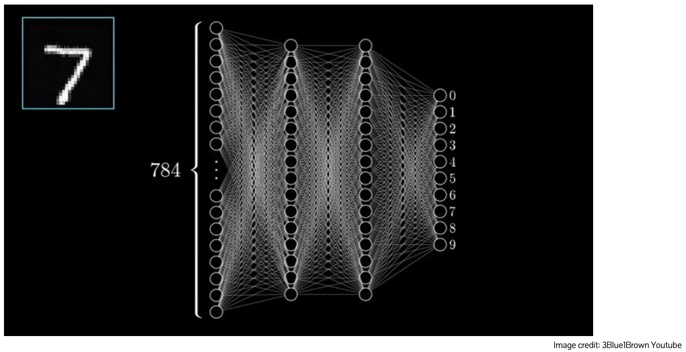
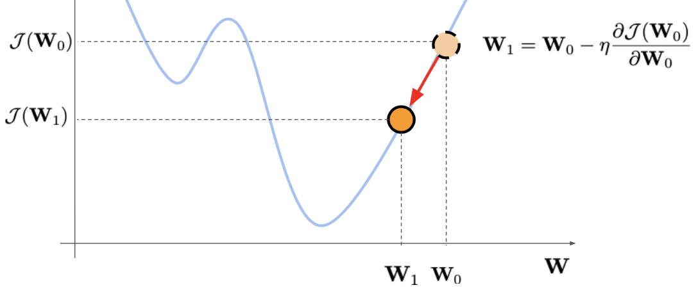
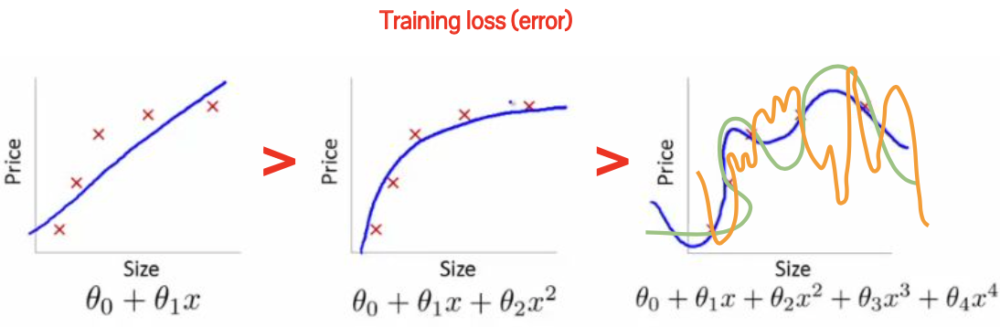
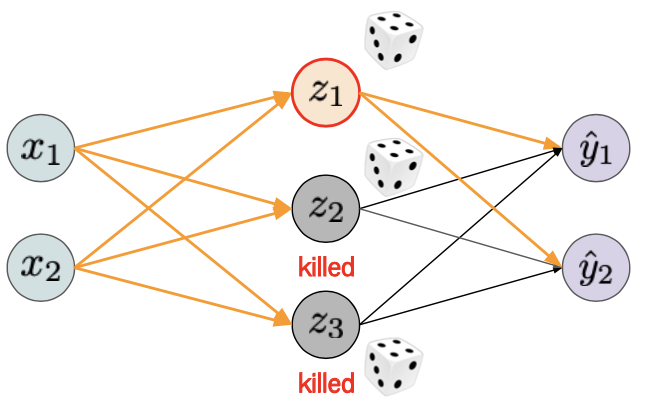
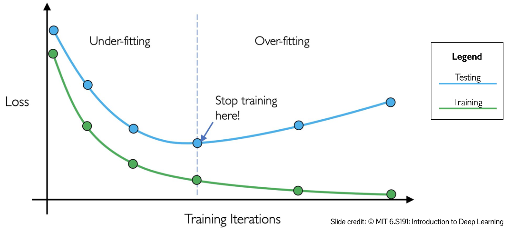

# Neural Network Basics
{: .no_toc }

  

    목차
  

  {: .text-delta }
1. TOC
{:toc}

AI의 목표는 `계산가능한 함수를 이용하여 지능의 구성요소를 모델링`하는 것
- 어떻게 모델링할 것인가? `학습을 통한 함수 모델링`
- **함수를 매개변수화하고, 데이터로부터 매개변수를 학습한다**

## 이진 분류 (Binary Classification)
---
2차원 데이터 포인트를 Positive 또는 Negative class로 분류한다.

$\hat{y}=f(x;w, b)=w_{1}x_{1}+w_{2}x_{2}+b$
 
$\hat{y}=w^{T}x+b \text{ where } w=\begin{bmatrix} w_{1} \newline w_{2} \end{bmatrix}, x=\begin{bmatrix} x_{1} \newline x_{2} \end{bmatrix}$

매개변수가 함수를 특정짓는다 (characterize)
- $x$ (입력값): $x_{1}, x_{2}$
- $w, b$ (매개변수): $w_{1}, w_{2}, b$

{:style="display:block; margin-left:auto; margin-right:auto; width: 300px"}

그러나 대부분의 실제 데이터는 직선으로 분리될 수 없다 (not linearly separable)
- **비선형성 (Non-linearities)은 임의의 복잡한 함수를 모델링하기 위한 필수요소다**
- $\hat{y}=h(w^{T}x+b)$

비선형 활성화 함수 (Nonlinear activation, $h(x)$)
1. Sigmoid
    - $h_{i}=\sigma(x_{i})=\frac{1}{1+\exp(-x_{i})}$
2. Hyperbolic Tangent (tanh)
    - $h_{i}=\tanh(x_{i})=\frac{\exp(x_{i})-\exp(-x_{i})}{\exp(x_{i})+\exp(-x_{i})}$
3. Rectified Linear (ReLU)
    - $h_{i}=\text{ReLU}(x_{i})=\max(x_{i}, 0)$

## 퍼셉트론 (Perceptron)과 다층 퍼셉트론 (MLP, Multi-Layer Perceptron)
---
퍼셉트론은 비선형 활성화 함수를 포함한 최소 단위의 함수 $\hat{y}=g(w^{T}x+b)$
- Sum $z=w_{0}+\sum_{j=1}^{m}x_{j}w_{j} $
- 비선형 함수 $g(x)$를 적용한 Output $y=g(z)$

다층 퍼셉트론은 Input layer, Hidden layer, Output layer로 구성됨
- Sum 
    - $z_{i}=w_{0,i}^{(1)}+\sum_{j=1}^{m}x_{j}w_{j,i}^{(1)} $
- Final Output은 Hidden layer에서 계산된 Sum들을 Input으로 취급
    - Output $\hat{y_{i}}=g(w_{0,i}^{(2)}+\sum_{j=1}^{d_{1}}z_{j}w_{j,i}^{(2)})$

{:style="display:block; margin-left:auto; margin-right:auto; width: 400px"}

다층으로 쌓는 이유
- Hidden layer는 Input이 비선형성을 갖도록 공간에 임베딩한 결과
- 모델은 Input data를 직선으로 분리할 수 있는 공간으로 임베딩할 수 있다

{:style="display:block; margin-left:auto; margin-right:auto; width: 400px"}

## 심층 신경망 (DNN, Deep Neural Network)
---
많은 layer를 쌓은 신경망
- layer마다 다른 수준으로 feature를 추상화하여, features들의 hierarchy를 학습한다
- 얼굴 이미지의 경우, 윤곽 $\rightarrow$ 눈, 코, 입 $\rightarrow$ 전체 얼굴

{:style="display:block; margin-left:auto; margin-right:auto; width: 450px"}

예 - 손글씨 숫자 인식 (Recognizing hand-written digits, [3Blue1Brown] 참조) 
1. 28*28 크기의 gray-scale 이미지를 784개의 픽셀 배열로 표현한다
    - 각 픽셀은 [0, 1] 사이의 값
2. Input은 784개의 $x_{i}$, Output은 10개(0~9)로 구성됨
3. Hidden layer에서는 Input을  쉽게 분리할 수 있는 공간에 비선형적으로 임베딩한다
    - Hidden layer가 깊어질수록 feature는 `low-level` (픽셀 조각)에서 `high-level` (원, 직선, 곡선, ...)

[3Blue1Brown]:https://www.youtube.com/playlist?list=PLZHQObOWTQDNU6R1_67000Dx_ZCJB-3pi

## 신경망 학습
---
데이터셋에 대한 에러를 최소화하는 매개변수의 조합 $W^{\ast}$을 찾는 것
- 데이터셋 $\{(x^{(1)},y^{(1)}),...,(x^{(N)},y^{(N)})\}$ ($N$개의 학습 데이터)
- 매개변수 $\{W^{(1)},...W^{(L)}\}$ ($L$개의 레이어)

$W^{\ast}=\arg\min_{W}\frac{1}{N}\sum_{I=1}^{N} \mathcal{L}(f(x^{(i)}; W), y^{(i)}) $

$\mathcal{L}$ (Loss function)
- 특정 태스크 및 데이터에 대한 모델의 성능을 수치화 (quantify the performance)
- 실제 label과 모델의 예측 결과 사이의 mismatch를 측정
    - mismatch의 정도를 측정하는 여러 방법들이 있음

MSE (Mean squared error)  
$\mathcal{J}(W)=\frac{1}{N}\sum_{i=1}^{N}\vert\vert f(x^{(i)};W)-y^{(i)}\vert\vert_{2}^{2}$

|$\hat{y}$|$y$|$\hat{y}-y$|
|---|---|---|
|1|9.5|-8.5|
|3.5|3|0.5|
|9.2|12.1|-2.9|

$\vert\vert \frac{1}{N}\hat{y}-y \vert\vert_{2}^{2} = \frac{8.5^{2}+0.5^{2}+2.9^{2}}{3}= 30.0$

BCE (Binary cross-entropy)  
$\mathcal{J}(W)=\frac{1}{N}\sum_{i=1}^{N}y^{(i)}\log(f(x^{(i)};W))+(1-y^{(i)})\log(1-f(x^{(i)}; W))$
- $\text{softmax}(\hat{y})=\frac{e^{\hat{y_{j}}}}{\sum_{j}e^{\hat{y_{j}}}}$
- $\sum_{j}\text{softmax}(\hat{y_{j}})=1$

|$\hat{y}$|$\text{softmax}(\hat{y}) = f(x^{(i)}; W)$|$y$|
|---|---|---|
|1|0.01|0|
|3.5|0.15|1|
|5.2|0.84|0|

## Loss function 최적화
---
Challenges
1. 볼록하지도 않고 오목하지도 않다 (non-convex, non-concave)
2. 완벽한 해를 찾는 것 ($\mathcal{L}=0$)은 불가능하다 (impossible to find the analytical solution)

경사하강법 (Gradient descent)
1. 임의의 $W_{0}$을 고른다
2. 경사도 (gradient, $\frac{\delta\mathcal{J}(W_{0})}{\delta W_{0}}$)를 구한다
3. 음의 경사도 (negative gradient)방향으로 $W_{0}$를 조금 이동시킨다 ($W_{1}=W_{0}-\eta\frac{\delta\mathcal{J}(W_{0})}{\delta W_{0}}$)
    - $\eta$ (학습률, learning rate)
4. 수렴할 때까지 (1-3) 과정을 반복한다

{:style="display:block; margin-left:auto; margin-right:auto; width: 450px"}

그러나 $\mathcal{J}(W)$를 계산할 때 **모든 데이터**에 대한 loss를 구하는 것은 매우 소모적인 연산이다 (computationally expensive)

확률적 경사하강법 (SGD, Stochastic gradient descent)
1. 임의의 $W_{0}$을 고른다
2. 하나의 샘플 데이터를 고른다 $(x^{(i)}, y^{(i)})$
3. 경사도 (gradient, $\frac{\delta\mathcal{J}^{(i)}(W_{0})}{\delta W_{0}}$)를 구한다
4. 음의 경사도 (negative gradient)방향으로 $W_{0}$를 조금 이동시킨다 ($W_{1}=W_{0}-\eta\frac{\delta\mathcal{J}^{(i)}(W_{0})}{\delta W_{0}}$)
5. 수렴할 때까지 (2-4) 과정을 반복한다

하나의 데이터에 대한 loss이자 경사도를 추정 (Point-wise loss, gradient estimation)하는 방식으로 효율적이지만 **변동이 심하다 (Very noise)** 

미니배치 확률적 경사하강법 (minibatch SGD)
1. 임의의 $W_{0}$을 고른다
2. 샘플 데이터 배치를 만든다 $\mathcal{B}=\{(x^{(k)}, y^{(k)})\}_{k=1}^{\mathcal{B}}$
3. 경사도 (gradient, $\frac{\delta\mathcal{J}(W_{0})}{\delta W_{0}} = \frac{1}{\mathcal{B}}\sum_{k=1}^{\mathcal{B}}\frac{\delta\mathcal{J}^{(k)}(W_{0})}{\delta W_{0}}$)를 구한다
4. 음의 경사도 (negative gradient) 방향으로 $W_{0}$를 조금 이동시킨다 ($W_{1}=W_{0}-\eta\frac{\delta\mathcal{J}^{(i)}(W_{0})}{\delta W_{0}}$)
5. 수렴할 때까지 (2-4) 과정을 반복한다

## 과적합 (Overfitting)
---

{:style="display:block; margin-left:auto; margin-right:auto; width: 450px"}

loss가 낮으면 좋은 모델인가? NO
- 학습 데이터를 단순히 **기억**하므로 낮은 training error를 가지지만, 높은 test error를 보인다 (새로운 데이터에 대해서는 일반화되지 못한 모델)
- 학습 데이터 수에 비해 매개변수의 수가 지나치게 많을 때 주로 발생한다

## Regularization
---
### Weight decay
추가적인 제약조건 (additional constraints)를 이용하여 복잡한 함수에 패널티를 부여 (penalize)

$W^{\ast}=\arg\min_{W}\frac{1}{N}\sum_{I=1}^{N}\mathcal{L}(f(x^{(i)};W), y^{(i)}) + \lambda R(W)$

- $L$ (Training loss): 학습 데이터에 대해 모델이 얼마나 잘 학습했는가
- $\lambda$ (Weighting parameter): Regularization에 대한 가중치를 결정
- $R(W)$ (Regularization): 모델이 잘 학습할 수 있도록 하는 제약조건
    - L2 regularization (weight가 전체 뉴런에 균일하게 분배되도록 함; 모든 뉴런은 동등하게 중요함)
    - L1 regularization (sparse weight; 대부분의 weight이 0)

### Dropout

{:style="display:block; margin-left:auto; margin-right:auto; width: 450px"}

특정 확률 $p$로 hidden layer의 neuron 중 일부를 사용하지 않음
- 데이터를 암기하지 않도록 데이터에 확률성 (stochasticity)를 부여함
- 동일한 입력값이 주어져도 forward propagation는 매번 다른 output을 내놓음

### Early stopping

{:style="display:block; margin-left:auto; margin-right:auto; width: 450px"}

test loss (validation loss)가 증가하기 시작할 때 학습을 종료함
- overfitting: 낮은 training error & 높은 test error
    - 데이터 암기를 방지하기 위해 regularization을 추가
- underfiitting: 높은 training error & 높은 test error
    - 학습률 또는 모델의 capacity를 증가시키거나 계속해서 학습시킴

## ML 시스템 학습 파이프라인
---
1. 데이터 수집: Training/Validation/Test data
2. Loss 정의: Objective (Loss) function
3. 신경망 설계: $f(x;w)$
4. SGD를 통한 최적화
5. Hyper-parameter 조절: $\eta$ (학습률), 네트워크 구조, regularization weight