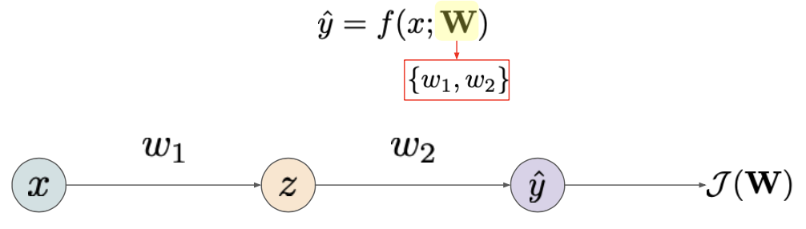
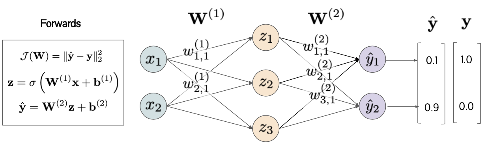

# Optimization
{: .no_toc }

  

    목차
  

  {: .text-delta }
1. TOC
{:toc}

## Backpropagation
---
매개변수에 대한 loss gradient를 계산하는 알고리즘으로, chain rule을 통해 매개변수의 업데이트는 output layer에서 input layer로 (backward) 전파된다.

예 1) two-layer neural network with one hidden node

{:style="display:block; margin-left:auto; margin-right:auto; width: 450px"}

$x\rightarrow_{\frac{\delta z}{\delta w_{1}}}^{w_{1}} z\rightarrow_{\frac{\delta\hat{y}}{\delta z}}^{w_{2}} \hat{y}\rightarrow_{\frac{\delta\mathcal{J}(W)}{\delta\hat{y}}}\mathcal{J}(W)$

$\frac{\delta\mathcal{J}(W)}{\delta w_{1}}=\frac{\delta\mathcal{J}(W)}{\delta\hat{y}}\cdot\frac{\delta\hat{y}}{\delta z}\cdot\frac{\delta z}{\delta w_{1}}$

예 2) Fully-connected network

{:style="display:block; margin-left:auto; margin-right:auto; width: 450px"}

- $\frac{\delta\mathcal{J}(W)}{\delta W^{(2)}}=\frac{\delta\mathcal{J}(W)}{\delta\hat{y}}\cdot\frac{\delta\hat{y}}{\delta W^{(2)}}=2(\hat{y}-y)z^{T}$
    - $\frac{\delta\mathcal{J}(W)}{\delta\hat{y}}=2(\hat{y}-y)$
    - $\frac{\delta\hat{y}}{\delta W^{(2)}}=z^{T}$
- $\frac{\delta\mathcal{J}(W)}{\delta b^{(2)}}=\frac{\delta\mathcal{J}(W)}{\delta\hat{y}}\cdot\frac{\delta\hat{y}}{\delta b^{(2)}}=2(\hat{y}-y)$
    - $\frac{\delta\hat{y}}{\delta b^{(2)}}=1$
- $\frac{\delta\mathcal{J}(W)}{\delta z}=\frac{\delta\mathcal{J}(W)}{\delta\hat{y}}\cdot\frac{\delta\hat{y}}{\delta z}=2(W^{(2)})^{T}(\hat{y}-y)$
    - $\frac{\delta\hat{y}}{\delta z}=(W^{(2)})^{T}$
- $\frac{\delta\mathcal{J}(W)}{\delta W^{(1)}}=\frac{\delta\mathcal{J}(W)}{\delta\hat{y}}\cdot\frac{\delta\hat{y}}{\delta z}\cdot\frac{\delta z}{\delta W^{(1)}}=\frac{\delta\mathcal{J}(W)}{\delta z}\cdot\frac{\delta z}{\delta W^{(1)}}=\frac{\delta\mathcal{J}(W)}{\delta z}\cdot x^{T}$

Gradient는 항상 연결된 edge를 따라 흐른다 (연결된 neuron끼리는 상관관계를 갖게 된다)
- Gradient는 연결된 edge를 통해서만 backpropagate된다.
- 여러 개의 edge가 있는 경우, node의 gradient는 backpropagate되는 gradients들의 합이다.

Backpropagation에 대한 가정: 신경망은 미분 가능하다 (fully differentiable)
- 만약 미분 가능하지 않다면? 
- 이산적인 값 또는 활성화 함수

## Gradient Vanishing
---
신경망 학습은 gradient update로 이루어지는데, 만약 gradient가 0이 되어버리면 어떻게 되는가?

$h=\sigma(Wz+b)$  
$\frac{\delta\mathcal{L}}{\delta W}=\frac{\delta\mathcal{L}}{\delta h}\cdot\frac{\delta h}{\delta W}=\frac{\delta\mathcal{L}}{\delta h}\cdot(z^{T})$  
$\frac{\delta\mathcal{L}}{\delta z}=\frac{\delta\mathcal{L}}{\delta h}\cdot\frac{\delta h}{\delta z}=(\sigma'(\cdot)W^{T})\cdot\frac{\delta\mathcal{L}}{\delta h}$
- $\frac{\delta\mathcal{L}}{\delta h} = 0$
    - local optima (saddle point)에 도달했을 때 (GOOD)
- $z^{T}=0$
    - 모든 activation (sum)이 0일 때 (BAD)
    - 매개변수가 업데이트되지 않음
- $W^{T}=0$
    - 모든 매개변수가 0일 때 (BAD)
    - gradient가 backpropagate되지 않음
- $\sigma'=0$
    - 비선형 함수의 미분값이 0일 때 (BAD)
    - gradient가 backpropagate되지 않음

비선형 활성화 함수

||Formula|Pros|Cons|
|---|---|---|---|
|Sigmoid|$g(z)=\frac{1}{1+\exp(-z)}$|[0,1] 사이의 값|포화된 neuron에 대해 zero-gradient   Output은 zero-centered되지 않은 positive values|
|Tanh|$g(z)=\frac{\exp(z)-\exp(-z)}{\exp(z)+\exp(-z)}$|[-1,1] 사이의 값이며 zero-centered output|포화된 neuron에 대해 zero-gradient|
|ReLU|$g(z)=\max(0,z)$|포화되지 않고 계산이 간단함|zero-centered되지 않은 output   negative activation에 대해서는 zero-gradient|
|Leaky ReLU|$g(z)=\max(0.01z, z)$|||

Weight initialization
- 너무 작은 값으로 초기화한 경우
     - $\frac{\delta\mathcal{L}}{\delta W}=\frac{\delta\mathcal{L}}{\delta h}\cdot\frac{\delta h}{\delta W}=\frac{\delta\mathcal{L}}{\delta h}\cdot(z^{T}) = 0$
     - $z^{T} = 0$ (first layer에서 zero activation이 발생하여 학습이 진행되지 않음)
- 너무 큰 값으로 초기화한 경우
    - $\frac{\delta\mathcal{L}}{\delta z}=\frac{\delta\mathcal{L}}{\delta h}\cdot\frac{\delta h}{\delta z}=(\sigma'(\cdot)W^{T})\cdot\frac{\delta\mathcal{L}}{\delta h} = 0$
    - $\sigma'=0$ (비선형 함수에서의 포화로 인해 zero-gradient가 발생하여 학습이 진행되지 않음)
- Xavier (Glorot) initialization

Normalizing activation
1. Standard normalization
    - $\hat{z}=\frac{z-E[z]}{\sqrt{V(z)}}$
    - 미니배치의 평균 및 분산을 사용하여 모든 output ($z$)을 정규화
2. Batch normalization
    - $\hat{z}=\gamma\bar{z}+\beta \text{ where } \bar{z}=\frac{z-E[z]}{\sqrt{V(z)}}$
    - 학습가능한 매개변수 ($\gamma, \beta$)를 사용하여 표준 정규화
    - 주로 비선형 활성화 함수 적용 이전에 사용된다