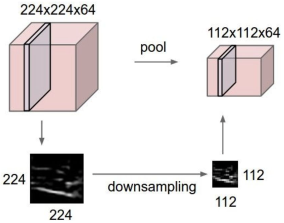

# Convolutional Neural Networks
{: .no_toc }

  

    목차
  

  {: .text-delta }
1. TOC
{:toc}

## Visual Recognition
---
`시각 데이터를 이해한다`
1. Concept의 존재 여부를 확인한다
2. Object의 위치를 파악한다
3. Concept간의 관계를 확인한다
4. Scene 내 Context를 이해한다

Challenges: 다양한 appearance variation을 처리해야 한다
- Viewpoint (보는 방향), Scale (크기), Deformation (다른 자세), Occlusion, Illumination (빛의 조건), Background clutter (호랑이 가죽 위에 있는 호랑이), Intra-class variation (의자의 다양한 종류)
- $\therefore$ Variation으로부터 invariant한 universal feature를 설계하는 것은 매우 어렵다!

## DNN for high-dimensional data
---

{:style="display:block; margin-left:auto; margin-right:auto; width: 450px"}

MLP (Multi-layer perceptron): `linear layer와 비선형 활성화 함수`의 stack

### MLP의 문제점
파라미터가 너무 많이 필요하다
- 현재 layer의 모든 neuron을 다음 layer의 모든 neuron과 연결
- 입력값의 크기 (dimension)가 클수록 신경망의 깊이와 너비 또한 증가
- 예) 28*28 이미지, 3-layer MLP (784-2048-1024-10)
    - 필요 파라미터 수: `784*2048 + 2048 + 2048*1024 + 1024 + 1024*10 + 10` = 3,716,106개
- GPU 메모리 용량을 초과한다..
    - 연산적으로 고비용 (Computationally expensive)
    - forward/backward propagation 과정에서 엄청난 연산이 요구됨
    - Overfitting이 발생할 수 있다 (파라미터의 수가 학습 데이터 수보다 지나치게 많은 경우 흔히 발생)

{:style="display:block; margin-left:auto; margin-right:auto; width: 450px"}

Fully-connected layer의 비효율성
- primitive (복잡한 대상을 표현할 때 사용되는 기초 요소)
    - `9`는 `o`과 `|`의 조합, `8`은 `o` 두 개의 조합, ... 
- 같은 primitive 라도 모든 위치에 대해서 모델이 인식하도록 파라미터를 학습시켜야 함!
    - 파라미터의 중복성 (Huge redundancy)
    - 엄청나게 큰 신경망을 필요로 함

### Filtering
값의 배열 Filter를 이용하여 모든 이미지 내 위치에서 weighted average를 계산한다

1) 4*4 filter가 주어진다

$\begin{bmatrix}
.0 & 1. & 1.& .0\newline
.0 & 1. & 1.& .0\newline
.0 & 1. & 1.& .0\newline
.0 & .9 & .9& .0\newline
\end{bmatrix}$

2) filter와 같은 이미지 영역에 대해 element-wise multiplication and average 결과를 저장한다

{:style="display:block; margin-left:auto; margin-right:auto; width: 250px"}

3) 결과
- Filter는 특정한 시각적 primitive (`o`이나 `ㅣ`)에 대한 neuron을 활성화시키는 파라미터이다.
- filter는 object가 어느 위치에 있든 처리할 수 있다
- Filtering은 translation invariant

{:style="display:block; margin-left:auto; margin-right:auto; width: 450px"}

## CNN
---

{:style="display:block; margin-left:auto; margin-right:auto; width: 450px"}

Main idea: filter를 parameterize한다
1. Input (`32*32*3` 크기의 이미지)과 filter (`5*5*3`)
2. Filter를 image에 convolve한다
    - convolve (이미지에 spatial하게 filter를 slide하면서 dot product 결과를 저장한다)
3. Activation map (연산 결과)을 얻는다
    - map size는 `28*28*1`이다 (가로/세로는 `32-5+1=28`, 높이는 `1`)
    - 6개의 (동일 사이즈) filter를 적용하면, 6개의 activation map을 얻는다
    - stacked map은 `28*28*6` 사이즈의 새로운 이미지이다

{:style="display:block; margin-left:auto; margin-right:auto; width: 450px"}

Convolution layer의 operation 종류
- Naive (위에서 했던 방식)
- Padding (이미지 boundary에 특정 value를 추가한다)
- Stride (N개의 픽셀 간격으로 sparse한 convolution)

Convolution layer의 arithmetic
- Input 크기 `N*N*C` (가로/세로/채널 수)
- Convolution `K, S, P, D` (#Kernel/Stride/Padding/#Filter)
- Output 크기 `N'*N'*C'` (가로/세로/채널 수)
    - $N'=\frac{N-K+2P}{S}+1$
    - $C'=D$

Conv layer와 Fully-connected layer
- FC layer 
    - 모든 node는 다음 layer의 모든 node에 연결)
- Conv layer 
    - 모든 node는 locally connected (kernel 크기에 의해 neighborhood 결정)
    - weight는 다른 spatial location을 따라 공유

{:style="display:block; margin-left:auto; margin-right:auto; width: 450px"}

Receptive field (field of view)
- 특정 layer의 단위 activation unit가 다루는 이미지 영역 (image region covered)으로, $R_{out}=R_{in}+(K-1)\times S$

||Input layer|1st layer|2nd layer|3rd layer|
|---|---|---|---|---|
|$R_{out}$|1|`1+(7-1)*1=7`$\rightarrow$`7*7`|`7+(3-1)*1=9`$\rightarrow$`9*9`|`9+(3-1)*2=11`$\rightarrow$`11*11`|

{:style="display:block; margin-left:auto; margin-right:auto; width: 300px"}

Spatial pooling layer
- Convolution은 local information만 다루지만, 결국은 전체 이미지 정보를 기반으로 하는 예측을 수행해야 함
- pooling window는 공간적으로 추상화된 정보를 포함 (spatially abstract information)하며, 각 채널마다 independent하게 적용된다
    1. Max-pooling (pooling window 내 최댓값을 계산)
    2. Avg-pooling (pooling window 내 평균값을 계산)

## Overview
---

{:style="display:block; margin-left:auto; margin-right:auto; width: 500px"}

Convolution Neural Network
- Convolutional layer (Convolution, 비선형 활성화 함수, pooling 과정의 반복)
    - Convolution을 사용하는 이유: 효율적인 parameterization (local connection, weight sharing)
- Fully-conneceted layer (linear layer와 비선형 활성화 함수 과정의 반복)
- Output layer (예측값에 softmax 함수를 적용하여 정규화한 값으로 label을 결정)

## CNN for image classification
---
### AlexNet
딥러닝을 적용한 첫 CNN-based model로, 8개의 layer (5개의 conv layer + 3개의 fc layer)로 구성됨

{:style="display:block; margin-left:auto; margin-right:auto; width: 500px"}

Architecture

|Layer|Configuration|Output size|#Parameter|
|---|---|---|---|
|Input||$227\times 227\times 3$||
|Conv1 (+ ReLU)|`11*11`-sized 96 kernels, stride=4, pad=0|$\frac{227-11}{4}+1=55\rightarrow 55\times 55\times 96$|11.6K|
|MaxPool + Norm|`3*3` kernel, stride=2|$\frac{55-3}{2}+1=27\rightarrow 27\times 27\times 96$||
|Conv2 (+ ReLU)|`5*5`-sized 256 kernels, stride=1, pad=2|$\frac{27-5+2*2}{1}+1=27\rightarrow 27\times 27\times 256$|6.4K|
|MaxPool + Norm|`3*3` kernel, stride=2|$\frac{27-3}{2}+1=13\rightarrow 13\times 13\times 256$|| 
|Conv3 (+ ReLU)|`3*3`-sized 384 kernels, stride=1, pad=1|$\frac{13-3+2*1}{1}+1=13\rightarrow 13\times 13\times 384$|3.5K|
|Conv4 (+ ReLU)|`3*3`-sized 384 kernels, stride=1, pad=1|$\frac{13-3+2*1}{1}+1=13\rightarrow 13\times 13\times 384$|3.5K|
|Conv5 (+ ReLU)|`3*3`-sized 256 kernels, stride=1, pad=1|$\frac{13-3+2*1}{1}+1=13\rightarrow 13\times 13\times 256$|2.3K|
|MaxPool|`3*3` kernel, stride=2|$\frac{13-3}{2}+1=6\rightarrow 6\times 6\times 256$||
|FC6|Output = 4096|$9216\times 4096$|37749K|
|FC7|Output = 4096|$4096\times 4096$|16777K|
|FC8|Output = 1000|$4096\times 1000$|4096K|

Characteristics
1. 비선형 활성화 함수로 ReLU를 활용한 첫 CNN 모델
    - sigmoid나 tanh의 경우 saturated gradient (경사도가 0에 근사)가 발생하여 학습에 문제가 발생할 수 있음
2. Conv1에서 stride값이 크다
    - feature size를 줄여서 연산량을 낮춘다
3. Normalization layer를 추가했다
    - 요즘 CNN에서는 더 이상 사용되지 않음
4. FC layer에 Dropout (=0.5)가 적용됨
    - Overfitting을 방지
    - Parameter 수가 많다 (Computationally expensive!)

### ZFNet

{:style="display:block; margin-left:auto; margin-right:auto; width: 500px"}

AlexNet에 대한 parameter tuning으로 성능을 개선
1. Conv1에서 `11*11`-sized kernel, stride=4를
    - `7*7`-sized kernel, stride=2로 변경
2. Conv3~5에서 사용한 각각 `384, 384, 256`개의 filter를
    - `512, 1024, 512`개 사용하는 것으로 변경

### VGGNet

{:style="display:block; margin-left:auto; margin-right:auto; width: 300px"}

1. AlexNet과 달리 (`11*11, 5*5, 3*3` filters) 작은 conv filter (only `3*3` filter)만 사용함
2. layer를 많이 두어서 깊은 모델을 만듦 (AlexNet: 8 layers, VGGNet: 16/19 layers)

`Small filter + Deep layer`가 `large filter + Shallow layer`보다 성능이 잘 나온 이유 = 비선형성의 증가 (More non-linearity)
- 또한 parameter 수를 줄였다

### GoogleNet

{:style="display:block; margin-left:auto; margin-right:auto; width: 500px"}

더 깊으면서도 효율적이고 정확한 모델
- VGGNet보다도 깊은 22개의 layer로 구성되며, 각 layer는 `inception module`이라는 작은 네트워크로 구성됨
- Fully-connected layer를 사용하지 않기 때문에 AlexNet 대비 12배 적은 parameter를 갖는다 (Efficient paramterization)
- Architecture
    1. Initial layer는 간단한 conv layer로 구성
    2. 상위 layer에서 부터 Inception module를 쌓고, 중간 단계마다 downsampling을 적용한다
    3. FC layer를 사용하는 대신, spatial feature의 차원을 감소시키기 위해 average pooling을 적용한다
    4. (Auxiliary loss for strong gradient signals)

{:style="display:block; margin-left:auto; margin-right:auto; width: 400px"}

Inception module
- 각각 다른 크기의 filter의 조합으로 구성
    - (`1*1, 3*3, 5*5, MaxPool with stride=1`)
- 다양한 receptive field의 정보를 모은다 (Aggregate)
- 깊은 결합 (depth-wise concatenation)을 통해 모든 filter response를 합친다
    - 각 convolution 결과가 같은 spatial feature size를 갖도록 해야 함
- **문제점** = feature dimension이 너무 크다
    - 상위 layer의 parameter 크기가 증가한다
    - 메모리 사용량이 증가한다

|Layer|Configuration|Feature size|Parameter Size|
|---|---|---|---|
|Prev layer||$28\times 28\times 256$||
|$1\times 1$ Conv|128 kernels, stride=1, pad=0|$28\times 28\times 128$|$1\times 1\times 256\times 128$|
|$3\times 3$ Conv|192 kernels, stride=1, pad=1|$28\times 28\times 192$|$3\times 3\times 256\times 192$|
|$5\times 5$ Conv|96 kernels, stride=1, pad=2|$28\times 28\times 96$|$5\times 5\times 256\times 96$|
|$3\times 3$ MaxPool|stride=1, pad=1|$28\times 28\times 256$||
|Filter concatenation||$28\times 28\times 672$  
(128+192+96+256=672)||

해결책
- 차원 감소를 위해 모든 convolution과 pooling 단계에 $1\times 1$ convolution을 추가

{:style="display:block; margin-left:auto; margin-right:auto; width: 500px"}

### ResNet

{:style="display:block; margin-left:auto; margin-right:auto; width: 500px"}

신경망 깊이에 대하여 실질적인 성능 향상에 기여한 연구
- AlexNet (8 layers - 16.4% error rate), VGGNet (16 layers - 7.3%), GoogleNet (22 layers - 6.3%)
- 신경망은 깊게 만들기만 하면 무조건 좋은 성능을 보장하는가?

{:style="display:block; margin-left:auto; margin-right:auto; width: 500px"}

Network depth와 Performance 간의 관계
- Test data에 대해서 56-layer 모델 성능 < 20-layer 모델 성능
    - 혹시 Overfitting이 발생한 것인가?
- Training data에 대해서도 56-layer < 20-layer 
    - **Overfitting 때문이 아니다**

Deep network의 성능이 하락하는 이유
- 이론상으로 학습 데이터에 대하여, deep model의 성능은 shallow model보다 적어도 나쁘지는 않아야 한다
- **그러나 deep and large network는 최적화시키는 것이 매우 어렵다**: deep network에서 발생할 수 있는 잠재적 문제
    1. Gradient vanishing (경사도 값이 0에 근사)  
    $\frac{\delta\mathcal{J}(W)}{\delta h^{(l)}}=\frac{\delta\mathcal{J}(W)}{\delta h^{(L)}}\cdot\frac{\delta h^{(L)}}{\delta h^{(L-1)}}\cdot\cdot\cdot\frac{\delta h^{(l+1)}}{\delta h^{(l)}}$
    2. Covariate shift (상위 layer에서의 작은 variation은 깊은 layer에서 큰 variation을 유발한다, 나비효과)

{:style="display:block; margin-left:auto; margin-right:auto; width: 500px"}

Residual connection
- identity mapping을 학습하는 shortcut connection을 추가한다
- identity connection을 통해서 경사도값이 우회 (bypass)하는 것을 허용하기 때문에 최적화는 더욱 쉽다

## CNN 모델 학습 팁
---
Data augmentation (데이터 증강): Overfitting을 방지하기 위해 학습 데이터를 추가하는 것
1. Flip (Horizontal, Vertical, ...)
2. Crop (Random) - 입력 이미지의 크기를 확대해서 임의의 영역을 크롭
3. Random color jittering - 임의 영역의 색의 명도/채도 변환

Fine-tuning: 다른 태스크를 위해 대용량의 학습 데이터로 학습된 모델의 weight를 활용하는 것
- 최적화의 관점에서, 좋은 local optima에 위치한 parameter 조합 상태에서 initialize할 수 있다
- Transfer learning: 한 태스크에서의 knowledge를 다른 태스크를 위해 transfer

