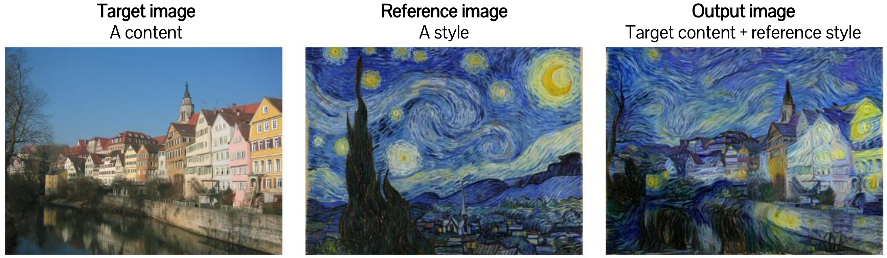
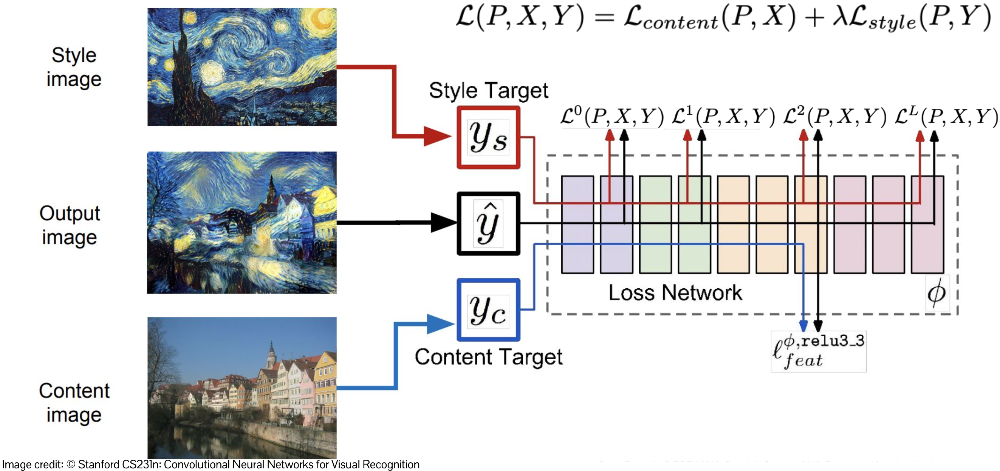
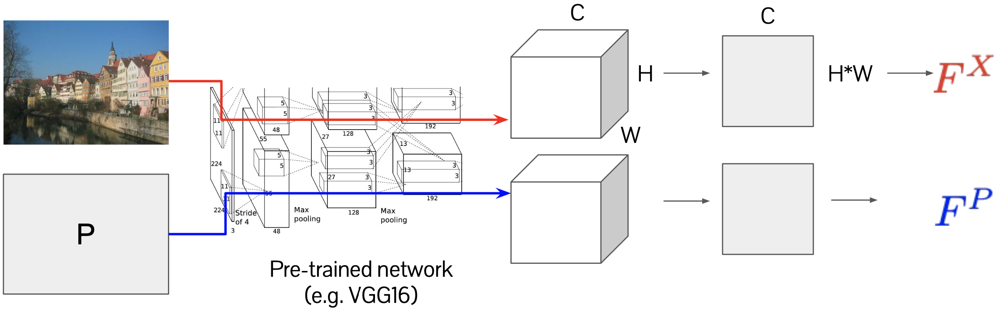
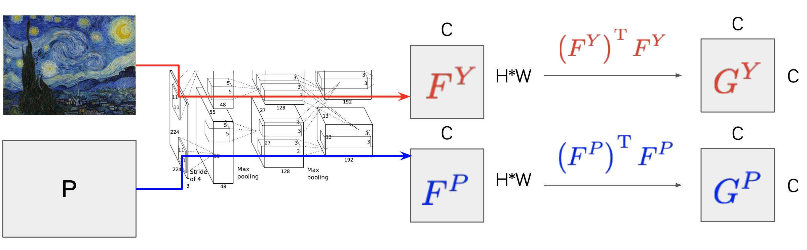
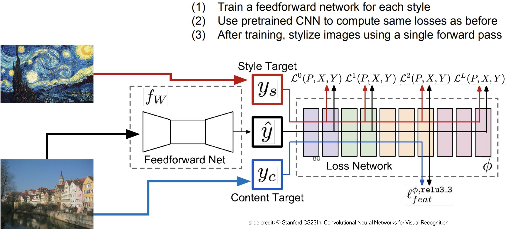
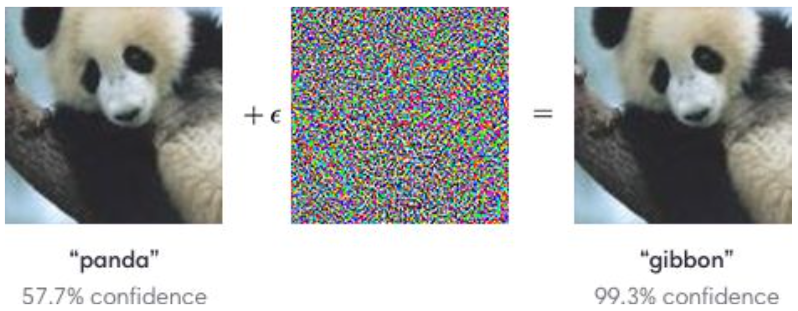
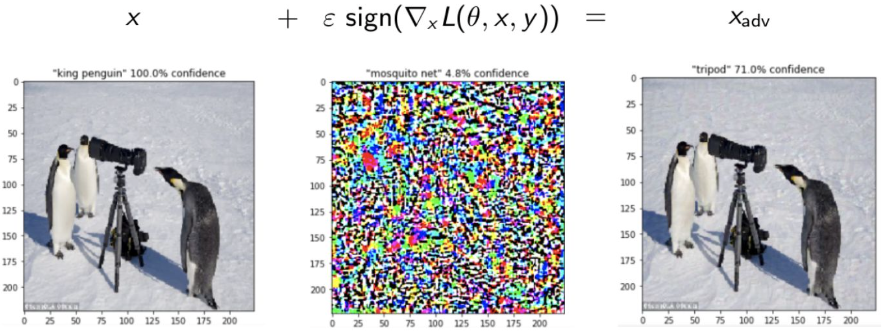
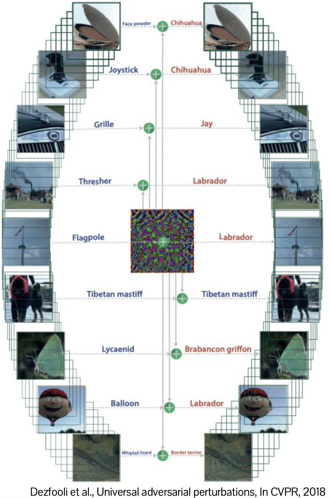

# Style Transfer, Adversarial Attacks
{: .no_toc }

  

    목차
  

  {: .text-delta }
1. TOC
{:toc}

## Neural style transfer
---
`Target image`와 `Reference image`가 주어졌을 때,  
`Target`의 content와 `Reference`의 style을 보존하는 새로운 이미지를 생성하는 것

{:style="display:block; margin-left:auto; margin-right:auto; width: 400px"}

**어떻게 Content와 Style을 정의할 수 있을까?**
- Neural Network의 `feature statistics`는 content와 style을 characterize할 수 있다.
- Target image $X$, Reference image $Y$
- Objective function: $\arg\min_{P}L_{content}(P, X)+\lambda L_{style}(P, Y)$
    - content loss와 style loss를 최소화하는 image $P$를 찾는다.

{:style="display:block; margin-left:auto; margin-right:auto; width: 400px"}

### Content loss
$L_{content}(P, X)$
- $F$: Feature map을 reshape, $(C, H, W) \rightarrow (C, H\times W)$
    - $F^{X}, F^{P}$
- $L_{content}(P, X) = \sum_{l}\sum_{i,j}(F_{ij}^{X,l}-F_{ij}^{P,l})^{2}$

{:style="display:block; margin-left:auto; margin-right:auto; width: 400px"}

### Style loss
$L_{style}(P, Y)$
- $\sum_{m=1}^{H\times W}F_{i,m}^{Y}F_{j,m}^{Y}=G_{i,j}^{Y}$
- $F^{Y} \rightarrow (F^{Y})^{T}F^{Y} = G^{Y}$
    - Gram matrix $G$: filter response 사이의 correlation으로, style을 encoding
    - $G^{Y}, G^{P}$
- $L_{style}(P, Y) = \sum_{l}\sum_{i,j}w_{l}(G_{ij}^{Y,l}-G_{ij}^{P,l})^{2}$

{:style="display:block; margin-left:auto; margin-right:auto; width: 400px"}

Overview
- Parameter를 고정시킨 상태에서, 경사 하강법으로 Random image를 반복적으로 업데이트 함
    - feature visualization 방식과 유사
- 경사 하강법을 기반으로 한 Style transfer
    - Content loss와 style loss를 최소화하며 Random image를 업데이트
- Limitation
    - 연산량이 큰 여러 번의 gradient-update가 요구된다.
    - **Single forward propagation만으로 style transfer를 할 수 있을까?**

### Single forward propagation

{:style="display:block; margin-left:auto; margin-right:auto; width: 400px"}

**Summary**
- Feature statistics를 matching하여 image style을 transfer
    - Content (Feature map)
    - Style (Gram matrix)
- Target image를 다루는 두 가지 방식
    1. Optimization-based: random image에 대한 backprop
    2. Feedforward-based: target image를 변환하는 generator를 학습

## Adversarial attack
---
{:style="display:block; margin-left:auto; margin-right:auto; width: 400px"}

ML 알고리즘의 misprediction을 유발하는 `small additive perturbation`을 찾는다

**Adversarial example이 존재하는 이유**
- 대부분의 신경망은 piecewise linear (e.g. ReLU)
- Input에서의 small perturbation이 prediction에서는 large perturbation으로 이어질 수 있음
- Real example가 Linear decision boundary를 넘게 만드는 많은 adversarial perturbation이 존재한다

ML 알고리즘의 Objective: 
- $\arg\min_{\theta}E_{(x,y)\sim D}[L(x,y;\theta)]$
- Dataset $D$의 모든 image, label $(x, y)$에 대하여, $L$을 최소화하는 model parameter $\theta$를 찾는다.

Adversarial attack의 Objective: 
- $\arg\max_{\delta}L(x+\delta, y; \theta) \text{ s.t. } \vert\vert\delta\vert\vert\le\epsilon$ 
- 특정 example, label $(x, y)$에 대하여, $L$을 **최대화**하는 perturbation $\delta$를 찾는다.
- $\delta$는 작도록 제약 조건이 있다: $\vert\vert x-(x+\delta)\vert\vert\le\epsilon$
    - 원본 이미지와 perturbed 이미지가 매우 유사하도록 만든다.

### The fast gradient sign method
Adversarial attack의 Objective function
- $\arg\max_{\delta}L(x+\delta, y; \theta) \text{ s.t. } \vert\vert\delta\vert\vert\le\epsilon$

By the 1st-order taylor expansion,
- $L(x+\delta)\approx L(x)+\delta^{T}\nabla_{x}L(x) \text{ subject to } \vert\vert\delta\vert\vert_{\infty}\le\epsilon$

**Final adversarial example **
- $x_{adv}=x+\epsilon\text{sign}(\nabla_{x}L(x))$

{:style="display:block; margin-left:auto; margin-right:auto; width: 400px"}

Adversarial example을 생성하려면 model parameter 전체에 대해 access할 수 있어야 한다.  
**다른 model과 example로 transferable한 adversarial example을 만들 수 있을까?**

### Universal adversarial perturbation
모든 이미지에 적용될 수 있는 **single perturbation**을 계산한다.
- Target classifier를 속인다. (fool)
- 모든 example을 decision boundary로 이동시킨다.

{:style="display:block; margin-left:auto; margin-right:auto; width: 300px"}

### Physical attack
Classifier를 속이기 위해 실제 image를 조작 (manipulate) 할 수 있을까?
- 생성한 Adversarial image를 print하여 사진을 찍고, crop된 사진을 다시 classifier에 적용한다.
- 실제 object에 camouflage를 적용한다.
    1. 다양한 조건에서의 실제 object data를 모은다 (e.g. 표지판)
    2. Object 표면에 adversarial noise를 적용한다
    3. Adversarial noise에 근사한 real object에 sticker를 붙인다.

### Adversarial defense
Adversarial example에 robust한 classifier를 학습시킨다
- $\min{\theta}E_{(x,y)\sim D}\Big[\max_{x_{adv}\in S(x)}L(x_{adv},y;\theta)\Big]$
    - $x_{adv}$ (Inner loop)
        - $\theta$로 학습된 classifier를 속이는 adversarial example을 생성한다.
    - $\theta$ (Outer loop)
        - real example과 adversarial example을 함꼐 사용하여 classifier를 학습시킨다.

## Summary
---
- 구별하기 어려운 perturbation을 image에 추가하는 것은 misprediction을 야기한다
- 간단한 attack method이라도 효과적으로 작용한다.
    - 대부분의 CNN 모델이 piecewise linear한 모델이기 때문이다.
- Adversarial attack으로부터 방어하기
    - Adversarial training: 학습 데이터로 adversarial example을 증강한다.
    - 근본적인 문제를 해결하지는 못한다.

