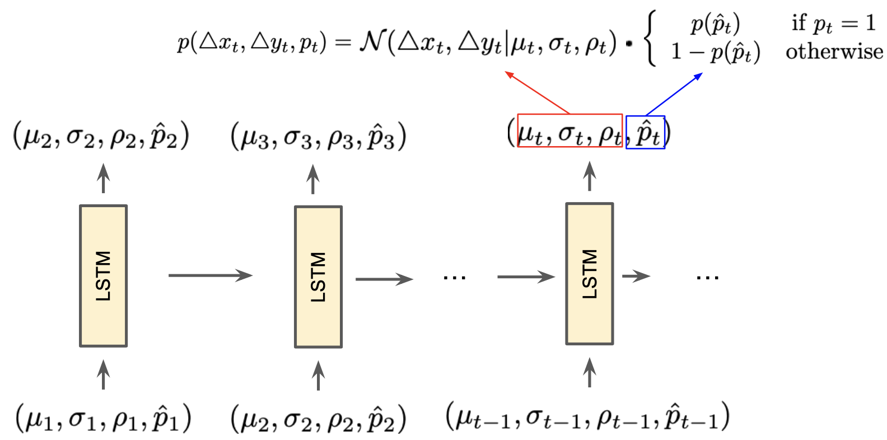
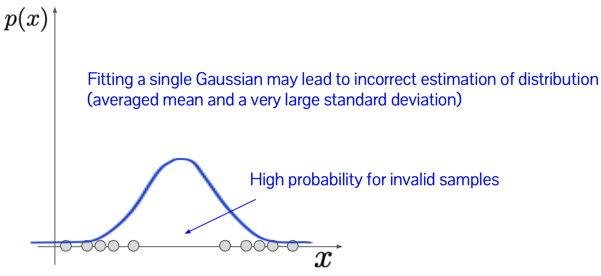
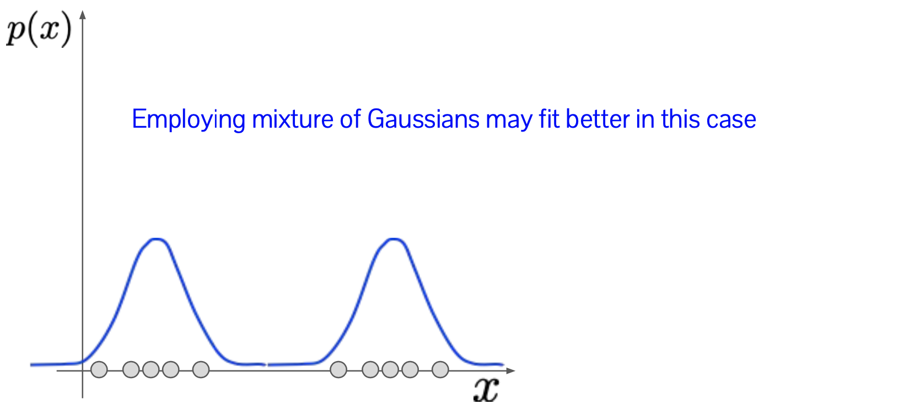
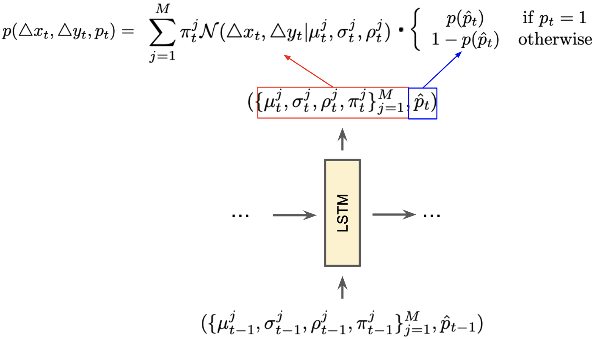

# Autoregressive Model
{: .no_toc }

  

    목차
  

  {: .text-delta }
1. TOC
{:toc}

## AR with continuous output
---

### Modeling continuous sequences
Continuous sequence: 연속적인 data로 구성된 시퀀스
- e.g. Hand-drawings (a sequence of dots or pen strokes)
  - 각 stroke는 2d point로 표현할 수 있다
  - $(x_i, y_i):$ $i$ 번째 point의 $x, y$ 좌표

**Representation** of pen strokes
- $(\Delta x_i, \Delta y_i) = (x_i - x_{i-1}, y_i - y_{i-1})$
  - `Continuous`, previous stroke position으로부터 $i$ 번째 point의 offset
- $p_i$ 
  - `Categorical`, a pen state (paper에 없으면 0, 있으면 1)

**Likelihood** of pen strokes
- Stroke coordinate: 2d gaussian distribution
  - $p(\triangle x_t, \triangle y_t)=\mathcal{N}(\triangle x_t, \triangle y_t\vert \mu_t, \sigma_t, \rho_t)$
    - $\mathcal{N}(\triangle x_t, \triangle y_t\vert \mu_t, \sigma_t, \rho_t) = \frac{1}{2\pi\sigma_x \sigma_y\sqrt{1-\rho^2}}\exp\Big[\frac{-Z}{2(1-\rho^2)}\Big]$
    - $Z = \frac{(\triangle x - \mu_x)^2}{\sigma_x^2} + \frac{(\triangle y - \mu_y)^2}{\sigma_x^2} - \frac{(\triangle x - \mu_x)(\triangle y - \mu_y)}{\sigma_x \sigma_y}$
- Pen state: Categorical distribution, softmax
  - $p(p_t)=\frac{1}{1+\exp(\hat{p}_t)}$

Overall architecture

{:style="display:block; margin-left:auto; margin-right:auto; width: 400px"}

**Issues**: Pen stroke 위치 예측 시 uncertainty
1. Previous stroke으로부터 생성될 수 있는 equally-plausible stroke가 많이 존재한다.
2. Single gaussian으로 multiple plausible outputs를 modeling하는 경우, 원치 않는 averaging effect가 발생할 수 있다. 

{:style="display:block; margin-left:auto; margin-right:auto; width: 400px"}

$\therefore$ Mixture of gaussian!

{:style="display:block; margin-left:auto; margin-right:auto; width: 400px"}

**Modification** of Stroke coordinate: 2d mixture of gaussians
- $p(\triangle x_t, \triangle y_t)=\sum_{j=1}^{M}\pi_{t}^{j}\mathcal{N}(\triangle x_t, \triangle y_t\vert \mu_t^{j}, \sigma_t^{j}, \rho_t^{j})$
  - $\mathcal{N}(\triangle x_t, \triangle y_t\vert \mu_t, \sigma_t, \rho_t) = \frac{1}{2\pi\sigma_x \sigma_y\sqrt{1-\rho^2}}\exp\Big[\frac{-Z}{2(1-\rho^2)}\Big]$
  - $Z = \frac{(\triangle x - \mu_x)^2}{\sigma_x^2} + \frac{(\triangle y - \mu_y)^2}{\sigma_x^2} - \frac{(\triangle x - \mu_x)(\triangle y - \mu_y)}{\sigma_x \sigma_y}$
  - $\pi_t^{j} = \frac{\exp(\hat{\pi}_t^{j})}{\sum_{j'=1}^{M}\exp(\hat{\pi}_t^{j'})}$

{:style="display:block; margin-left:auto; margin-right:auto; width: 400px"}

Results
- Handwriting synthesis
- Sketch synthesisx`