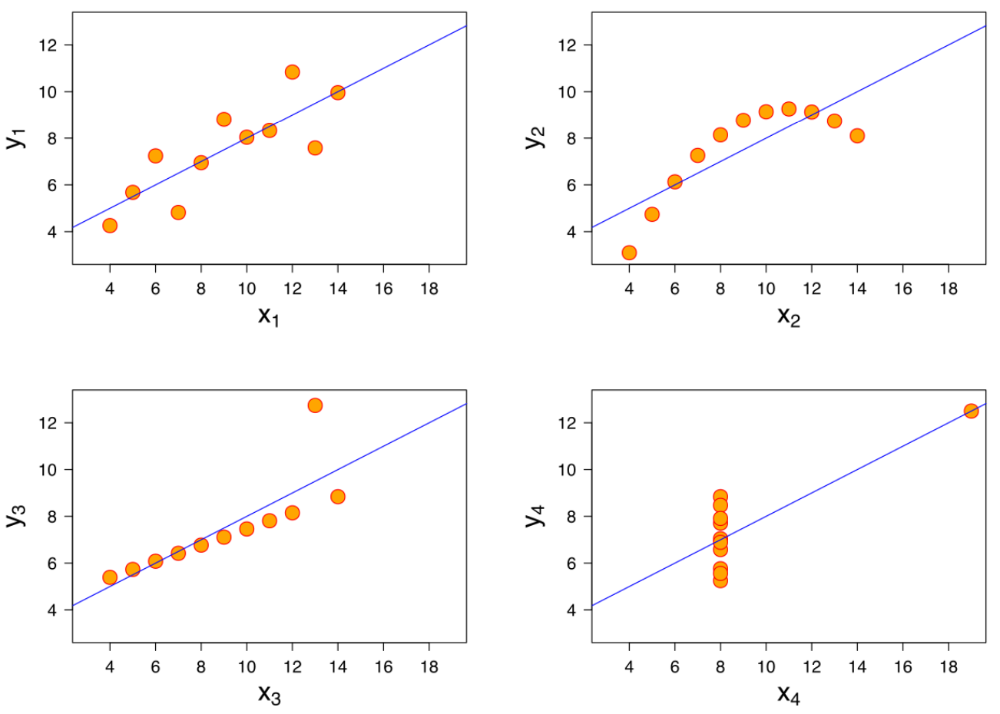
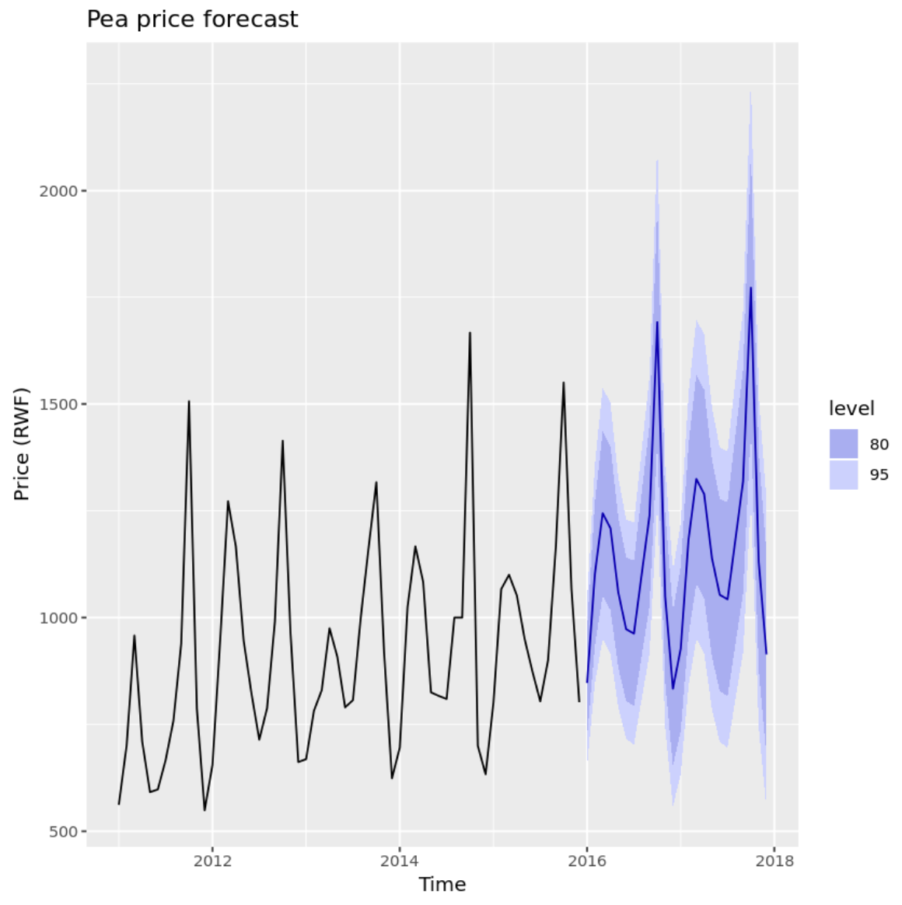
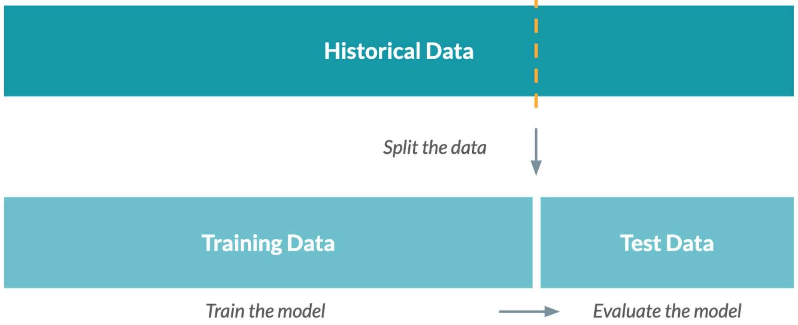

# Data Science
{: .no_toc }

  

    목차
  

  {: .text-delta }
1. TOC
{:toc}

## 데이터 사이언스란
---
저장된 대용량의 데이터 (예 - 좋아요 수, 클릭, 이메일, 카드 결제 기록, 트윗)로부터 현재 상태를 나타내거나 미래를 예측하는 (의미있는 정보를 만드는) 것
- 조직 또는 프로세스의 현재 상태를 나타낸다
- 비정상적 (anomalous) 이벤트를 감지한다
- 이벤트나 행동의 원인을 진단한다
- 미래의 이벤트를 예측한다

워크플로우
1. 데이터 수집 및 저장 (Data Collection & Storage)
2. 데이터 준비 (Data Preparation)
3. 관찰 및 시각화 (Exploration & Visualization)
4. 실험 및 예측 (Experiment & Prediction)

적용 분야 1: 머신러닝 (Traditional Machine Learning, ML)
- 예 - 위조된 거래 감지 (fraud detection)
  - 거래 기록 데이터가 주어졌을 때, 각 기록이 정상 거래인지 위조거래인지 구분

ML을 수행하기 위해 필요한 조건
1. 잘 정의된 문제: 해당 거래가 위조되었을 확률은?
2. Example data: `위조` 혹은 `정상` 거래 기록들
3. 알고리즘에 적용할 새로운 데이터셋: 새로운 신용카드 결제 기록들

적용 분야 2: 사물인터넷 (Internet of Things, IoT)
- 예 - 스마트 워치
  - 스마트 워치의 3축 가속도계 (accelerometer) 데이터가 주어졌을 때 해당 시계열 데이터를 보고 사용자의 행동 (예 - 달리기, 걷기, 앉기 등)을 인지

IoT는 일반적인 컴퓨터가 아닌 가젯 (gadget)을 활용
- 스마트 워치
- 홈 보안 시스템
- 하이패스 (Electronic toll collection)
- 건물 에너지 관리 시스템

적용 분야 3: 딥러닝 (Deep Learning, DL)
- 예 - 이미지 인지 (image recognition)
  - 여러 뉴런 (neuron)으로 구성된 학습 모델이며, 대용량의 학습 데이터를 필요로 함
  - 복잡한 문제 해결에 사용됨: 이미지 분류, 언어 학습/이해

## 역할 및 도구
---
### Data Engineer
정보를 설계하며, 데이터에 대한 접근을 관리하며 데이터 파이프라인 및 저장 솔루션을 구축한다 - `데이터 수집 및 저장`
- `SQL`: 데이터 저장 및 조직화에 필요
- `Java/Scala/Python`: 데이터 처리를 위한 프로그래밍 언어
- `Shell`: 태스크를 실행 및 자동화
- `Cloud Computing`: AWS, Azure, Google Cloud Platform

### Data Analyst
분석을 위한 데이터 전처리와 함께 데이터를 나타내는 간단한 분석 (데이터 요약 보고서나 대시보드)을 수행 - `데이터 준비, 관찰 및 시각화`
- `SQL`: 데이터를 검색하고 집계 (aggregate)
- `Python/R`: 데이터 전처리 및 분석
- `Spreadsheets - Excel, Google sheets`: 간단 분석
- `BI tools - Tableau, Power BI, Looker`: 대시보드 및 시각화

### Data Scientist
머신러닝 등 통계 방법론을 잘 다루며, 실험 및 분석을 통해 인사이트를 얻는다 - `데이터 준비, 관찰 및 시각화, 실험 및 예측`
- `SQL`: 데이터를 검색하고 집계
- `Python/R`: `pandas`나 `tidyverse` 같은 데이터 사이언스를 위한 라이브러리를 활용

### Machine Learning Scientist
딥러닝 기반 태스크 (이미지 처리, 자연 언어 처리 등)를 통해 데이터를 통한 예측 및 추정 - `실험 및 예측`에 심화
- `Python/R`: `Tensorflow`나 `Spark` 등의 머신러닝 라이브러리 활용

## 데이터 수집
---
### 데이터 소스
회사 데이터: 회사에서 수집된 데이터로 데이터 기반 의사결정을 할 수 있도록 활용
- 웹 데이터, 설문조사, 소비자, 물류, 금융 거래 데이터 등
- Net Promoter Score (NPS)

오픈 데이터: 무료의 개방된 데이터로 누구나 사용 및 공유가 가능
- 데이터 API (Application Programming Interface)
    - 인터넷을 통해 데이터를 요청할 수 있음
    - 트위터, 위키피디아, 야후 파이낸스, 구글 맵 등
- 공공 기록: 국제 기구, 국내 통계청, 정부 기관

### 데이터 타입
데이터 타입에 따라 데이터를 저장하거나 분석 및 시각화하는 방식이 다를 수 있다.
- 이미지: 픽셀
- 텍스트: 리뷰
- 공간 (geospatial): 도로, 건물, 식물 위치 등
- 네트워크 등: 사용자 계정 간 팔로우 관계

양적 데이터 (Quantitative): 숫자로 측정되는 것
- 냉장고는 `60 inch`의 높이를 갖고, 내부에는 `2개`의 사과가 있고, 가격은 `1000불`이다.

질적 데이터 (Qualitative): 설명이 필요하며, 관찰될 수 있으나 측정되지는 않는 것
- 냉장고는 `빨간색`이고, `이태리에서 생산`되었고, 내부에서는 `생선 냄새`가 난다.

### 데이터 저장 및 검색
- 위치
    1. `On-premises cluster`: 자체 서버
    2. `Cloud`: Azure, AWS, Google Cloud
- 데이터 타입
    - 비구조적 형태 (이메일, 텍스트, 비디오/오디오, 웹 페이지, 소셜미디어) - `Document DB`
    - 테이블 형태 (Tabular) - `Relational DB`
- 검색

||쿼리 언어|데이터 타입|
|---|---|---|
|Document DB|NoSQL|Unstructured|
|Relational DB|SQL|Tabular|

### 데이터 파이프라인
다양한 데이터 소스 (공공 기록, APIs, DBs)와 서로 다른 데이터 타입 (비구조적, 테이블, 실시간 스트림 데이터)을 갖는 데이터를 처리
- 데이터를 정의된 단계로 전송하며, 데이터 수집 및 저장을 자동화함
- 빅데이터 프로젝트에 필수적이며, 데이터 엔지니어의 역할
- `ETL`: Extract - Transform - Load

Case Study: 스마트 홈

|데이터|소스|주기|
|---|---|---|
|날씨|기상청 API|30분|
|트윗|트위터 API|실시간 스트림|
|실내 온도|스마트 홈 온도계|5분|
|전등 상태|스마트 전구|1분|
|현관문 상태|스마트 도어|15초|
|에너지 소비|스마트 측정기|매주|

1. Extract: 모든 데이터를 데이터 소스로부터 가져옴
2. Transform: 서로 다른 데이터를 어떻게 사용하기 쉽게 조직화할 것인가?
    - 데이터 소스를 JOIN하여 하나의 데이터셋으로
    - 데이터 구조를 DB 스키마에 맞도록 변환
    - 관련없는 데이터 삭제
    - **데이터 준비, 관찰은 아직 수행되지 않음**
3. Load
4. Automation (ETL의 자동화)

## 데이터 준비
---
실제 데이터는 매우 더러운 상태 (값이 없거나 잘못된 값이거나..)이기 때문에 오류, 잘못된 결과, 편향된 (biased) 결과를 방지하기 위해 필요한 단계

||Sara|Lis|Hadrien|Lis|
|---|---|---|---|---|
|Age|"27"|"30"||"30"|
|Size|1.77|5.58|1.80|5.58|
|Country|"Belgium"|"USA"|"FR"|"USA"|

Tidy data
- 변수 (나이, 키, 국적)를 column에, 각 관측치 (Sara, Lis, Hadrien, Lis)는 row로

|Name|Age|Size|Country|
|---|---|---|---|
|Sara|"26"|1.78|"Belgium"|
|Lis|"30"|5.58|"USA"|
|Hadrien||1.80|"FR"|
|Lis|"30"|5.58|"USA"|

중복된 데이터 제거
- `Sara`의 데이터가 중복되어 들어있을 때

|Name|Age|Size|Country|
|---|---|---|---|
|Sara|"26"|1.78|"Belgium"|
|Lis|"30"|5.58|"USA"|
|Hadrien||1.80|"FR"|

고유 ID 부여하기
- 이름이 같을 경우 어떻게 구별할 것인가?

|ID|Name|Age|Size|Country|
|---|---|---|---|---|
|0|Sara|"26"|1.78|"Belgium"|
|1|Lis|"30"|5.58|"USA"|
|2|Hadrien||1.80|"FR"|

Homogeneity
- 키의 단위 (`feet`, `m`)가 나라마다 다르기 때문에 `m`로 통일
- 국적명을 2개의 이니셜로 통일

|ID|Name|Age|Size|Country|
|---|---|---|---|---|
|0|Sara|"26"|1.78|"BE"|
|1|Lis|"30"|1.70|"US"|
|2|Hadrien||1.80|"FR"|

데이터 타입
- `Age`는 숫자이기 때문에 INT 타입으로 변환

|ID|Name|Age|Size|Country|
|---|---|---|---|---|
|0|Sara|26|1.78|"BE"|
|1|Lis|30|1.70|"US"|
|2|Hadrien||1.80|"FR"|

Missing values
- 오류일수도 있고, 의도된 것 (사용자가 기입하지 않음)일 수도 있다.
- 값을 특정 값 (나머지 값들의 평균)으로 채워넣거나, 나머지 값도 다 버리거나, 그냥 그대로 둘 수도 있음

|ID|Name|Age|Size|Country|
|---|---|---|---|---|
|0|Sara|26|1.78|"BE"|
|1|Lis|30|1.70|"US"|
|2|Hadrien|28|1.80|"FR"|

## 데이터 시각화
---
### EDA (Exploratory Data Analysis)
1. 데이터를 관찰한다
2. 가설을 세운다
3. 특징을 검증한다
4. 시각화한다

|x1|y1|x2|y2|x3|y3|x4|y4|
|---|---|---|---|---|---|---|---|
|10.0 |8.04 |10.0 |9.14 |10.0 |7.46 |8.0  |6.58 |
|8.0  |6.95 |8.0  |8.14 |8.0  |6.77 |8.0  |5.76 |
|13.0 |7.58 |13.0 |8.74 |13.0 |12.74|8.0  |7.71 |
|9.0  |8.81 |9.0  |8.77 |9.0  |7.11 |8.0  |8.84 |
|11.0 |8.33 |11.0 |9.26 |11.0 |7.81 |8.0  |8.47 |
|14.0 |9.96 |14.0 |8.10 |14.0 |8.84 |8.0  |7.04 |
|6.0  |7.24 |6.0  |6.13 |6.0  |6.08 |8.0  |5.25 |
|4.0  |4.26 |4.0  |3.10 |4.0  |5.39 |19.0 |12.50|
|12.0 |10.84|12.0 |9.13 |12.0 |8.15 |8.0  |5.56 |
|7.0  |4.82 |7.0  |7.26 |7.0  |6.42 |8.0  |7.91 |
|5.0  |5.68 |5.0  |4.74 |5.0  |5.73 |8.0  |6.89 |

$(x_{i}, y_{i})$로 구성된 4개의 데이터셋이 있을 때, 이들은 유사한 특성을 갖는다.
- $x$의 평균과 분산이 동일
- $y$의 평균과 분산이 동일
- 상관계수 동일
- 선형 회귀 방정식 동일

각 데이터셋의 선형 회귀 방정식을 시각화해보자. 

### 대시보드 (Interactive Dashboards)
- Color의 사용은 반드시 목적이 있어야한다
    - 연도별로 색상을 다르게 할 필요가 있는가?
    - `Red, Green`이 가장 많이 사용됨
- 가독성 좋은 글꼴: `sans-serif`
- 그래프에 라벨링: 제목, 가로/세로 축, 범례 (legend)
- 축: 서로 비교하는 값의 대소 관계가 명확하도록

## 실험 (Experiment)
---
실험은 의사결정을 유도하고 결론을 이끌어낸다.
1. 문제, 질문을 정의한다
2. 가설을 세운다
3. 데이터를 수집한다
4. 가설에 대해 통계적 검증을 수행한다
5. 결과를 해석한다

용어 정리
- 샘플 크기: 사용된 데이터 포인트의 수
- 통계적 유의성: `결과가 우연에 의한 것이 아니다`
    - 통계적 모델에 대해 가정을 세운다
    - 통계적 검정을 수행한다: `t-test, Z-test, ANOVA, Chi-square test`

Case study: 어떤 블로그 제목이 더 나은가?
- 문제 정의: `제목 A 또는 B 중 더 많은 클릭 수를 유발한 것은?`
- 가설 설정: `제목 A와 B는 동일한 클릭 수를 유발한다.`
- 데이터 수집:
    - 사용자 중 절반은 제목 A를, 나머지 절반은 제목 B를 본다
    - 목표한 샘플 크기에 도달할 때까지 클릭 비율 (click-through rate)을 추적한다
- 가설에 대한 통계 검증 수행:
    - `제목별 클릭 비율의 차이는 유의미한가?`
- 결과 해석:
    - 두 제목 중 하나를 선택하거나, 추가 실험을 하거나, 다른 실험을 설게한다.

### A/B Testing
Champion/Challenger Testing라고도 한다.
1. tracking할 metric을 결정한다: `click-through rate`
    - 전체 사용자 중 제목 링크를 선택한 사용자의 비율
    - 변화를 측정하기 위한 `baseline metric`을 구한다: 평소에 사람들이 얼마나 자주 블로그 제목을 클릭하는지
2. 샘플 크기를 계산한다.
    - `click-through rate`이 50%보다 훨씬 크거나 작은 경우, 샘플 크기를 키운다
        - 일반적으로 클릭 비율은 매우 낮다 ($<3\%$)
    - 샘플 크기가 클수록 작은 변화를 감지할 수 있다
        - (작은 샘플 크기) low sensitivity, large differences
        - (큰 샘플 크기) high sensitivity, small differences
3. 실험을 수행한다.
4. 유의성을 확인한다.
    - 만약 결과가 유의미하지 않다면?
        - difference는 우리가 선택한 임계값보다 작다
        - 검정을 더 오래하는 것이 도움이 되진 않는다

### 모델링
통계적 모델이란
- 통계로 실제 프로세스를 표현
- 임의변수를 포함하여 변수 간의 수학적 관계를 나타냄
- 통계적 가정과 이전 데이터를 기반으로 함

예측적 모델링 (Predictive modeling)  
`New Input` $\rightarrow$ `Predictive Model` $\rightarrow$ `Outcome`
- New Input (미래 특정 날짜, 트윗)
- Predictive Model (선형 회귀 방정식, Neural Net)
- Outcome (실업률, 가짜 트윗일 확률)

### 시계열 예측 (Time Series Forecasting)
시간에 따라 순차적으로 발생하는 데이터인 시계열 데이터 (주식 및 가스 가격, 실업률, 맥박 등)를 다루며, 과거 데이터로부터 예측 결과를 도출하는 모델을 만듦
- 다음 달 강우량?
- 30분 이후의 교통량 변화?
- 앞으로 6시간 동안의 주식 가격 변화?
- 20년 후의 인구 변화?

시계열 데이터

|Date|Rate|
|---|---|
|1976-01-01|7.1|
|1976-02-01|7|
|...|...|
|1991-01-01|10.3|
|...|...|
|2015-04-01|6.8|
|2015-05-01|6.8|

계절성 (Seasonality): 일정 주기마다 반복되는 특징
- 아이스크림 판매량이 여름에는 높고 겨울에는 낮다
- 소비량이 매월 말에는 높게 나타난다 (월급 들어오는 날)

신뢰구간 (Confidence Intervals)
- 실제 값이 해당 구간 내에 발생할 것이라고 모델은 $x\%$ 확신함

### 지도 기계학습 (Supervised ML)
`label`과 `features`를 갖는 데이터를 이용하여 `label`을 예측
- `label`: 예측하고자 하는 결과
- `features`: `label` 예측에 필요한 데이터
- 추천 시스템, 생의학 이미지 진단, 숫자 인식, 가입자 이탈률 (customer churn) 예측

Case study: 가입자 이탈률 예측
1. 학습 데이터로 예측 모델을 학습시킨다.
2. 새로운 소비자 데이터의 `features`를 예측 모델에 넣어 `label`을 예측한다.

학습 데이터 (Training data)
- `label`: 가입자 구독/해지 여부
- `features`: 소비자 데이터
    - 나이, 성별, 직업, 거주지, 최근 방문일 등

모델 평가 (Model evaluation)
- 이전 데이터를 학습 데이터와 테스트 데이터로 분할한다.

### 비지도 기계학습 (Unsupervised ML)
`features`만 갖는 데이터 (`unlabeled data`)를 이용

클러스터링 (Clustering)
- 데이터를 여러 카테고리로 분류
- 소비자 분할, 이미지 분할, 이상 감지 등에 활용됨

Case study: 새로운 품종 분류하기
1. `feature` 정의하기
    - 꽃 색깔, 꽃잎의 길이/너비, 꽃받침의 길이/너비, 꽃잎 수
2. `cluster number` 정하기
    - number에 따른 클러스터링 결과를 보고 직접 결정
    - domain knowledge가 최적의 수를 정하는데 필요할 수 있다
3. 문제 해결을 위해 `clustering result`를 활용