# Data Visualization
{: .no_toc }

  

    목차
  

  {: .text-delta }
1. TOC
{:toc}

## Introduction
---
데이터로부터 Insight를 얻는 세 가지 방법
1. **통계 (Summary statistics)**: 평균, 중앙값, 표준편차
2. **모델 실행**: 선형 회귀, 로지스틱 회귀
3. **Plot 그리기**: Scatter, Bar, Histogram

예 - [Datasaurus Dozen] 데이터셋
- `away`, `bullseye` 등 각 데이터셋은 `(x, y)` 좌표 데이터로 구성되어 있다.
- 각 데이터셋의 `mean(x)`, `mean(y)`, `std(x)`, `std(y)`는 모두 동일하다.

[Datasaurus Dozen]: https://www.autodeskresearch.com/publications/samestats

|away_x|away_y|bullseye_x|bullseye_y|...|x_shape_x|x_shape_y|
|---|---|---|---|---|---|---|
|32.33|61.41|51.20|83.34|...|38.34|92.47|
|53.42|26.19|58.97|85.50|...|35.75|94.12|
|...|...|...|...|...|...|...|
|63.92|30.83|51.87|85.83|...|32.77|88.52|

그러나 각 데이터셋의 분포는 아래 그림과 같이 다르다.

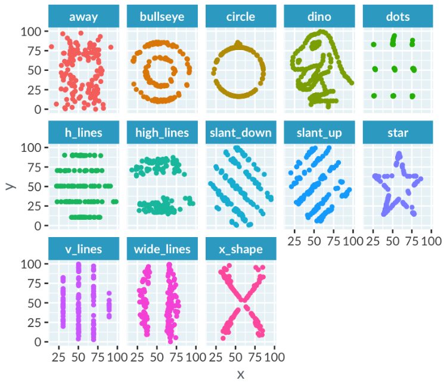{:style="display:block; margin-left:auto; margin-right:auto; width: 500px"}

연속 변수와 카테고리 변수
1. **연속 변수** (주로 숫자): 높이, 온도, 수익 등
2. **카테고리 변수** (주로 텍스트): 눈동자 색깔, 나라, 산업 등
  - 나이 (20세) 는 연속 변수이지만, 연령대 (20-29세) 는 카테고리 변수
  - 시간은 연속 변수이지만, 월 (month)은 카테고리 변수

## Histogram
---
Histogram을 사용하는 이유
1. 단일 연속 변수 데이터를 표현하는 경우
2. 데이터 분포 형태를 분석하려는 경우

예 - 영국의 왕 (Kings and Queens)들의 집권 시작 당시 나이 (age at start of rule)에 따른 Histogram

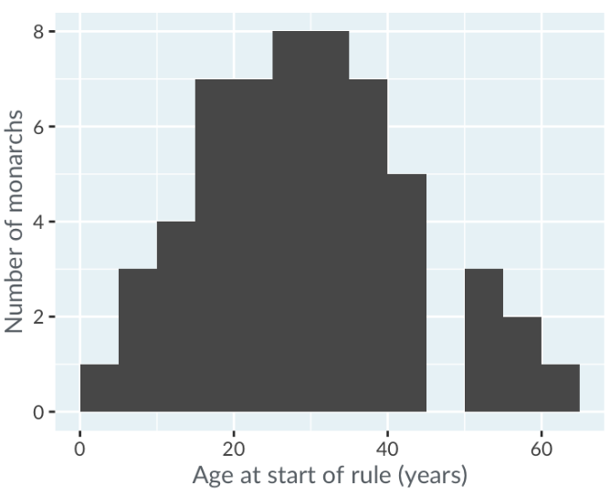{:style="display:block; margin-left:auto; margin-right:auto; width: 300px"}

binwidth: 하나의 bar에 포함되는 데이터 값의 범위
- 너무 짧으면 전체 데이터가 많은 bin으로 나눠지게 됨
- 너무 긴 경우에는 분명히 다른 분류로 취급되어야 할 데이터끼리 같은 bin에 속하게 되어 
- 두 경우 모두 데이터 분포를 해석하기 어려우므로, 적절한 binwidth를 설정해야 한다.

modality: peak의 수
- `unimodal, bimodal, trimodal, ...`

skewness: extreme value의 수
1. left-skewed: Histogram 왼쪽이 꼬리 (tail, 데이터가 거의 없음)이고 오른쪽에 데이터가 치우친 경우
2. symmetric: Histogram이 축을 기준으로 대칭인 형태
3. right-skewed: Histogram 오른쪽이 꼬리이고 왼쪽에 데이터가 치우친 경우

kurtosis: 데이터 분포의 뾰족한 정도 (How many extreme values?)
1. leptokurtic: 분포의 형태가 평균을 중심으로 뾰족하게 모인 경우
  - `lepto`는 얇다는 의미
2. mesokurtic: 분포의 형태가 정규분포 모양과 유사한 경우
3. platykurtic: 분포의 형태가 평균을 중심으로 넓게 펼쳐진 경우
  - `platy`는 넓다는 의미

## Box plots
---
Boxplot을 사용하는 이유
1. (카테고리 변수로 분할할 수 있는) 연속 변수를 표현하는 경우
2. 각 카테고리마다 연속 변수의 분포를 비교하려는 경우

Boxplot 해석
- mid-line (중앙값)
- box
  - `lower quartile (LQ)` (1/4분위수)
  - `upper quartile (UQ)` (3/4분위수)
  - `Inter-quartile range (IQR)`: `LQ`와 `UQ` 사이 범위
- whisker
  - `lower whisker` (`LQ - 1.5*IQR` 보다 큰 값 중 최솟값)
  - `upper whisker` (`UQ + 1.5*IQR` 보다 작은 값 중 최댓값)

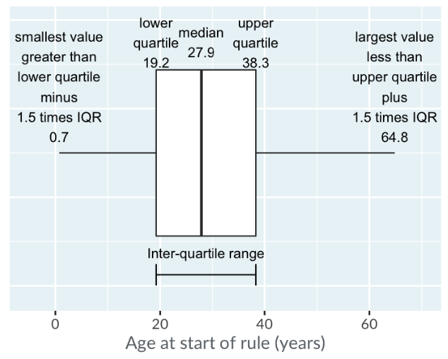{:style="display:block; margin-left:auto; margin-right:auto; width: 300px"}

## Scatter plots
---
Scatterplot을 사용하는 이유
1. 두 개의 카테고리 변수를 표현하려는 경우
2. 두 카테고리 변수 간의 관계를 분석하려는 경우

예 - LA County의 집값

|city|n_beds|price_musd|area_sqft|
|---|---|---|---|
|Long Beach|1|0.3250|846|
|Beverly Hills|3|2.1950|2930|
|...|...|...|...|
|Westwood|3|0.6950|1913|

집값 (Price)과 평수 (Area)의 관계 - 우측 plot은 Price를 log-scale로 표현

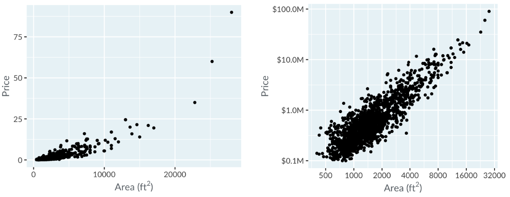{:style="display:block; margin-left:auto; margin-right:auto; width: 400px"}

### 상관관계 (Correlation)
1. Strong negative: 군집되어 직선을 이루고 기울기가 음수
2. Weak negative: 분산되어 직선을 이루고 기울기가 음수
3. No: 직선을 이루지 않음
4. Weak positive: 분산되어 직선을 이루고 기울기가 양수
5. Strong positive: 군집되어 직선을 이루고 기울기가 양수

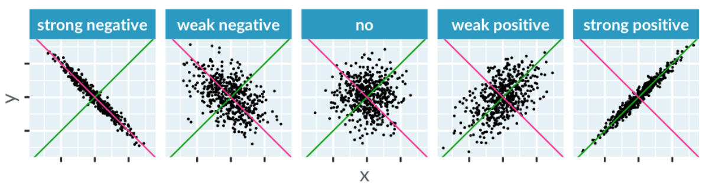{:style="display:block; margin-left:auto; margin-right:auto; width: 400px"}

## Line plots
---
Lineplot을 사용하는 이유
1. 두 개의 카테고리 변수 데이터가 있다
2. 두 변수 사이의 관계를 분석해야 한다
3. 연속된 데이터끼리 연결되어 있다
4. (대부분의 경우 $x$축은 날짜 또는 시간이다)

예 - [COVID-19 누적 확진자]

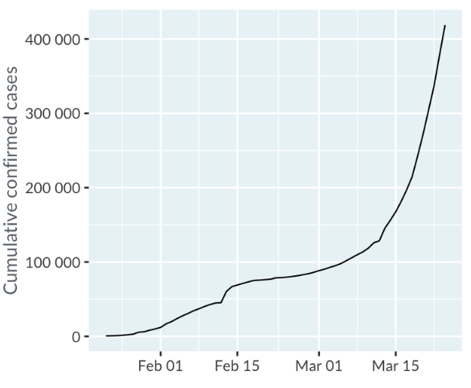{:style="display:block; margin-left:auto; margin-right:auto; width: 300px"}

[COVID-19 누적 확진자]: https://github.com/RamiKrispin/coronavirus

## Bar plots
---
Barplot을 사용하는 이유
1. 단일 카테고리 변수 데이터가 있다.
2. 카테고리 별 횟수 또는 퍼센트를 계산해야 한다.

예 - [ESPN 선정 2017년 유명 운동선수 TOP 100] 나라별 선수 수

[ESPN 선정 2017년 유명 운동선수 TOP 100]: https://data.world/wesmagee/2017-espn-world-fame-100

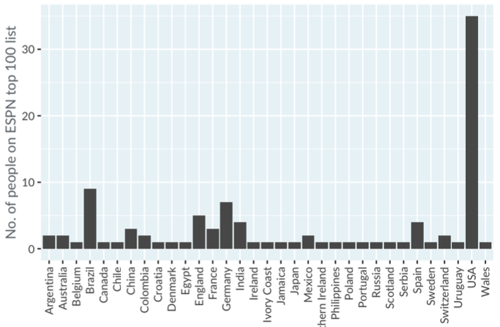{:style="display:block; margin-left:auto; margin-right:auto; width: 300px"}

Stacking bars
 - [어린이들의 과일/채소 소비량] 전체 대비 섭취량에 따른 어린이 구성 퍼센트

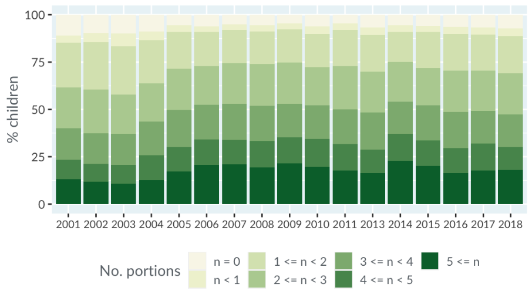{:style="display:block; margin-left:auto; margin-right:auto; width: 300px"}

[어린이들의 과일/채소 소비량]: https://digital.nhs.uk/data-and-information/publications/statistical/health-survey-for-england/2018/health-survey-for-england-2018-data-tables

## Dot plots
---
Dotplot을 사용하는 이유
1. 카테고리 변수 데이터가 있다.
2. 각 카테고리에 대한 점수를 나타내야 한다.
  - log-scale로 나타내거나, 여러 점수들을 나타내는 경우

예 - 지구 근처의 별과 왜소 행성 (Nearby stars and brown dwarfs)들을 태양 대비 질량 순으로 정렬
- 질량은 log-scale로 표현

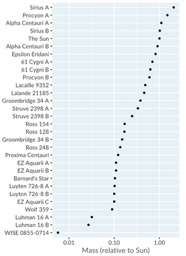{:style="display:block; margin-left:auto; margin-right:auto; width: 300px"}

## Polar Coordinates
---
극좌표를 사용하는 경우
1. **거의 없음**
2. 하루 중 시간, 나침반 방향 같이 Circular한 특성을 갖는 변수를 갖는 경우 가끔 사용함

극좌표를 활용한 방식
1. Pie plots = `Bar plot` + `Polar coordinates`
2. Rose plots = `Histogram` + `Polar coordinates`

## High Dimension Visualziation
---
$(x, y)$가 (평균 학교 교육 기간, 1인당 국민소득)이라고 할 때, `평균 수명`이라는 카테고리를 표현하려고 한다.

Scatterplot
1. New axis: ~~데이터를 해석하기 어려워진다~~
2. Color: 평균 수명 (<60 파랑), (60-70 녹색), (70-80 노랑)
3. Size: 평균 수명 (<60 Small), (60-70 M), (70-80 L)
4. Transparency: 평균 수명 (<60 0.1), (60-70 0.5), (70-80 0.9)
5. Shape: 평균 수명 (<60 원), (60-70 세모), (70-80 네모)
6. Multiple graphs: N개의 연령대 각각에 대한 그래프

Lineplot
1. Color: 카테고리 별 multiple lines
2. Linetype: Solid, dashes, Dotted, ...
3. Thickness
4. Transparency

Colorspaces
- RGB (Red-Green-Blue) 또는 CMYK (Cyan-Magenta-Yellow-blacK)
  - Color를 고를 때, 현재 Color와 다음 Color 간의 `perceptual distance`은 일정해야 한다.
- HCL (Hue-Chroma-Luminance)
  - Hue
  - Chroma (Hue의 맑고 탁한 정도)
  - Luminance (밝기)

### Colorscale의 세 가지 종류

|종류|목적|변화시킬 특성|
|---|---|---|
|Qualitative|정렬되지 않은 카테고리 분류|Hue|
|Sequential|순서 표현|Chroma 또는 Luminance|
|Diverging|기준점 이상 또는 이하 표현|H,C,L|

Qualitative palette: 각 카테고리 (자동차, 냉장고, 스토브, 청소기)의 연도별 adoption 퍼센트

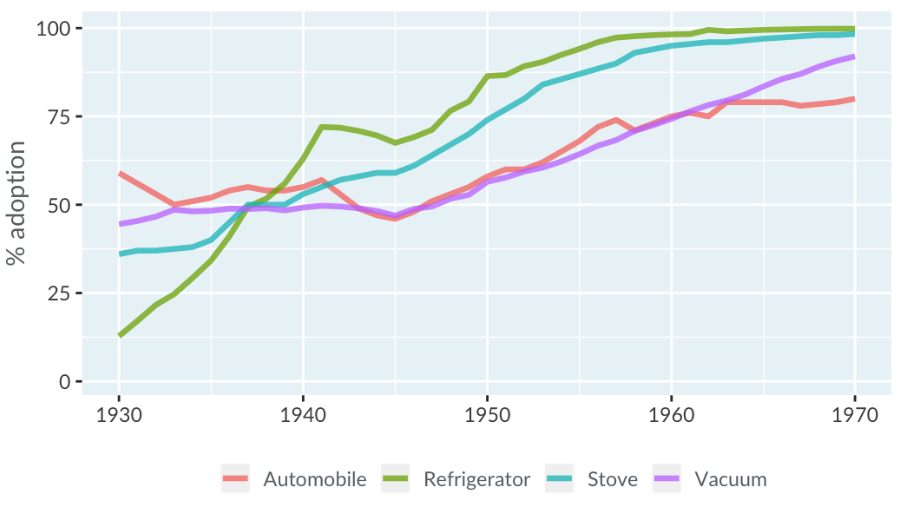{:style="display:block; margin-left:auto; margin-right:auto; width: 300px"}

Sequential palette: Bar plots > Stacking bars 참조

Diverging palette: [친환경 기술에 대한 말레이시아 여론조사]

[친환경 기술에 대한 말레이시아 여론조사]: http://dx.doi.org/10.17632/wggvryfhsk.1

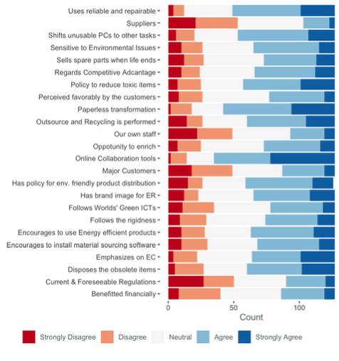{:style="display:block; margin-left:auto; margin-right:auto; width: 300px"}

### Pair plots
Pairplot을 사용하는 이유
1. 최대 10개의 변수가 있다 (연속 변수든 카테고리 변수든)
2. 각 변수의 분포를 표현해야 한다
3. 각 변수 쌍 사이의 관계를 분석한다

예 - 4개의 변수 (도시, 침대 수, 집값, 평수)

{:style="display:block; margin-left:auto; margin-right:auto; width: 300px"}

- Diagonal
  - (도시, 도시): 도시에 따른 Histogram
  - 나머지: 침대 수, 집값, 평수에 따른 각 Histogram
- (침대 수, 집값, 평수)
  - Lower triangle: 변수 쌍으로 표현된 Scatterplot
  - Upper triangle: 변수 쌍 사이의 상관관계 값
- 도시와 나머지 변수
  - first column: 나머지 변수 각각에 대한 도시별 Histogram
  - first row: 나머지 변수 각각에 대한 도시별 Boxplot

### Correlation heatmap
Correlation heatmap을 사용하는 이유
1. 많은 카테고리 변수 데이터가 있다
2. 각 변수 쌍 사이의 연관관계를 간단한 Overview로

예 - [마케팅 요소 간의 상관관계]

{:style="display:block; margin-left:auto; margin-right:auto; width: 300px"}

[마케팅 요소 간의 상관관계]: https://www.jstor.org/stable/4129743

### Parallel coordinates
Parallel coordinates를 사용하는 이유
1. 많은 연속 변수 데이터가 있다
2. 변수들 간의 패턴을 찾거나
3. 데이터의 클러스터를 시각화한다

예 - 대륙별 `1인당 국민소득, 인간개발지수, 기대수명, 학교교육기간`의 정도

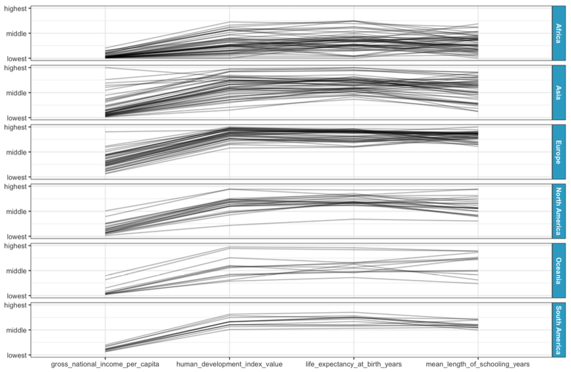{:style="display:block; margin-left:auto; margin-right:auto; width: 300px"}

## 좋은 시각화란
---
1. Plot에서 독자가 얼마나 많은 insight를 얻을 수 있는가?
2. 얼마나 빠르게 독자가 insight를 획득할 수 있는가?

Plot 주의사항
- 값의 차이에 비례하게 시각화해야 함
- 가급적 2개의 축을 같은 방향으로 plot (Dual axes) 하지 않고 multiple panel로 표현하기

Chartjunk: 독자의 insight 획득을 방해하는 요소
- 그림
- Skueomorphism (반사, 그림자 등)
- 추가적인 dimension
- Ostentatious colors, lines (불필요)

