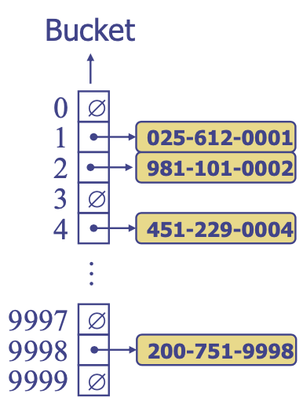

# 해시 테이블
{: .no_toc }

<details open markdown="block">
  <summary>
    목차
  </summary>
  {: .text-delta }
1. TOC
{:toc}
</details>

## 맵 (Maps)
---
`(key, value)` 엔트리의 `검색가능한` 컬렉션
- 주요 기능: 검색, 삽입, 삭제
- ~~동일한 키를 갖는 여러 개의 엔트리~~는 불가
- 활용 예시 - 주소록, 학생 데이터베이스

엔트리는 `(key, value)` 쌍을 저장한다.
- `key()`: 연관된 키를 반환한다.
- `value()`: 연관된 값을 반환한다.
- `setKey(k)`: 키를 `k`로 설정한다.
- `setValue(v)`: 값을 `v`로 설정한다.

맵의 추상 데이터 타입
- `find(k)`: 맵 `M`에 `k`를 키로 갖는 엔트리가 있을 때 반환한다.
- `put(k, v)`: `k`를 키로 갖는 엔트리가 없으면 `(k, v)` 엔트리를 삽입하고, 존재하는 경우에는 엔트리의 값을 `v`로 설정한다.
- `erase(k)`: 맵 `M`에 `k`를 키로 갖는 엔트리가 있을 때 그 엔트리를 제거한다.
- `size(), empty()`

### 리스트 기반의 맵
- `put`: $O(n)$ (시퀀스에 존재하는 엔트리인지 확인해야 함)
- `find, erase`: $O(n)$ (키를 갖는 엔트리가 없는 경우 전체 시퀀스를 순회해야 함)

## 해시 테이블 (Hash Table)
---
{:style="display:block; margin-left:auto; margin-right:auto"}

`key`를 값에 대한 `주소`로 사용한다.
- 최악의 경우 $O(n)$이지만 예상 성능은 $O(1)$
- 주요 컴포넌트: `버킷 배열`과 `해시 함수`

### 버킷 배열
크기 $N$의 배열 $A$에서 각각의 셀을 `버킷`이라 한다.
1. 크기 $N$을 어떻게 정할 것인가?
2. `key`는 정수여야 하지만 실제로는 그렇지 않을 수도 있다.

해시 함수와 해시 테이블
- 해시 함수 $h$는 특정 타입의 `key`를 $[0, N-1]$ 범위 내 정수로 맵핑한다.
  - $h(x) = x \% N $
  - 정수 $h(x)$는 키 $x$에 대한 해시 값이다.
  - 해시 함수의 목적은 임의의 방식으로 키를 `disperse`하는 것
- 해시 테이블은 해시 함수 $h$, 크기 $N$의 (버킷) 배열
  - 해시 테이블로 맵을 구현할 때 엔트리 $(k, o)$를 인덱스 $i=h(k)$에 저장해야 한다.

### 해시 함수
두 가지 함수의 결합 $h(x)=h_{2}(h_{1}(x))$
1. 해시 코드 $h_{1}: keys \rightarrow integers$
  - 메모리 주소: `key` 개체의 메모리 주소를 정수로 재해석
  - 정수 캐스팅: `key`의 비트를 정수로 재해석
  - 다항식 해시 코드 (Polynomial hash code)
2. 압축 함수 $h_{2}: integers \rightarrow [0,N-1]$
  - `Division`: $h_{2}(y)=\vert y \vert \% N$
  - `Multiply, Add and Divide`: $h_{2}(y)=\vert ay+b \vert \% N$

### Collision Handling
다른 요소들이 같은 셀에 맵핑될 때 충돌이 발생한다.

(해결 방법 1) <br>
Separate Chaining: 해시 테이블 내 셀이 엔트리의 연결 리스트를 가리키도록 함
   - 간단하지만 테이블 외부에 추가적으로 메모리가 요구된다.

{:style="display:block; margin-left:auto; margin-right:auto"}

(해결 방법 2) <br>
Open Addressing: 충돌되는 요소는 테이블의 다른 셀로 옮긴다.
    - Linear probing: 충돌되는 요소를 사용가능한 다음 테이블 셀로 위치시킨다.
    - 충돌되는 요소들끼리는 하나의 군집을 이루게 되므로, 이후 충돌하게 되는 경우는 긴 시퀀스의 셀들을 모두 조사 (probe)해야 한다: `Clustering Problem`

{:style="display:block; margin-left:auto; margin-right:auto"}

#### Linear probing을 활용한 검색

```python
### 해시 테이블 A가 linear probing을 사용할 때,
def find(k):
    i = h(k)
    p = 0
    while p <= N:
      c = A[i]
      if c == None: # empty
        return None
      elif c.key() == k:
        return c.value()
      else:
        i = (i + 1) % N
        p = p + 1
    return None
```

#### Linear probing을 활용한 삽입 및 제거
- 제거된 요소를 대체하는 `AVAILABLE`이라는 마커를 사용하여 shift를 줄인다.

```python
def erase(k):
  i = h(k)
  p = 0
  while p < N:
    c = A[i]
    if c.key() == k:
      A[i] = "AVAILABLE"
      return c.value()
    else:
      i = (i + 1) % N
      p = p + 1
  return None

def put(k, o):
  i = h(k)
  p = 0
  while p < N:
    c = A[i]
    if c == None or c == "AVAILABLE":
      A[i] = (k, o)
    else:
      i = (i + 1) % N
      p = p + 1
  raise fullHash
```

#### Load factor
해시 테이블의 성능에 영향을 미치는 지수로, $a=\frac{n}{N}$
- Open addressing: $a<0.5$
  - 삽입의 경우, 기대되는 probe 횟수는 $\frac{1}{1-a}$
- Separate-chaining: $a<0.9$
- 해시 테이블의 사이즈를 재조정 (새로운 테이블에서 해싱을 다시 함)
