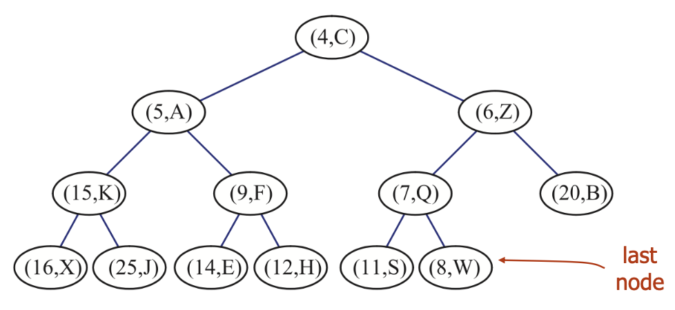
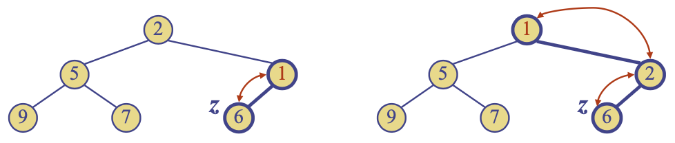
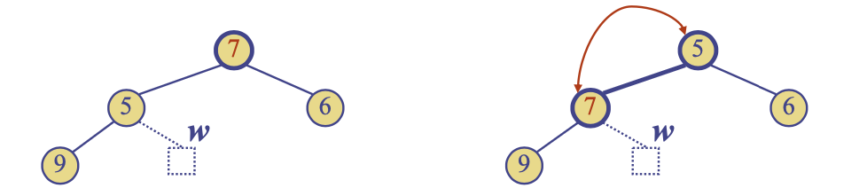
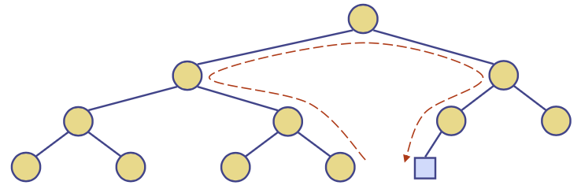
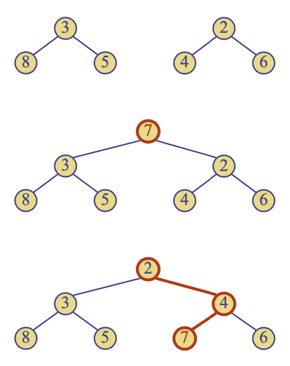

# 우선순위 큐와 힙
{: .no_toc }

<details open markdown="block">
  <summary>
    목차
  </summary>
  {: .text-delta }
1. TOC
{:toc}
</details>

## 우선순위 큐 (Priority Queue)
---
우선순위를 갖는 요소들의 컬렉션을 저장하기 위한 자료구조
- 임의의 요소 삽입
- 우선순위에 따른 요소

지금은 `위치 기반`의 자료구조를 다룸: 스택, 큐, 덱, 리스트
- 특정 위치에 요소를 저장 (선형적으로 또는 계급적으로)
- 삽입과 삭제 또한 위치에 기반을 둠
- 그러나 우선순위 큐는 삽입 및 삭제가 `우선순위 기반`

어떻게 요소의 우선순위를 표현할 것인가? `key`

### 추상 데이터 타입 (ADT: Abstract Data Types)
우선순위 큐는 `엔트리`의 컬렉션을 저장: 엔트리는 `(key, value)` 쌍이며, `key`는 우선순위를 나타낸다.
- 주요 메소드:
1. `insert(e)`: 엔트리 `e`를 삽입한다.
2. `removeMin()`: 가장 작은 `key`를 갖는 엔트리를 제거한다.
- 추가 메소드:
1. `min()`: 가장 작은 `key`를 갖는 엔트리를 반환한다 (제거 X).
2. `size(), empty()`
- 적용 사례: 경매, 주식 시장 등

### Total Order Relations
우선순위 큐에서 `key`는 순서가 정의된 임의의 개체가 될 수 있다. <br>
우선순위 큐에서 같은 `key`를 갖는 서로 다른 엔트리가 존재할 수 있다.

Total ordering: Comparison rule은 모든 `key`의 쌍에 대해 정의되어야 한다.
1. Reflexive: $x\leq x$
2. Antisymmetric: $x\leq y \wedge y\leq x \Rightarrow x = y$
3. Transitive: $x\leq y \wedge y\leq z \Rightarrow x \leq z$
- 위 세 가지 특성을 만족하면 절대 `Comparison contradiction`이 발생하지 않는다.

예 - 좌표평면 내 $(x, y)$
1. $x_{first}, y_{next}$에 대한 $\geq$ 릴레이션: Total ordering
    - $(4, 3) \geq (3,4), (3, 5) \geq (3,4)$
2. $x, y$ 모두에 대한 $\geq$ 릴레이션: Partial ordering
    - $(4, 3) \geq (2,1)$
    - $(4, 3) ~???~ (3,4)$
    - 일부 개체에 대해 비교를 정의할 수 없음
- Total ordering이 가능한 비교를 정의해야 함.

### 우선순위 큐를 이용한 정렬
1. 연속된 `insert()`을 통해 요소들을 차례로 투입
2. 연속된 `removeMin()`를 통해 `정렬된 순서대로` 요소들을 제거
```python
def pq_sort(S, C):
    # Input: Sequence S, (S의 요소에 대한) Comparator C
    # Output: C에 의해 증가하는 순서로 정렬된 S
    P = priority_queue(C)
    while not S.empty():
        e = S.front()
        S.eraseFront()
        P.insert((e, None))
    while not P.empty():
        e = P.removeMin()
        S.insertBack(e)
```

### 시퀀스 기반 우선순위 큐
1. 정렬되지 않은 리스트를 이용한 구현
- `insert()`은 $O(1)$의 시간복잡도를 갖는다 (요소를 시퀀스 처음 또는 끝에 삽입할 수 있다)
- `removeMin(), min()`은 $O(n)$의 시간복잡도를 갖는다 (가장 작은 `key`를 찾기 위해서 전체 시퀀스를 순회해야 하기 때문이다)

2. 정렬된 리스트를 이용한 구현
- `insert()`은 $O(n)$의 시간복잡도를 갖는다 (요소를 삽입할 위치를 찾아야 한다)
- `removeMin(), min()`은 $O(1)$의 시간복잡도를 갖는다 (가장 작은 `key`는 시퀀스의 가장 처음에 위치한다)

### 선택 정렬 (Selection Sort)
정렬되지 않은 시퀀스로 구현한, 우선순위 큐를 활용한 정렬
- $n$번의 `insert`을 수행하여 우선순위 큐로 요소를 넣는데 $O(n)$의 시간복잡도
- $n$번의 `removeMin`을 수행하여 우선순위 큐에서 정렬된 순서로 요소를 제거하는 시간은 $1+2+...+n = O(n^{2})$
- 선택 정렬은 $O(n^{2})$의 시간복잡도가 요구됨.

### 삽입 정렬 (Insertion Sort)
정렬된 시퀀스로 구현한, 우선순위 큐를 활용한 정렬
- $n$번의 `insert`을 수행하여 우선순위 큐로 요소를 넣는데 $1+2+...+n = O(n^{2})$의 시간복잡도
- $n$번의 `removeMin`을 수행하여 우선순위 큐에서 정렬된 순서로 요소를 제거하는 시간은 $O(n)$
- 선택 정렬은 $O(n^{2})$의 시간복잡도가 요구됨.

## 힙 (Heaps)
---


노드에 `key`를 저장하는 이진트리이며, 다음과 같은 특성을 만족한다:
1. 힙 순서 (Heap-order)
    - 루트를 제외한 모든 internal node `v`에 대하여, $key(v) \geq key(parent(v))$
    - 루트에서 리프 노드 $T$까지의 경로에서 마주하는 `key`들은 감소하지 않는다.
    - 가장 작은 `key`는 항상 루트에 있다.
2. 완전 이진 트리 (Complete binary tree)
    - 마지막 level를 제외하고 모든 level이 모두 채워져 있고, 마지막 level의 모든 노드는 왼쪽부터 채워짐.
    - $h$를 힙의 height라고 했을 때,
        - $i=0, ..., h-1$에 대해 depth $i$에 $2^{i}$개의 노드가 있다.
        - depth $h-1$에서 internal node는 external node의 왼쪽에 있다.
- 힙의 마지막 노드는 가장 깊은 depth에 있는 rightmost node이다.

(Theorem) $n$개의 요소를 갖는 힙의 height은 $O(\log n)$
- 증명: 완전 이진 트리의 특성을 적용
    - $h$를 $n$개의 `key`를 저장하는 힙의 높이라고 했을 때,
    - depth $i=0,...,h-1$에는 $2^{i}$의 `key`가 있고, depth $h$에는 적어도 하나의 `key`가 존재하므로, $n\geq 1+2+4+...+2^{h-1}+1$
    - $n\geq 2^{h} \rightarrow h\leq\log n$

시퀀스 기반 

|Operation|정렬되지 않은 리스트|정렬된 리스트|
|---|---|---|
|`size, empty`|$O(1)$|$O(1)$|
|`insert`|$O(1)$|$O(n)$|
|`min, removeMin`|$O(n)$|$O(1)$|

힙 기반

|Operation|시간|
|---|---|
|`size, empty`|$O(1)$|
|`min`|$O(1)$|
|`insert`|$O(\log n)$|
|`removeMin`|$O(\log n)$|

### 힙과 우선순위 큐
우선순위 큐를 구현하기 위해 힙을 이용할 수 있다.
- 각 internal node에 `(key, element)`를 저장한다.
- 마지막 노드의 위치를 추적한다: $O(1)$


### 힙 삽입
1. insertion node $z$를 찾는다 (새로운 마지막 노드)
2. `key` $k$를 $z$에 저장한다
3. 힙 순서 특성을 유지하도록 처리한다

Upheap
- 새로운 `key` $k$를 삽입하면 힙 순서 특성에 위반될 수 있다.
- Upheap 알고리즘은 힙 순서 특성을 유지하기 위해 삽입 노드로부터 upward 경로를 통해 $k$를 스왑한다.
- Upheap은 $k$가 루트에 도달하거나, 위치한 노드의 부모가 더 작은 `key`를 가지고 있을 때 종료된다.
- 힙은 $O(\log n)$의 높이를 가지므로, upheap은 $O(\log n)$의 시간복잡도를 갖는다.



### 힙 제거
1. 루트 노드의 `key`를 마지막 노드 $w$의 `key`와 맞바꾼다.
2. $w$를 제거한다.
3. 힙 순서 특성을 유지하도록 처리한다

Downheap
- 마지막 노드의 `key` $k$와 루트 노드의 `key`를 맞바꾸면 힙 순서 특성에 위반될 수 있다.
- Downheap 알고리즘은 힙 순서 특성을 유지하기 위해 루트 노드로부터 downward 경로를 통해 $k$를 스왑한다.
- Downheap은 $k$가 리프 노드에 도달하거나, 위치한 노드의 자식이 더 크거나 같은 `key`를 가지고 있을 때 종료된다.
- 힙은 $O(\log n)$의 높이를 가지므로, downheap은 $O(\log n)$의 시간복잡도를 갖는다.



마지막 노드 업데이트: 삽입 노드 (새로운 마지막 노드)를 어떻게 찾는가?
- 삽입 노드는 $O(\log n)$ 노드의 경로를 순회하여 찾는다.
1. 왼쪽 자식 또는 루트에 도달할 때까지 올라간다.
2. 왼쪽 자식에 도달한 경우 오른쪽 자식으로 간다.
3. 리프 노드에 도달할 때까지 왼쪽 아래로 간다.
- 삭제 이후 마지막 노드를 업데이트하는 경우도 유사하다.



### 힙 정렬
힙으로 구현된, $n$개의 요소를 갖는 우선순위 큐
- 공간복잡도는 $O(n)$
- `insert, removeMin`은 $O(\log n)$의 시간복잡도
- `size, empty, min`은 $O(1)$의 시간복잡도

힙 기반의 우선순위 큐를 활용하여 $n$개의 요소를 갖는 시퀀스를 $O(n\log n)$의 시간복잡도로 정렬할 수 있다.
- Construction: $n$ `insert`
- Actual Sorting: $n$ `remove`
- 힙 정렬은 삽입 정렬이나 선택 정렬 같은 quadratic 정렬 알고리즘보다 훨씬 빠르다.

### 배열 기반의 힙 구현
길이 $n+1$을 갖는 배열로 $n$개의 `key`를 갖는 힙을 구현할 수 있다.
- $rank_{node} = i$의 노드에 대하여, $rank_{lchild} = 2i, rank_{rchild}=2i+1$
- 노드 간의 링크는 저장되지 않으며, 0은 사용되지 않는다.
- `insert`는 rank $n+1$에 삽입
- `removeMin`은 rank $n$을 제거

### 힙 병합
두 개의 힙이 있고 `key` $k$가 주어졌을 때,
- $k$를 저장한 루트 노드와, 두 힙을 subtree로 하는 새로운 힙을 만든다
- 힙 순서 특성을 유지하기 위해 downheap을 수행한다

{:style="display:block; margin-left:auto; margin-right:auto"}
