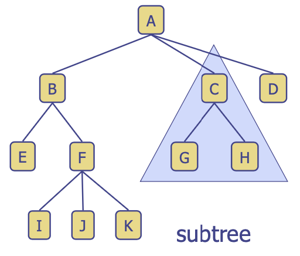
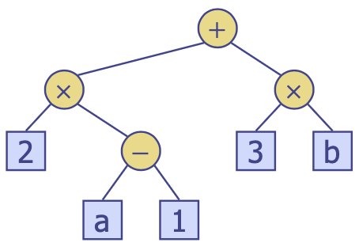
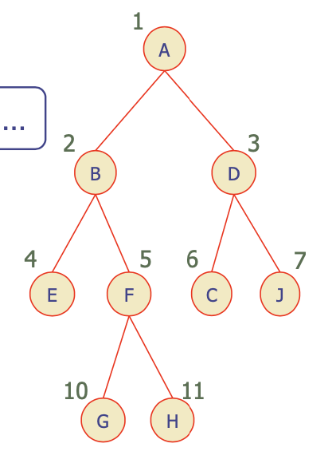

# 트리
{: .no_toc }

<details open markdown="block">
  <summary>
    목차
  </summary>
  {: .text-delta }
1. TOC
{:toc}
</details>

Cycle이 없는 그래프이며 부모-자식 관계를 갖는 노드들로 구성됨. 
- 적용: 조직 차트, 파일 시스템, 프로그래밍 환경 등
- 일반 메소드: `size(), empty()`
- 접근 메소드: `root(), positions()`
- 위치 기반 메소드: `p.parent(), p.children()`
- 쿼리 메소드: `p.isRoot(), p.isExternal()`



용어 정리
1. Root (부모 없는 노드, A)
2. Internal node (하나 이상의 자식을 갖는 노드, ABCF)
3. External node (리프 노드, 자식 없는 노드, EIJKGHD)
4. Ancestors (parent, grandparent, grand-grandparent, ...)
5. Depth of a node (노드의 Ancestors 수)
6. Height of a tree (노드의 최대 depth, 3)
7. Descendant of a node (child, grandchild, grand-grandchild, ...)
8. Subtree (노드와 노드의 descendants로 구성된 트리)

## 트리 순회 알고리즘
---
순회 연산
- Depth: 복잡도는 $O(d_{p})$로, worst-case $O(n)$
    ```python
    def depth(tree, p):
        if p.isRoot():
            return 0
        return 1 + depth(tree, p.parent())
    ```
- Height
    - height1: 복잡도는 $O(n+\sum_{p}(1+d_{p}))$로, worst-case $O(n^{2})$
        ```python
        def height1(tree):
            h = 0
            nodes = tree.positions() # 모든 노드들의 리스트
            for q in nodes:
                if q.isExternal():
                    h = max(h, depth(tree, q))
            return h
        ```
    - height2: 복잡도는 $O(\sum_{p}(1+c_{p}))$로, worst-case $O(n)$
        ```python
        def height2(tree, p):
            if p.isExternal():
                return 0
            h = 0
            ch = p.children()
            for q in ch:
                h = max(h, height2(tree, q))
            return 1 + h
        ```
- 모든 노드 방문
    1. Preorder: descendant를 방문하기 전에 노드부터 먼저 방문
        ```python
        # node -> 
        # left (right) child -> 
        # right (left) child
        def preorder(v):
            visit(v)
            for each child w of v:
                preorder(w)
        ```
    2. Postorder: descendant를 방문한 뒤에 노드를 방문
        ```python
        # left (right) child ->
        # right (left) child ->
        # node
        def postorder(v):
            for each child w of v:
                postorder(w)
            visit(v)
        ```
    3. Inorder: $lchild \rightarrow node \rightarrow rchild$
        ```python
        def inorder(v):
            if not v.isExternal():
                inorder(v.left())
            visit(v)
            if not v.isExternal():
                inrder(v.right())
        ```

## 이진 트리
---
각 internal node는 `많아야 자식이 두 개`이며, 노드의 자식들은 순서쌍 (ordered pair)으로 left child와 right child로 부른다.

예: 연산 표현 트리 (Arithmetic Expression Tree), 의사결정 트리 (Decision Tree)
- internal node: 연산자
- external node: 피연산자
- $(2\times(a-1)+(3\times b))$를 다음과 같이 표현한다.



```python
def eval_expr(v):
    if v.isExternal():
        return v.element()
    x = eval_expr(v.left())
    y = eval_expr(v.right())
    o = v.operator
    return o(x, y)
```

정 이진 트리 (Proper, full binary tree)
- 모든 노드가 자식이 0개거나 2개인 트리
- $n$ (노드 수), $e$ (external 노드 수), $i$ (internal 노드 수), $h$ (height)
- $e = h + 1, n = 2e - 1$
- $h \leq i, h \leq \frac{n-1}{2}$
- $e \leq 2^{h}, h \geq \log_{2}e$
- $h \geq \log_{2}(n+1)-1$

## 트리 표현하기
---
연결 리스트를 활용: 노드의 구성
1. 요소
2. 부모 노드
3. 자식 노드들의 시퀀스
    - (이진 트리의 경우) 왼쪽 자식 노드, 오른쪽 자식 노드

배열을 활용
- 노드들은 배열 $A$에 저장된다.
- 노드 $v$는 $A[rank(v)]$에 저장된다.
    - $rank(root) = 1$
    - 노드 $v$가 부모 노드의 왼쪽 자식이라면, $rank(v) = 2\cdot rank(parent(v))$
    - 노드 $v$가 부모 노드의 오른쪽 자식이라면, $rank(v) = 2\cdot rank(parent(v)) + 1$

{: width="250" }
