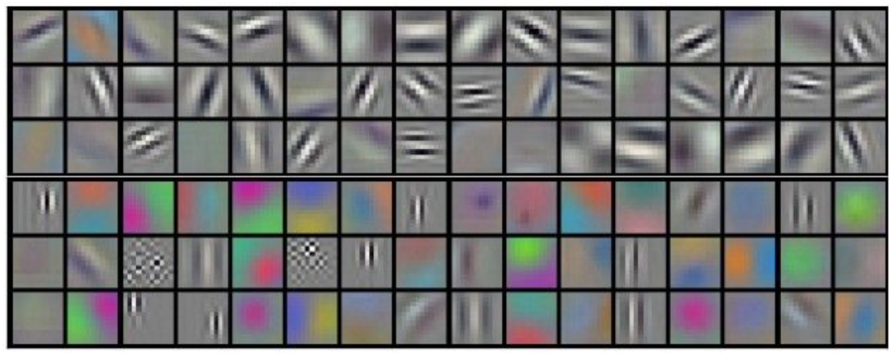

# Feature Visualization
{: .no_toc }

  

    목차
  

  {: .text-delta }
1. TOC
{:toc}

Image classification, Semantic segmentation, Pose estimation, Object detection

**CNN은 정말로 visual concept을 이해하는가?**
- CNN이 학습하는 representation은 무엇일까?
- CNN 모델은 예측을 위해 어떤 observation을 사용할까?

시각화를 통해 CNN을 이해해보자.  
Nearest neighbor, Saliency map, Feature visualization, Attention

## CNN Representation 시각화하기
---
Network에 encoding되어 있는 정보를 시각화한다.

{:style="display:block; margin-left:auto; margin-right:auto; width: 400px"}

**Challenge**: Intermediate feature는 high-dimensional space에 존재한다
- `conv5` layer의 output size = $(13, 13, 256)$
- Feature를 어떻게 human-understandable form으로 시각화할 수 있을까?

## Filters in CNN
AlexNet의 1st-layer filter
- Number of filters = 96, Channel = 3, Kernel size = 11x11
- **11x11 크기를 갖는 96개의 RGB 이미지**
    * 다양한 각도에서의 edge (Horizontal, Vertical, Diagonal, ...)
    * Color patterns (Green, Magenta, ...)

{:style="display:block; margin-left:auto; margin-right:auto; width: 400px"}

## Activation map in CNN
- `conv2` feature map $(27, 27, 256)$: 27x27 크기의 256개 gray-scale 이미지
- `conv4` feature map $(13, 13, 384)$: 13x13 크기의 384개 gray-scale 이미지

{:style="display:block; margin-left:auto; margin-right:auto; width: 400px"}

AlexNet
- `conv1` feature map: Object boundary에 대한 strong activation (Horizontal or vertical edge)
- `conv3` feature map: Meaningful group에 대한 strong activation (피부색)
- `conv5` feature map: Semantic group에 대한 strong activation (얼굴)

{:style="display:block; margin-left:auto; margin-right:auto; width: 300px"}

## Maximally activated patch
1. Layer와 channel을 선택한다.
    - `conv5` layer $(13, 13, 128)$
    - `17th channel out of 128`
2. Network에 많은 이미지를 적용하여 해당 channel 값을 기록한다.
3. Maximally activate된 image patch를 시각화한다.

## Saliency map

{:style="display:block; margin-left:auto; margin-right:auto; width: 400px"}

예측에 있어 이미지의 어떤 부분이 가장 큰 Contribution을 했는지 파악하기
- Forward $S_{c}(I)$
- Backward $\frac{\delta S_{c}(I)}{\delta I}$
    - 픽셀 변화에 대한 점수 변화의 Sensitivity
    - **분류를 위한 픽셀의 Contribution**

{:style="display:block; margin-left:auto; margin-right:auto; width: 400px"}

## Guided backpropagation 
1. Single intermediate neuron을 선택한다.
    - `conv5` feature map에서의 one value
    - Intermediate features
2. Image 픽셀에 대한 neuron value의 gradient를 계산한다.

{:style="display:block; margin-left:auto; margin-right:auto; width: 450px"}

(Left) 임의의 hidden unit에서 최대로 활성화된 patch  
(Right) 해당 patch에 대한 guided backprop
- Deeper layer일수록 meaningful pattern이 나타난다
- Pooling에서의 spatial abstraction으로 이미지의 변형이 크다
- 특정 hidden unit은 얼굴, 다리 등 meaningful part에 대해 activate하도록 학습한다.

## Activation maximization

{:style="display:block; margin-left:auto; margin-right:auto; width: 400px"}

- Network의 특정 feature를 선택한다.
    - $F^{(l)}: l$-th layer feature $(W, H, C)$
- 선택한 activation을 최대화하기 위해, parameter를 고정시킨 상태에서 Input image를 최적화한다
    - $I^{*} = \arg\max_{I}f(I)$

1. Random value로 image 초기화
2. Target layer의 feature 계산 (Forward)
    - $F^{(l)}$
3. Gradient 계산 (Backpropagation) 
    - $\frac{\delta F^{(L)}}{\delta I}$
4. Gradient ascent를 통한 image update
    - $I=I-\eta\frac{\delta F^{(L)}}{\delta I}$

그러나 생성된 이미지의 noise가 많고 less realistic하다.  
$\rightarrow$ Regularization을 추가한다: $I^{*} = \arg\max_{I}f(I) + \lambda R(I)$

{:style="display:block; margin-left:auto; margin-right:auto; width: 400px"}

DeepDream: 특정 layer의 모든 activation을 증폭시키기 위해 이미지를 변경함
1. Random value 대신에 real image를 사용함
2. 선택한 layer의 전체 feature가 최대화되도록 최적화한다.

{:style="display:block; margin-left:auto; margin-right:auto; width: 400px"}

**Limitation**
1. 최적화 방식으로 이미지를 합성하는 과정에서 연산량이 크다
2. 독립적으로 구현되었다
    - Classifier와 Visualization을 통합할 수 없을까?

## Attention

{:style="display:block; margin-left:auto; margin-right:auto; width: 450px"}

분류 과정에서 image region의 importance를 single forward pass로 시각화하며, classifier와 통합
- $I: (224, 224, 3)$
- $F(I): (16, 16, 256)$
- GAP (Global Average Pooling) $F'(I) = \sum_{x, y}F(I)_{x,y,c}$
- $F'(I): (1, 1, 256)$
- $W: (256, 1000)$
    - $W_{c}: (256, 1)$
    - Feature $f$에 대해 class $c$ 분류를 위한 각 **channel의 contribution**

{:style="display:block; margin-left:auto; margin-right:auto; width: 450px"}

