# Language and Vision
{: .no_toc }

  

    목차
  

  {: .text-delta }
1. TOC
{:toc}

## Modeling language using RNN
---
문장은 discrete symbol의 시퀀스이다.
- One-hot encoding of discrete symbol (tokenization)

|A|Man|is|holding|a|bat|
|---|---|---|---|---|---|
|[00001000]|[01000000]|[00000010]|[00000100]|[00001000]|[10000000]|
|$x_0$|$x_1$|$x_2$|$x_3$|$x_4$|$x_5$|

### Sentence generation
다음 단어 (token)을 예측하기
- $f_{\theta} \rightarrow$ `I'm very hungry at the end of every class`

|5|$\hat{\textbf{x}}_{t+1} = \textbf{W}_{d} \textbf{h}_{t} + \textbf{b}_{d}$|Classification layer|$\textbf{W}_{d}\in\R^{n\times d}, \hat{\textbf{x}}_{t+1}\in\R^n$|
|---|---|---|---|
|4|$\textbf{h}_t = \textbf{LSTM}(\textbf{z}_{t}, \textbf{h}_{t-1}, \textbf{c}_{t-1};\theta)$|Continuous output embedding|$\textbf{h}_{t}\in\R^d$|
|3|$\textbf{LSTM}$|Recurrent neural network||
|2|$\textbf{z}_{t} = \textbf{W}_{e} \textbf{x}_{t} + \textbf{b}_{e}$|Continuous word embedding|$\textbf{W}_{e} \in \R^{d \times n}, \textbf{z}_{t} \in \R^{d}$|
|1|$\textbf{x}_{t}$|One-hot encoding|$\textbf{x}_{t} \in \R^{n}$|

**Training**
- Teacher forcing: current cell input으로 previous cell output 대신에 ground-truth word를 투입
- Cross-entropy loss: word-level classification

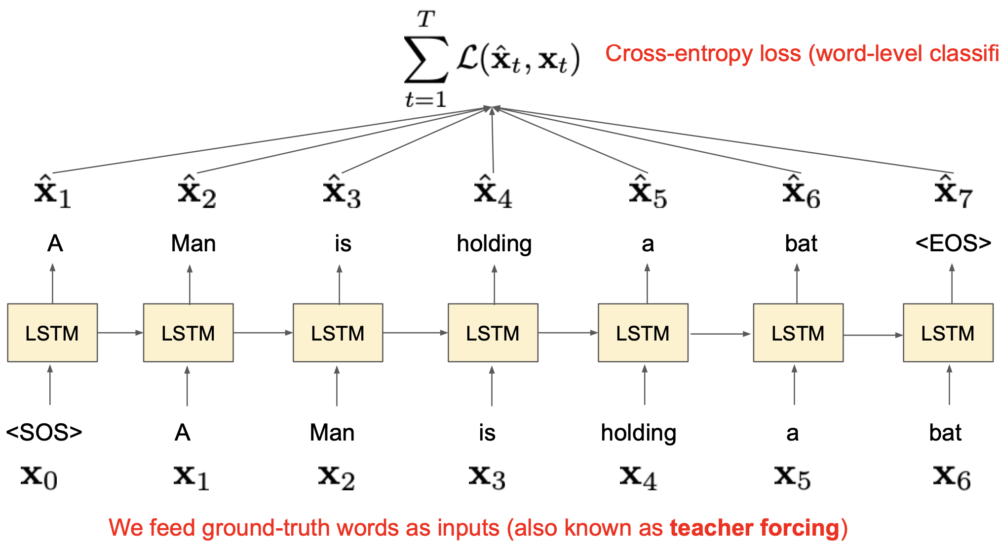{:style="display:block; margin-left:auto; margin-right:auto; width: 400px"}

**Inference**   
Cell마다 output score로부터 단어를 샘플링하며, 샘플링 방식은:
1. 최대 점수를 갖는 단어를 추출 (greedy, deterministic) - $\arg\max{S_{x_t}}$ 
2. Score probability에 따라 단어를 샘플링 (stochastic) - $x_t \sim S(x_t)$

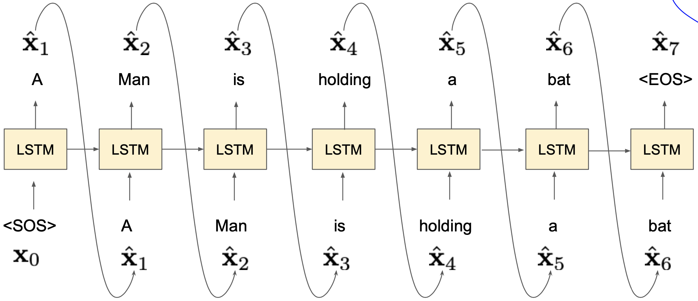{:style="display:block; margin-left:auto; margin-right:auto; width: 400px"}

### Machine translation
English sentence $\rightarrow f_{\theta} \rightarrow$ French sentence

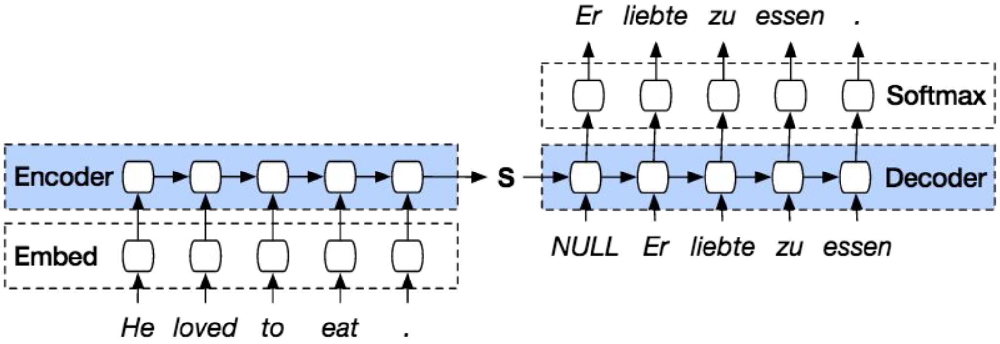{:style="display:block; margin-left:auto; margin-right:auto; width: 400px"}

**Summary**
1. 문장은 discrete symbol의 시퀀스이다
2. RNN으로 이를 모델링할 때,
    - 단어 = one-hot encoding
    - Sentence generation: 이전 단어들이 주어졌을 때 다음 단어를 예측
        - Training (순차적 분류 - cell의 output word를 매번 분류함)
        - Inference (순차적으로 단어를 예측하고 다음 cell의 input으로 활용)

## Image captioning
---
자연 언어를 사용하여 이미지를 묘사하는 것  
$x$ (image) $\rightarrow f_{\theta}(y\vert g_{\phi}(x)) \rightarrow y$ (sentence)
- Training data로 (image, sentence) pair가 주어진다
- Cross-entropy loss (Sentence generation과 동일)

### Naive
$g_{\phi}(x)$: Image에서 visual pattern을 인지 (CNN)
- Pretrained-CNN에 input image를 넣어 feature를 추출

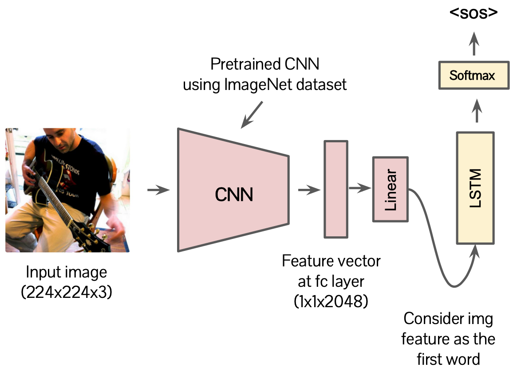{:style="display:block; margin-left:auto; margin-right:auto; width: 300px"}

$f_{\theta}(y\vert g_{\phi}(x))$: Image가 주어졌을 때, 문장을 생성 (RNN)
- 추출된 feature를 RNN 모델에 투입 (first word 취급)

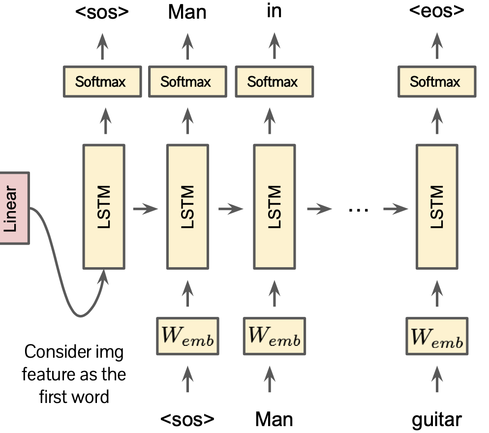{:style="display:block; margin-left:auto; margin-right:auto; width: 300px"}

**Issue**
- RNN 모델이 `이미지가 아닌, 이전 단어들`을 조건부로 한 문장을 생성할 수 있다.
    - Short dependency length (이전 단어들은 다음 단어 예측에 대한 impact가 크다)
- Image content를 조건부로 한 captioning을 위해서는 **image condition을 강하게 적용해야 한다.**

### Naive + shortcuts

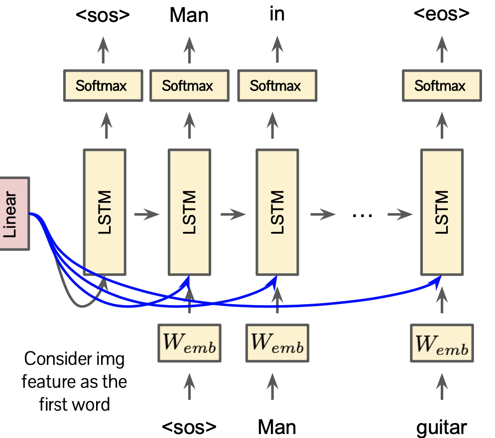{:style="display:block; margin-left:auto; margin-right:auto; width: 300px"}

모든 step (cell)에 대해 image condition (short-cut connection) 추가
- Pros: dependency distance가 1로 감소되었다.
- Cons: 여전히 image condition이 무시될 수 있다.

### Attention-based

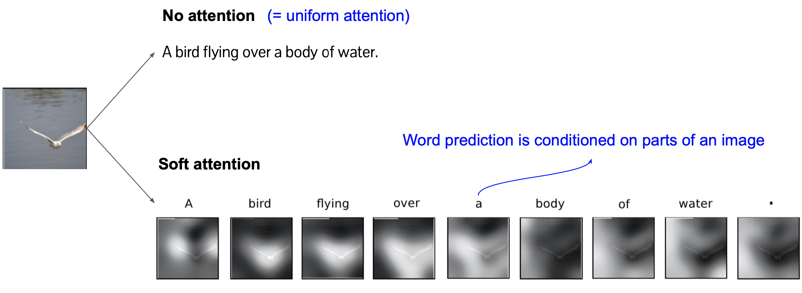{:style="display:block; margin-left:auto; margin-right:auto; width: 450px"}

**Attention**
- 대응되는 단어를 생성할 때 **주요 물체 (salient object)를 주시 (gaze on)** 하도록 설계하며, Image의 part에 대하여 word prediction을 수행
- Feature map과 동일한 spatial dimension을 갖는 positive matrix
    - $\alpha^{(t)}\in R^{W\times H}, \sum_{i,j}\alpha_{i,j}^{(t)}=1$
- 각 단어에 대한 attention을 계산하고자 한다.
    - $\alpha^{(1)}$ - a
    - $\alpha^{(2)}$ - bird
    - $\alpha^{(3)}$ - flying
    - $\alpha^{(N)}$ - .
- Attention은 image feature의 abstraction에 활용된다.
    - $z^{(t)}=\sum_{i,j}\alpha_{i,j}^{(t)}x_{i,j}\in R^{C}$

Question
1. 어떻게 attention을 계산할 것인가?
2. Attention을 어떻게 단어 예측에 활용할 것인가?

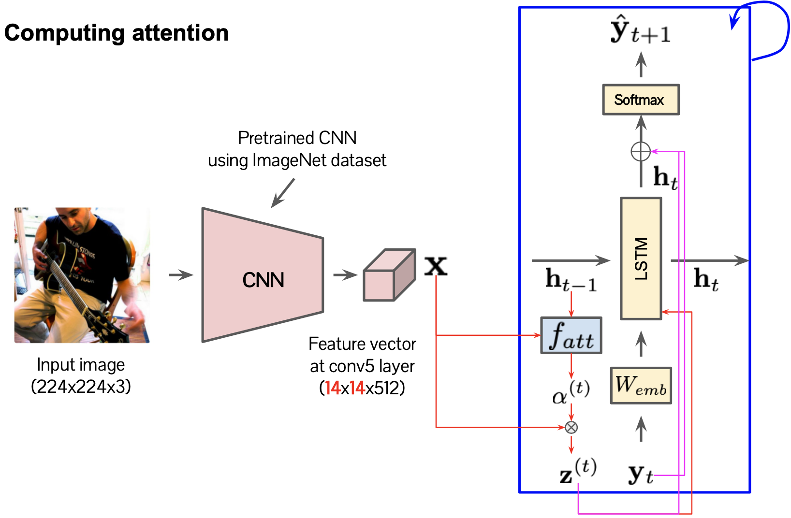{:style="display:block; margin-left:auto; margin-right:auto; width: 500px"}

Attention module
- $e^{(t)}=f_{att}(x, h_{t-1})$
- $\alpha^{(t)}=\frac{\exp(e^{(t)})}{\sum_{i,j}\exp(e_{i,j}^{(t)})}$
- $z^{(t)}=\sum_{i,j}\alpha_{i,j}^{(t)}x_{i,j}$

Modified LSTM
- $h^{(t)}=LSTM(h_{t-1}, W_{emb} y_{t}, z^{(t)})$
- $\hat{y}_{t+1}=\exp{(W_{o}(W_{emb}y_{t}+W_{h}h_{t}+W_{z}z_{t}))}$

**Result**

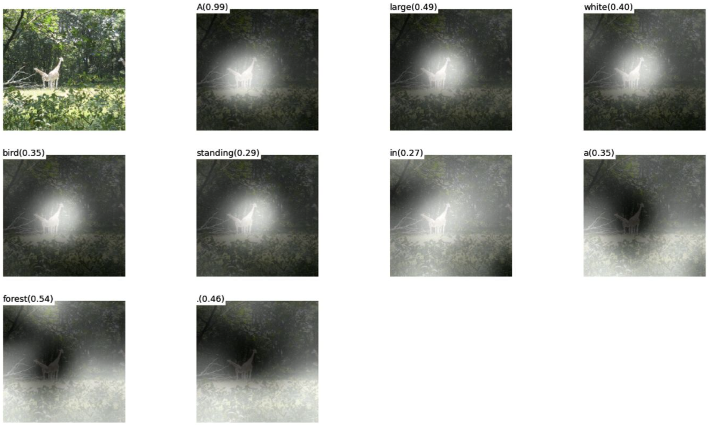{:style="display:block; margin-left:auto; margin-right:auto; width: 500px"}

## Visual question answering
---
`Image`와 `image 관련 질문`이 주어졌을 때 정답을 예측하기

**Naive**

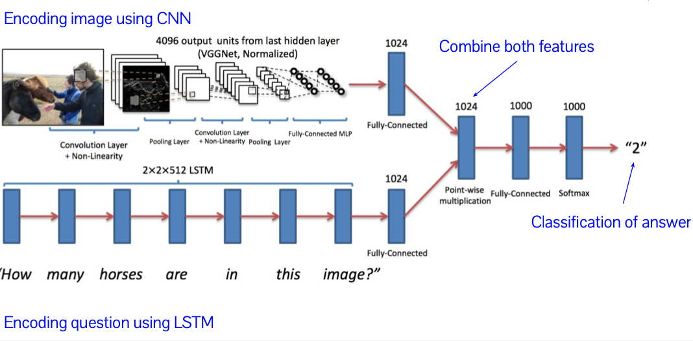{:style="display:block; margin-left:auto; margin-right:auto; width: 500px"}

**Attention-based**

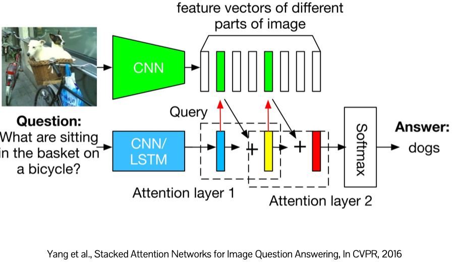{:style="display:block; margin-left:auto; margin-right:auto; width: 500px"}
