# Object Detection
{: .no_toc }

  

    목차
  

  {: .text-delta }
1. TOC
{:toc}

## Review: image classification
---
Image classification: 이미지에서 visual concept의 존재 여부를 파악하는 것
- `dog`가 있는가? YES/NO
- `human`이 있는가? YES/NO

Object detection: classification + **object localization**
- class label (Object가 속하는 카테고리)
- bounding box (Object의 위치 및 크기를 나타내는 2d box)

$\therefore$ **Object detection은 Region-based classification**

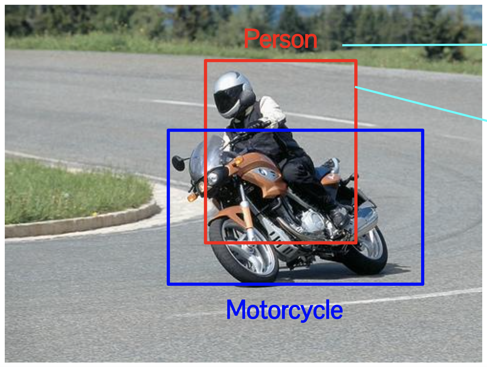{:style="display:block; margin-left:auto; margin-right:auto; width: 250px"}

**Challenges**
1. Object의 위치를 어떻게 찾을까? (How to localize?)
2. 여러 개의 Object를 어떻게 다룰까? (Various number of objects)
3. Object의 다양한 사이즈 및 비율을 어떻게 다룰까? (Various size and aspect ratio)

## Traditional Object detection pipeline
---
1) 영역 추출 (Region extraction)
- 가능한 모든 영역, 크기, 비율에 대해 Sliding window 방식으로 추출

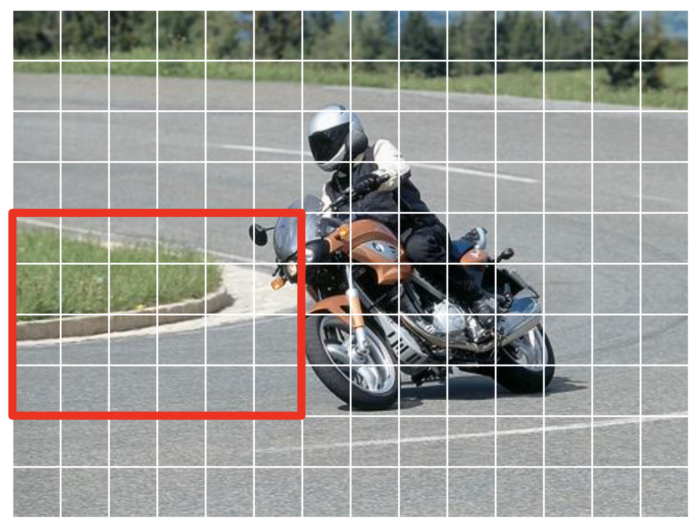{:style="display:block; margin-left:auto; margin-right:auto; width: 250px"}

2) 특징 추출 (Feature extraction) 
- HOG (Histogram of Oriented Gradient)

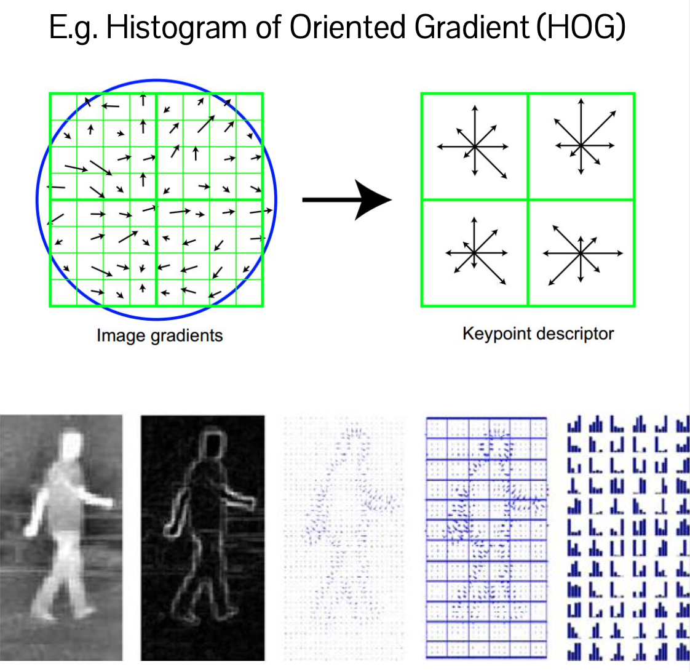{:style="display:block; margin-left:auto; margin-right:auto; width: 250px"}

3) 분류 (Classification) 
- SVM (Support Vector Machine)으로 주어진 모든 Region에 대해 특징 추출 및 분류를 반복

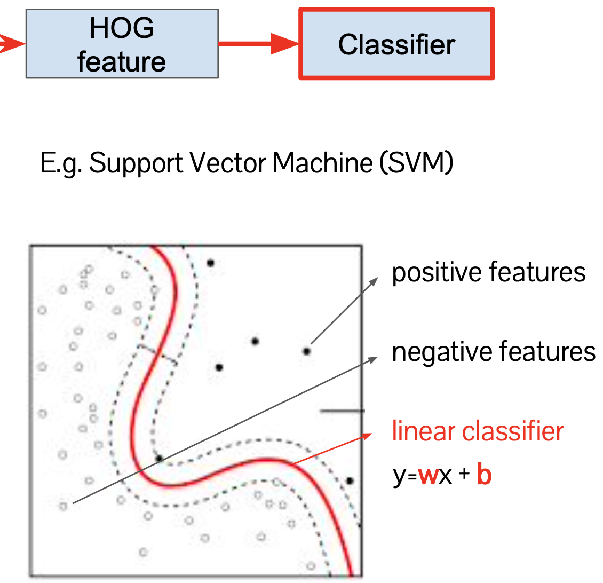{:style="display:block; margin-left:auto; margin-right:auto; width: 250px"}

4) Post-processing
- 수많은 Candidate 중 `Person`과 `Motorcycle`에 대해서 0.9이상의 확률을 보이는 box를 선택

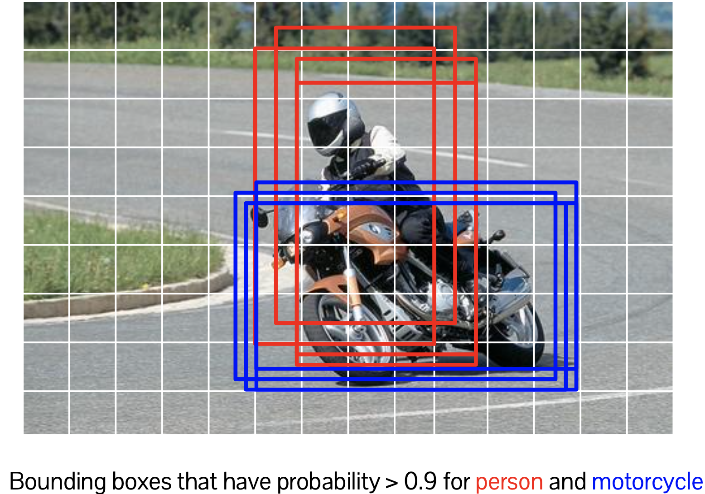{:style="display:block; margin-left:auto; margin-right:auto; width: 250px"}

Final result

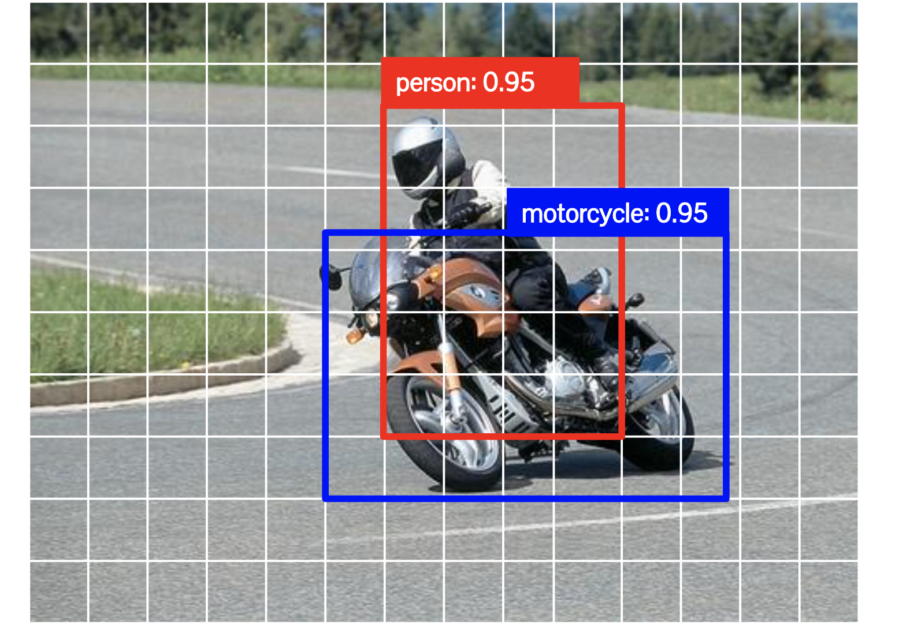{:style="display:block; margin-left:auto; margin-right:auto; width: 250px"}

**Challenges**
1. Robust한 representation을 필요로 한다: 다양한 appearance variation에 invariant
2. Processing speed를 높여야 한다.
  - Image 크기 $(W, H)$, Image 크기 수 $S$, Image 비율 수 $A$
  - 총 분류 횟수 $W\times H\times S\times A$
  - $W=H=128, S=5, A=32 \rightarrow $ 하나의 Image 당 2,420,640번의 분류를 수행해야 한다.

## R-CNN (Region-based CNN)
---
Review - 이미지 분류를 위한 CNN

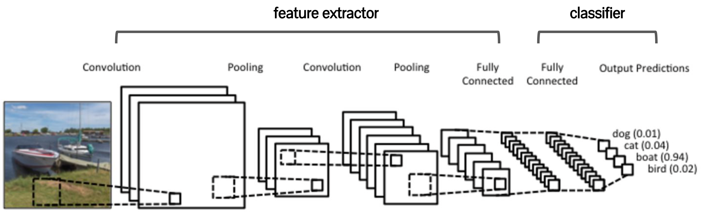{:style="display:block; margin-left:auto; margin-right:auto; width: 500px"}
 
- Low-level operation
  - convolution, non-linear activation, sub-sampling, fc layer
- High-level operation
  - **Feature extractor**
  - Classifier (the last layer)

$\therefore$ **Object detection의 특징 추출을 위해 CNN의 Feature extractor를 활용하자**

Why? 대용량 데이터셋으로 학습된 모델은 다양한 appearance variation에 robust한, 즉 powerful한 represenation을 제공하기 때문이다.

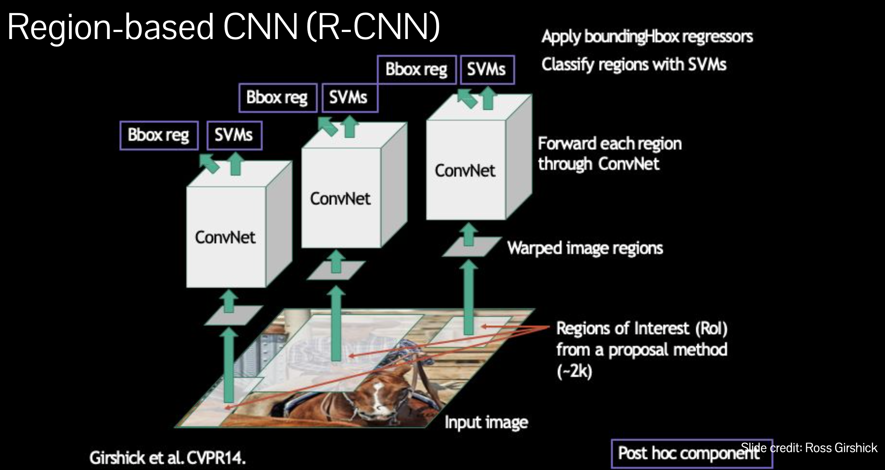{:style="display:block; margin-left:auto; margin-right:auto; width: 500px"}

1. Proposal method를 적용하여 Input의 Regions of Interest (RoI) 를 찾는다.
2. Region을 warp 처리한다.
3. 각 Region에 대해 ConvNet을 적용하여 특징을 추출한다.
4. 추출된 특징으로 SVM으로 분류를 수행한다.
5. Bounding-box regressor를 적용한다.

**Bounding box regression**

{:style="display:block; margin-left:auto; margin-right:auto; width: 300px"}

예측 bounding box $\textbf{p} = (p_x, p_y, p_w, p_h)$,  
실제 bounding box $\textbf{g} = (g_x, g_y, g_w, g_h)$ 일 때  
예측 box를 실제 box로 이동시키는데 필요한 displacement를 계산한다.
- $\textbf{d(p)}=(d_x(\bf{p}), d_y(\bf{p}), d_w(\bf{p}), d_h(\bf{p}))$

예측 box
  - $\hat{g}_x = p_w d_x(\bf{p}) + p_x$, $\hat{g}_y = p_h d_y(\bf{p}) + p_y$
  - $\hat{g}_w = p_w \exp{d_w(\bf{p})}$, $\hat{g}_h = p_h \exp{d_h(\bf{p})}$

실제 box까지의 displacement
  - $t_x = \frac{g_x - p_x}{p_w}$, $t_y = \frac{g_y - p_y}{p_h}$
  - $t_w = \log{(\frac{g_w}{p_w})}$, $t_h = \log{(\frac{g_h}{p_h})}$

$\therefore$ Regression loss $L_{reg} = \sum_{i\in\{x,y,w,h\}} (t_i - d_i(\bf{p}))^{2}$

**R-CNN Training**
1. 이미지 분류를 위한 CNN 모델을 pre-train (대용량 이미지 데이터셋인 ImageNet 이용)
2. Target dataset와 task에 대하여 CNN 모델을 fine-tuning한다
3. Detection을 위한 linear predictor (SVM) 를 학습시킨다
  - RoI 계산: Image 당 약 2000개의 wraped windows
  - CNN feature extractor로 특징을 추출한다.
  - 추출된 feature와 label로 per-class SVM을 학습시킨다.

**Summary**
- R-CNN: Region Proposal $\rightarrow$ CNN 특징 추출 $\rightarrow$ SVM 분류 $\rightarrow$ Post-processing
- 장점: CNN의 Powerful representation을 활용
- 단점: 처리 시간이 오래 걸린다 (모든 region proposal에 대해서 CNN을 적용하며, Feature extractor와 SVM를 따로 학습함)

## SPP-Net (Spatial Pyramid Pooling)
---
R-CNN 개선하기: Speed와 Training process
- **Feature를 효율적으로 추출**하는 방법
- **Region proposal 과정을 잠재적으로 제거**하는 방법
- **Model을 End-to-End 방식으로 학습**시키는 방법

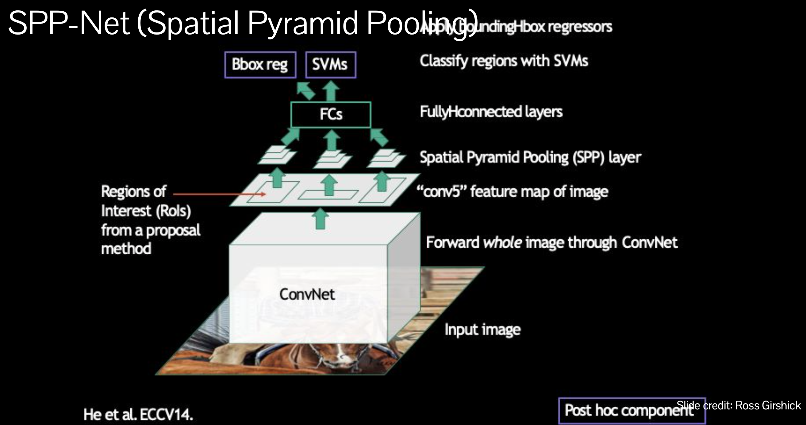{:style="display:block; margin-left:auto; margin-right:auto; width: 500px"}

1. Input 이미지 전체에 ConvNet을 적용한다.
2. `conv5` layer의 feature map을 추출한다.
3. feature map에 proposal method를 적용하여 RoI를 얻는다.
4. SPP layer를 적용한다.
5. Fully-connected layer를 통과한다.
6. SVM으로 region을 분류한다.
7. Bounding-box regressor를 적용한다.

**Spatial Pyramid Pooling**
* Feature map을 다양한 Grid로 분할한뒤 Concatenate한다.

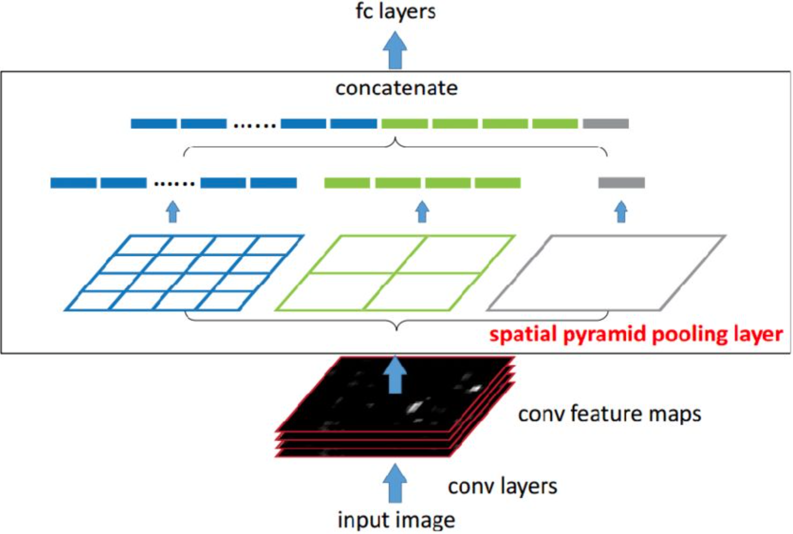{:style="display:block; margin-left:auto; margin-right:auto; width: 300px"}

**Limitation**
1. R-CNN보다는 빠르지만 여전히 학습이 느림
2. Ad-hoc training object (SVM): Class의 갯수마다 SVM 모델을 필요로 한다.
3. Convolutional layer는 학습 불가 (Frozen)

## Fast R-CNN
---
- SPP-Net처럼 빠른 test-time을 보이며, one stage에 학습되는 network를 갖는다.
- R-CNN과 SPP-Net보다 높은 mAP (mean average precision)을 기록한다.

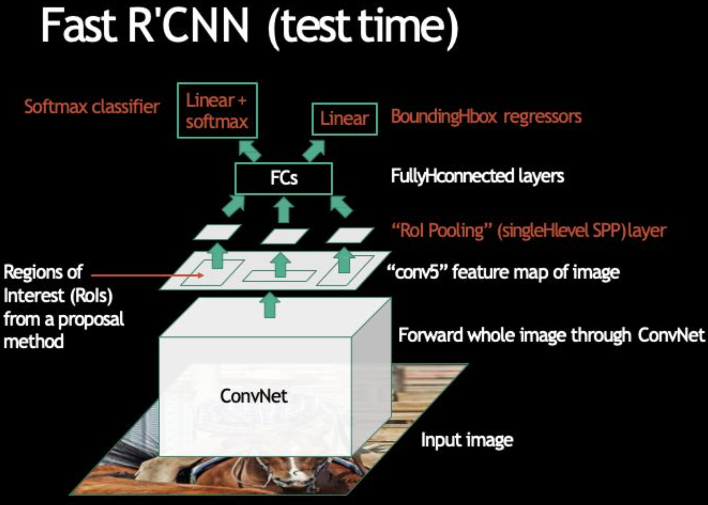{:style="display:block; margin-left:auto; margin-right:auto; width: 400px"}

Test stage
1. Input 이미지 전체에 ConvNet을 적용한다.
2. `conv5` layer의 feature map을 추출한다.
3. feature map에 proposal method를 적용하여 RoI를 얻는다.
4. RoI Pooling (single-level SPP) layer를 적용한다.
5. Fully-connected layer를 통과한다.
6. Softmax classifier (Linear model) 를 적용한다.
7. Bounding-box regressor (Linear model) 를 적용한다.

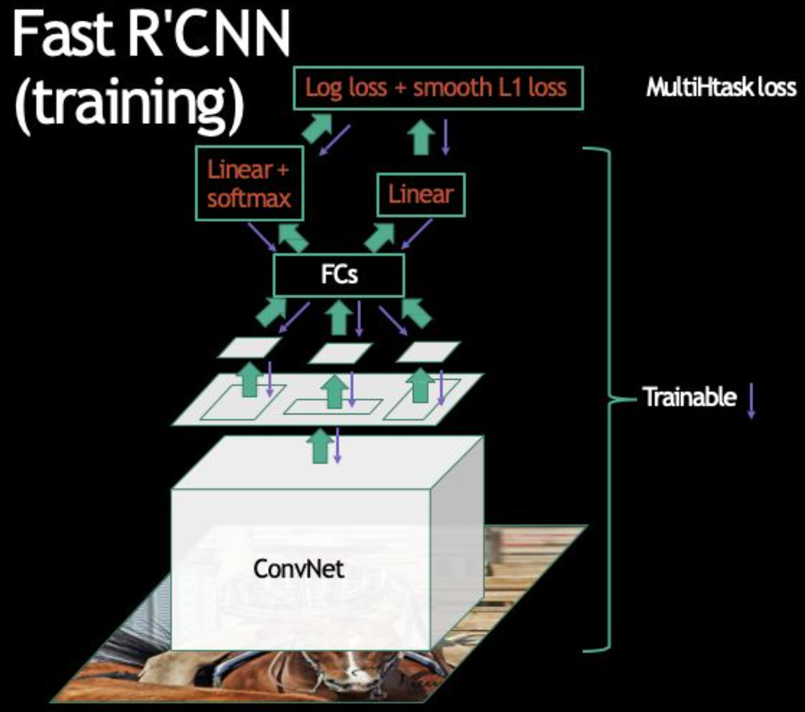{:style="display:block; margin-left:auto; margin-right:auto; width: 400px"}

Train stage
* `Log loss + smooth L1 loss`: multi-task loss를 정의
* End-to-end trainable한 Network

## Faster R-CNN
---
Region Proposal을 학습: Fast R-CNN에 Region Proposal Network (RPN)을 제안

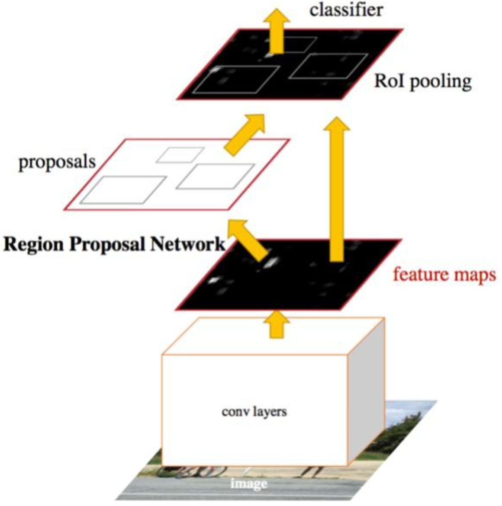{:style="display:block; margin-left:auto; margin-right:auto; width: 300px"}

**Region Proposal Network (RPN)**: 
- Feature map에 sliding window를 적용
- Small network를 구성함
  1. Object/Non-object 분류 모델
  2. Bounding box의 위치 Regression 모델
- Sliding window의 위치는 `이미지를 참조한` localization 정보를 제공
- Box regression은 `Sliding window를 참조한` finer localziation 정보를 제공

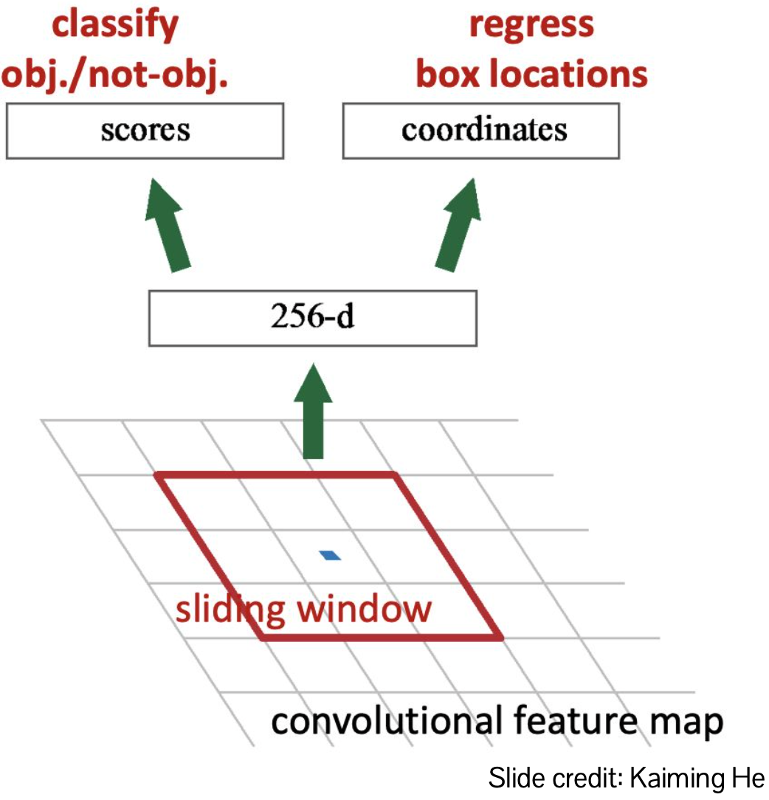{:style="display:block; margin-left:auto; margin-right:auto; width: 300px"}

**Anchors: pre-defined reference boxes**
- anchor box를 actual box로 regression한다.
- Object일 확률은 anchor와 관련된다.

{:style="display:block; margin-left:auto; margin-right:auto; width: 300px"}

- **Transition-invariant**
  - 동일한 anchor set과 prediction function을 사용한다.
  - Translate된 objects는 translate된 prediction을 갖는다.
- **Multi-scale/size**
  - 여러 scale과 aspect ratio를 갖는 anchor를 사용하며, 각 anchor에 대한 prediction function이 존재한다.
  - single-scale features, multi-scale predictions

## Summary
---
1. Region extraction (Faster R-CNN): Region proposal을 추출하기 위한 학습
2. Feature extraction (SPP-Net): 추출한 Feature를 공유하여 연산량을 줄임
3. Classification (Fast R-CNN): End-to-end 방식으로 Classifier, Bbox regressor, CNN을 함께 학습