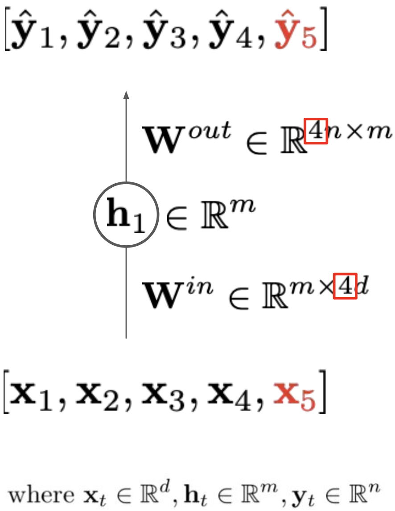
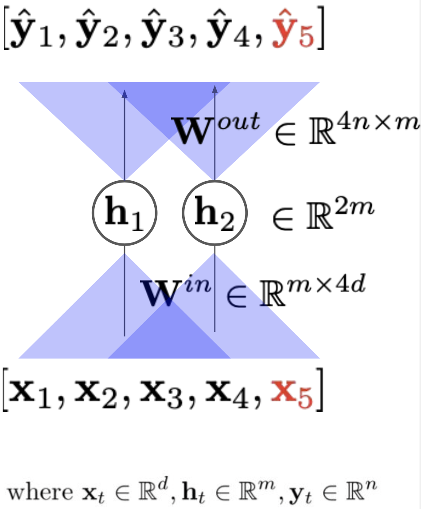
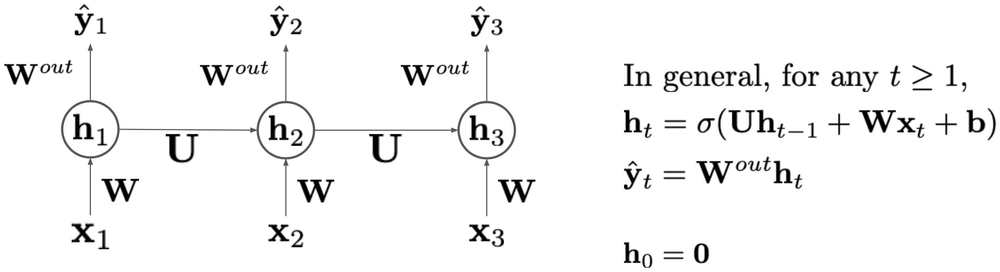
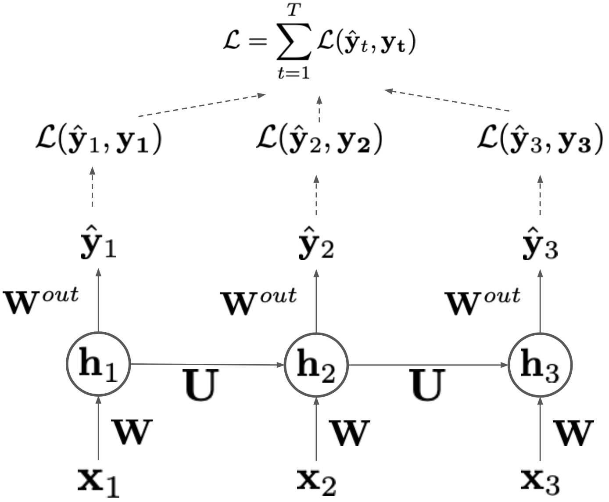
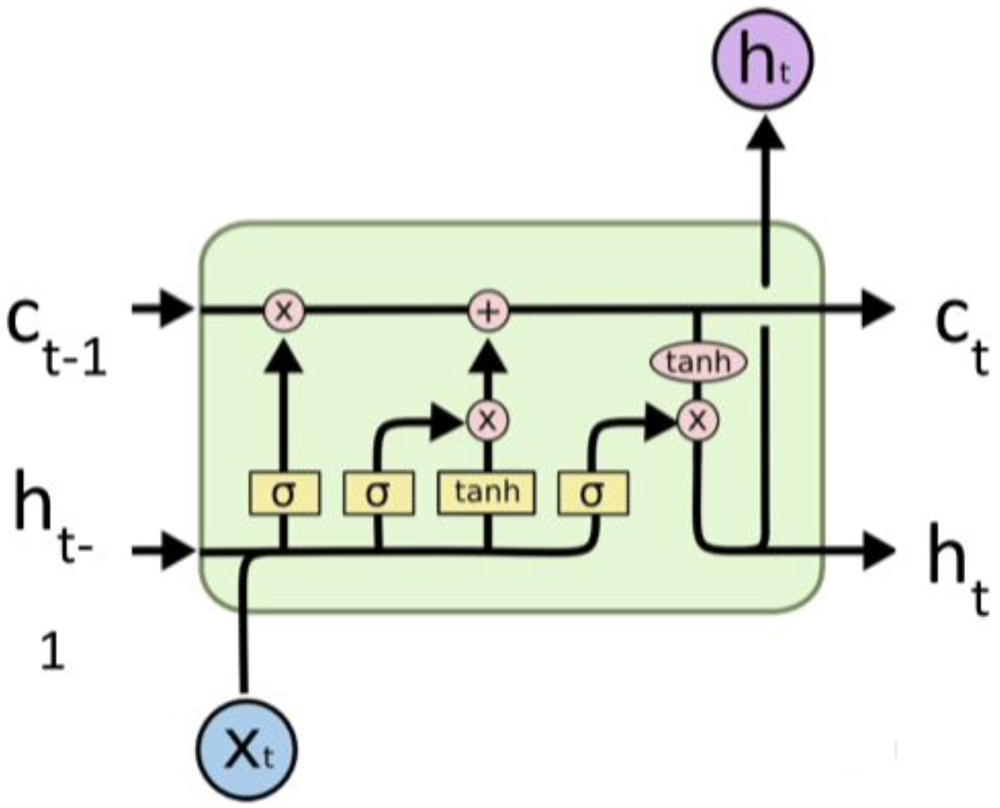
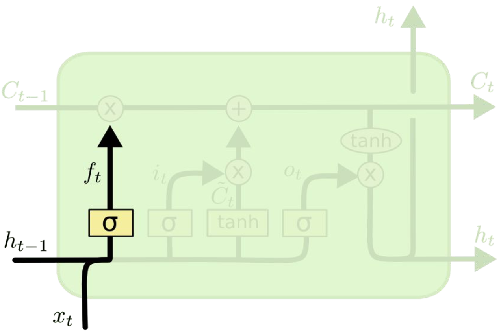
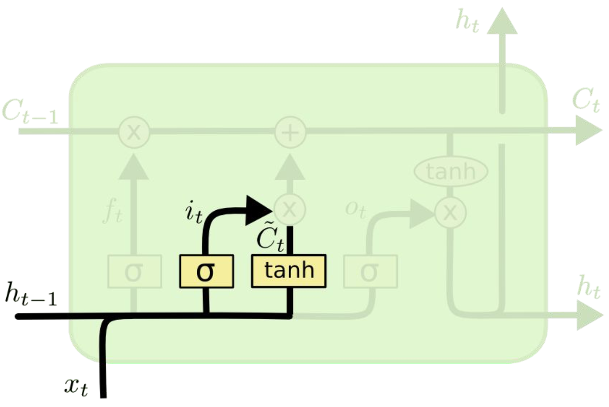
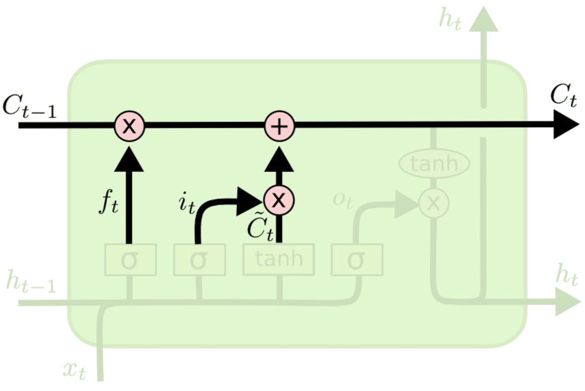
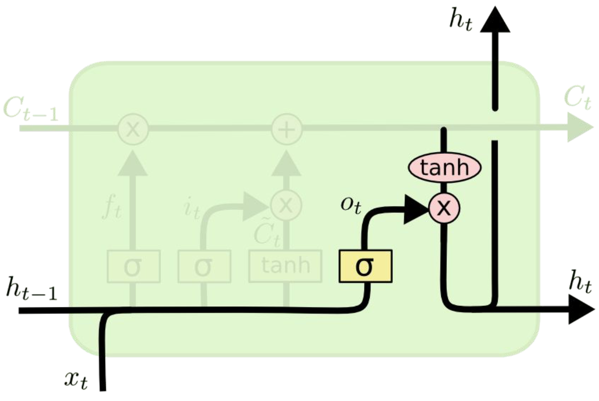
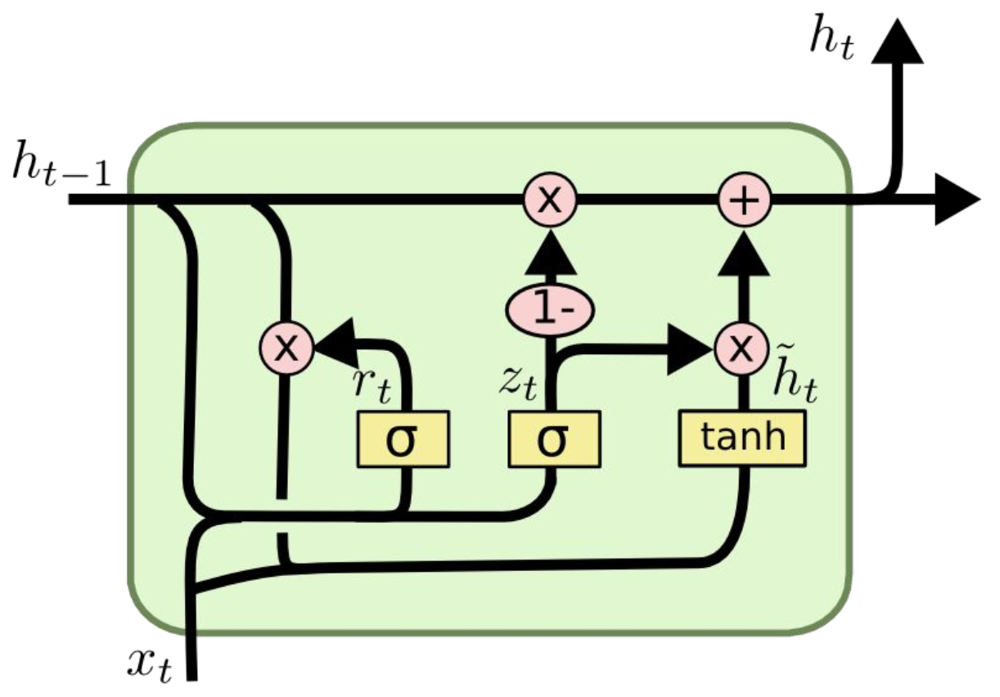

# Recurrent Neural Network
{: .no_toc }

  

    목차
  

  {: .text-delta }
1. TOC
{:toc}

## Modeling sequence
자연 언어, 시계열 데이터 같은 시퀀스 데이터는 어떻게 다룰 수 있을까?

Feedforward network를 이용하여 고정된 길이의 시퀀스를 모델링해보자.
- MLP
    - parameter는 시퀀스의 length에 해당하는 dimension을 갖는다.
    - **시퀀스의 길이가 변화하는 경우 기존 신경망을 재사용할 수 없다.**

{:style="display:block; margin-left:auto; margin-right:auto; width: 300px"}

- CNN
    - 시퀀스에 대해 convolution filter를 sliding하여 기존 신경망을 재사용할 수 있다.
        - **그러나 hidden representation의 크기가 시퀀스 길이에 따라 증가한다.**
        - **receptive field의 크기가 고정되어 있다.**

{:style="display:block; margin-left:auto; margin-right:auto; width: 300px"}

## Recurrent neural network (RNN)
효율적인 방법으로 시퀀스를 모델링하려면? **Recursion**을 활용하자!
- 매번 하나의 input을 받는 모델
- recurrent 연산에서 parameter는 각 input에 대하여 재사용(reuse, share) 될 수 있다

{:style="display:block; margin-left:auto; margin-right:auto; width: 400px"}

- $Uh_t:$ temporal dependency를 모델링하는 temporal connection
- $x_t\in R^d, h_t\in R^m, y_t\in R^n$일 때,
    - $W\in R^{m\times d}, U\in R^{m\times m}, W^{out}\in R^{n\times m}$

## Backpropagation through time (BPTT)
Loss 계산
- 각 단계에서의 loss를 구한 다음 aggregate
- RNN에서 gradient는 모든 단계로 전파된다

{:style="display:block; margin-left:auto; margin-right:auto; width: 400px"}

$L_{t}=\sum_{t^{\prime}=t}^{T}{L(\hat{y}_{t^{\prime}}, y_{t^{\prime}})}$ 라고 할 때,

$\frac{\delta L}{\delta W^{out}_{n,m}}=\sum_{t}\frac{\delta L(\hat{y}_{t, n},y_{t, n})}{\delta \hat{y}_{t,n}}\frac{\delta \hat{y}_{t,n}}{\delta W^{out}_{n,m}}$
- $W^{out}_{n,m}: W^{out}$의 (n, m) element

$\frac{\delta L_t}{\delta h_{t,m}}=\frac{\delta L(\hat{y}_t, y_t)}{\delta h_{t,m}}+\frac{\delta L_{t+1}}{\delta h_{t,m}} = \frac{\delta L(\hat{y}_t, y_t)}{\delta h_{t,m}}+ \sum_{m'}\frac{\delta h_{t+1, m'}}{\delta h_{t,m}}\frac{\delta L_{t+1}}{\delta h_{t+1, m'}}$
- $\frac{\delta L_t}{\delta h_{t,m}}, \frac{\delta L_{t+1}}{\delta h_{t+1, m'}}:$ temporal horizon에 대해 recursive하게 적용됨

$\frac{\delta L}{\delta U_{m, m'}}=\sum_{t}\frac{\delta L_t}{\delta h_{t,m}}\frac{h_{t,m}}{U_{m,m'}}$

$\frac{\delta L}{\delta W_{m,d}}=\sum_{t}\frac{\delta L_t}{\delta h_{t,m}}\frac{\delta h_{t,m}}{\delta W_{m, d}}$

## Gradient vanishing/exploding
BPTT에서 발생할 수 있는 문제: 

$\frac{\delta L_T}{\delta h_t}=\frac{\delta L_T}{\delta h_T}\frac{\delta h_T}{\delta h_t} = \frac{\delta L_T}{\delta h_T}\Pi_{i=t+1}^{T}\frac{\delta h_i}{\delta h_{i-1}}=\frac{\delta L_T}{\delta h_T}\Pi_{i=t+1}^{T}diag(h_{i}(1-h_{i}))U$

1. 마지막 단계의 loss에 대한 backpropation 과정에서,   standard RNN의 hidden-to-hidden connection이 gradient vanishing을 발생시킬 수 있다.
    - activation function에 대한 gradient가 시간에 따라 계속 곱해지기 때문이다.
    - $diag(h_{i}(1-h_{i})):$ 항상 <1이기 때문에 작은 값을 만들게 된다.
2. $U$의 norm이 너무 큰 경우에는 gradient가 explode할 수 있다.

Gradient vanishing/exploding을 해결하는 방법
1. $U$를 orthogonal하게 초기화한다.
2. value가 너무 큰 경우에는 gradient clipping을 적용한다.

## Long short-term memory (LSTM)
1. standard RNN의 gradient vanishing/exploding을 해결
2. long-term dependency를 유지하기 위해 설계
3. **previous memory에 대한 additive connection**

- Information은 두 variable를 통해 전달된다: $C, h$
- 시간에 따라 정보가 어떻게 전달되는지 결정하는 switch variable: $C_{t-1}, C_t, h_{t-1}, h_{t}$

{:style="display:block; margin-left:auto; margin-right:auto; width: 400px"}

### Forget gate $f_t$
{:style="display:block; margin-left:auto; margin-right:auto; width: 300px"}

Previous memory의 일부를 버리고 (zero out) 나머지는 통과시키도록 결정  
$f_t=\sigma(W_{t}\cdot[h_{t-1}, x_t]+b_f)$

### Input gate $i_t$
{:style="display:block; margin-left:auto; margin-right:auto; width: 300px"}

new input에 대해 forget gate와 같은 역할  
$i_t=\sigma(W_{i}\cdot[h_{t-1}, x_t]+b_i)$

### New information $\tilde{C}_t$
current input과 previous hidden unit으로 계산됨  
$\tilde{C}_t= \tanh(W_{C}\cdot[h_{t-1}, x_t]+b_{C})$

### Memories to be passed $C_t$
{:style="display:block; margin-left:auto; margin-right:auto; width: 300px"}

previous memory에 대한 forget gate와, current information에 대한 input gate로 계산  
$C_t=f_{t}\ast C_{t-1}+i_t\ast\tilde{C}_t$

### Output gate $o_t$
{:style="display:block; margin-left:auto; margin-right:auto; width: 300px"}

다음 hidden state를 위해 current memory의 정보를 선택  
$o_t=\sigma(W_{o}\cdot[h_{t-1}, x_t]+b_o)$

### Hidden state $h_t$
current memory와 output gate로 계산  
$h_t=o_t\ast\tanh(C_t)$

## Gated recurrent unit (GRU)
LSTM의 간단 버전 (simplified variation)으로  
forget $f_t$, input $i_t$, output $o_t$ gate가 single gate로 간소화

{:style="display:block; margin-left:auto; margin-right:auto; width: 300px"}

$z_t=\sigma(W_z\cdot[h_{t-1}, x_t])$  
$r_t=\sigma(W_r\cdot[h_{t-1}, x_t])$  
$\tilde{h}_t=\tanh(W\cdot[r_t\ast h_{t-1}, x_t])$  
$h_t=(1-z_t)\ast h_{t-1} + z_t\ast\tilde{h}_t$

