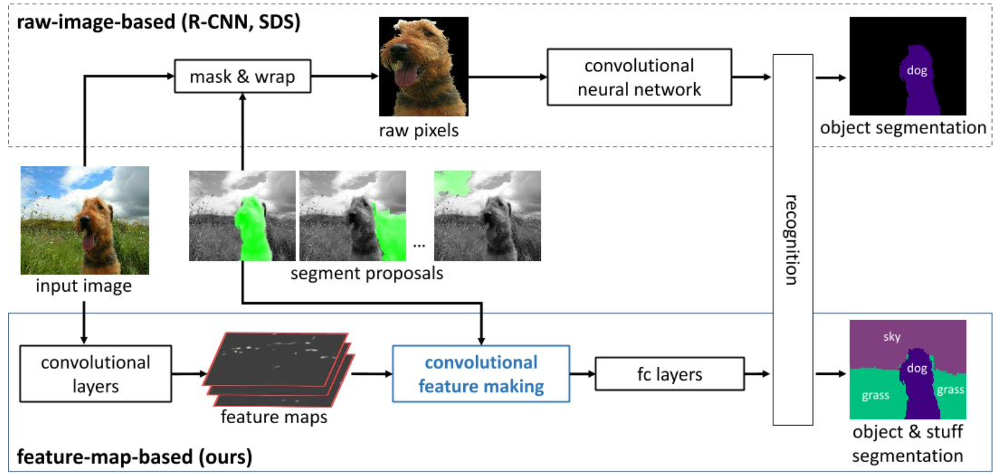

# Semantic Segmentation
{: .no_toc }

  

    목차
  

  {: .text-delta }
1. TOC
{:toc}

## Definition
---
Image의 visual concept를 인지하고 픽셀 단위의 localization를 수행하는 것

{:style="display:block; margin-left:auto; margin-right:auto; width: 400px"}

학습 데이터
- 각 이미지는 픽셀마다 class label을 갖는다.
- 주어진 이미지를 학습하여, 어떻게 픽셀 단위로 class를 추론할 수 있을까?

{:style="display:block; margin-left:auto; margin-right:auto; width: 400px"}

**Challenges**
1. Hand-designed representation
2. Labeling에 요구되는 large search space
    - $N$ (픽셀 수), $C$ (클래스 수) $\rightarrow$ 총 $C^N$개의 possible labeling
    - e.g. $N=32^2, C=20 \rightarrow 20^{1024}$

## CNN-based
---
region-based proposal + classification 방식

{:style="display:block; margin-left:auto; margin-right:auto; width: 400px"}

**Limitation**
1. segmentation 성능이 region-proposal의 정확도에 의해 결정됨
2. end-to-end 방식이 아닌, 각각의 classifier와 feature extractor를 사용

어떻게 end-to-end 방식으로 pixel-level prediction network를 설계할 수 있을까?
- Revisit: CNN은 convolutional layer와 fully-connected layer로 구성

{:style="display:block; margin-left:auto; margin-right:auto; width: 400px"}

||Convolutional layer|Fully-connected layer|
|---|---|---|
|operation|filtering|matrix multiplication|
|input size|arbitrary|fixed|
|output|preserving spatial information|fixed-sized output vector|

$\therefore$ fully-connected layer를 $1\times1$ convolution으로 대체하기!

## Fully convolutional network (FCN)
---
1) classification을 위해 `CNN` 모델을 pre-train  
2) `CNN` 모델을 `FCN` 모델로 변환: fully-connected layer를 $1\times1$ convolution으로

{:style="display:block; margin-left:auto; margin-right:auto; width: 300px"}

3) `FCN`을 larger image에 적용
- receptive field: 특정 neuron에서 관찰되는 input region의 크기

{:style="display:block; margin-left:auto; margin-right:auto; width: 300px"}

4) classes에 대해 per-pixel argmax를 취하여 final label map을 획득

{:style="display:block; margin-left:auto; margin-right:auto; width: 300px"}

---
**Limitation**

{:style="display:block; margin-left:auto; margin-right:auto; width: 300px"}

1. 저해상도 (low resolution)의 score map
    - $500\times500$ input image $\rightarrow 10\times 10$ score map
    - detailed shape information을 잃게 된다.
2. Fixed receptive field
    - 다양한 size의 object를 다룰 수 없다.

**Semantic segmentation 성능을 향상시키는 방법**
1. Encoder-decoder network
2. Atrous convolution

## Unet
---
Encoder-decoder network
- Encoder: 원본 데이터의 정보를 압축하여 higher-order 정보를 추출한다.  
- Decoder: encoding 과정에서 손실된 데이터의 원본 정보를 representation으로부터 추출한다.

{:style="display:block; margin-left:auto; margin-right:auto; width: 300px"}

Convolution operations
- Convolution
- Convolution with stride (downsampling)
- **Deconvolution, Transposed convolution (upsampling)**

{:style="display:block; margin-left:auto; margin-right:auto; width: 500px"}

Skip connection: detailed shape 정보를 capture하기 위함
- 한계: 저해상도 feature는 less discriminative, 확실히 구별되지 않으므로 bad classification

---

Unet: Encoder-decoder network + skip-connection
- encoding: 저해상도로 downsampling, low pixel에서 higher semantic으로 추상화
- decoding: 고해상도로 upsampling, shape 정보를 reconstruct
- skip-connection: feature를 concatenate하여 input image의 detail을 higher layer에 전달

{:style="display:block; margin-left:auto; margin-right:auto; width: 400px"}

## Deconvolution network
---

{:style="display:block; margin-left:auto; margin-right:auto; width: 500px"}

Encoder-decoder network + **shared pooling switches**
- unpooling: pooling switch를 이용하여 해상도를 높임
- deconvolution: unpooling 과정에서 손실되는 shape 정보를 reconstruct
- FCN와의 차이점은, **upsampling 과정을 learnable parameter로 대체하여 학습이 가능하다는 것**

{:style="display:block; margin-left:auto; margin-right:auto; width: 500px"}

1. Image $\rightarrow$ Activation map (encoder의 output)
2. Unpooling (해상도를 double했으므로 sparse activation, reconstructed shape)
3. Deconvolution (densify activation, reconstruct more detailed shape)
4. *Repeat 2-3*

## Atrous convolution
---
Field-of-View (FoV) = Receptive field
- FoV가 너무 작은 경우, local observation에 의해 classification의 ambiguity가 증가
- object 주변에 있는 rich context를 고려하지 못함

{:style="display:block; margin-left:auto; margin-right:auto; width: 400px"}

FoV를 증가시키는 방법
1. subsampling ratio를 증가시킨다
    - 더 많은 layer를 쌓는다? **spatial 정보를 잃는다**
2. convolution filter size를 증가시킨다
    - model parameter를 증가시킨다? **연산량이 증가하여 overfitting이 발생한다**

---

Atrous convolution
- Convolution with **holes**
- 동일한 parameter를 가지고 FoV를 증가시킬 수 있다.
- DeepLab (FCN with atrous convolution)

{:style="display:block; margin-left:auto; margin-right:auto; width: 400px"}
