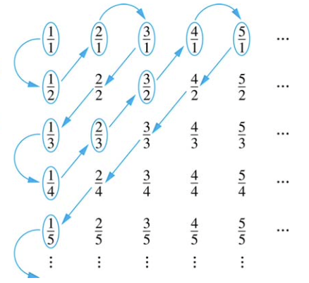

# 함수와 시퀀스
{: .no_toc }

  

    목차
  

  {: .text-delta }
1. TOC
{:toc}

수학으로 표현되는 모든 주제들은 함수, 시퀀스, 릴레이션을 활용한다.

함수 (Function): 집합 $X$의 각 원소들은 집합 $Y$ 내 `정확히 하나의 원소`에 대응됨

시퀀스 (Sequence): 함수의 특별한 종류로, 글자의 리스트로 구성된 단어 (e.g. FROM, FORM)가 대표적인 예시
- 집합과 달리 시퀀스에서는 순서가 고려된다

릴레이션 (Relations): 함수의 개념을 일반화한 것으로, 순서쌍의 집합이다.
- 릴레이션 내 $(a, b)$는 $a$에서 $b$로의 관계가 있다는 것을 가리킨다.

## 함수 (Functions)
---
$X, Y$를 공집합이 아닌 집합일 때, $X$에서 $Y$로의 함수 $f$ ($f: X \rightarrow Y$)는 각각의 $x \in X$에 대하여 정확히 하나의 $y \in Y$가 대응된다: $(x, y)\in f$
- Cartesian product $X\times Y$의 부분집합
- $f(x)=y$는 함수 $f$에서 집합 $X$의 원소 $x$에 대해 유일하게 대응되는 집합 $Y$의 원소 $y$를 뜻한다.
    - 정의역 (Domain): $X$
    - 공역 (Codomain): $Y$
    - 치역 (Range): $\\{y \vert (x, y) \in f \\}$

## 함수의 종류
---
### 단사함수 (One-to-one, injective function)
각 $y\in Y$에 대하여 $f(x)=y$인 $x\in X$가 많아야 하나 (at most one) 존재한다 

$\forall x_{1} \forall x_{2}  ((f(x_{1}) = f(x_{2})) \rightarrow (x_{1}=x_{2})$
- injective iff $f(a)=f(b)$ 일 때 f의 정의역 내 모든 $a, b$에 대하여 $a=b$

### 전사함수 (Onto, surjective function)
치역과 공역이 같다 (range of $y$ is $Y$)

$\forall y \in Y \exists x \in X (f(x)=y)$
- surjective iff 모든 $b\in B$에 대하여 $f(a)=b$인 원소 $a\in A$가 존재

### 전단사함수 (Bijection)
(단사함수이면서) 각 $y\in Y$에 대하여 $f(x)=y$인 $x\in X$가 많아야 하나 (at most one) 존재한다

(전사함수이다) 치역과 공역이 같다 (range of $y$ is $Y$)

### 역함수 (Inverse)
$f^{-1} (x)$ (역함수는 함수가 아닐 수도 있다)

### 합성함수 (Function composition)
모든 $x \in X$에 대하여 $f \circ g (x) = f(g(x))$
- $f: B \rightarrow C, g: A \rightarrow B$ 일 때 g에 대한 f의 합성함수 (the composition of $f$ with $g$)는 $A$에서 $C$로의 함수이다.
- 결합법칙 (Associative) 성립: $f \circ (g \circ h) = (f \circ g) \circ h$
- 그러나 일반적으로 교환법칙 (Commutative)은 성립 안함: $f \circ g \neq g \circ f$
- 단항 연산자 $f: P \rightarrow P$
- 이항 연산자 $f: P \times P \rightarrow P$

## 시퀀스와 문자열 (Sequences and Strings)
---
시퀀스: 정의역이 연속된 정수의 집합으로 구성된 특별한 형태의 함수
- 시퀀스의 인덱스
- 유한한/무한한 시퀀스 (정의역이 유한/무한)
- 증가, 감소, 감소하지 않는, 증가하지 않는
- 서브-시퀀스

문자열: $X$가 유한 집합일 때 $X$에 대한 문자열은 $X$의 원소들로 구성된 유한한 시퀀스
- $X = \\{a, b, c\\}$ 일 때, $\beta_{1}=b, \beta_{2}=a, \beta_{3}=a, \beta_{4}=c$이면 문자열은 `baac`
    - `baac`는 `acab`와 다르다
    - $bbaaac$는 $b^{2}a^{3}c$로 쓸 수 있다.
    - $\lambda$: 빈 문자열 (원소가 없는 문자열)
    - $X^{\ast}$: $X$로 만들 수 있는 모든 문자열의 집합 ($\lambda$ 포함)
    - $X^{+}$: $X$로 만들 수 있는 `빈 문자열이 아닌` 문자열의 집합
- 문자열의 길이 = 문자열에 있는 원소의 수
- 연결 (Concatenation)
    - $\alpha=bbaccc, \beta=caaba$
    - $\alpha\beta=bbaccccaaba=b^{2}ac^{4}a^{2}ba$
    - $\vert \alpha\beta\vert = \vert\alpha\vert + \vert\beta\vert$
- 하위 문자열 (Substring)

## 집합의 크기 (Cardinality)
---
유한한 집합의 크기 = 집합의 원소 갯수

`무한한 집합`의 크기는?

집합 $A, B$는 같은 크기를 같는다 ($\vert A\vert=\vert B\vert$) iff $A$에서 $B$로 전단사함수 관계를 갖는다
- $A$에서 $B$로 단사함수 관계를 갖는다면, $A$의 크기는 $B$의 크기보다 작거나 같다 ($\vert A\vert\leq\vert B\vert$)
- $\vert A\vert\leq\vert B\vert$이고 $A, B$가 다른 크기를 가질 때, $A$의 크기는 $B$보다 작다 ($\vert A\vert<\vert B\vert$)

Definitions
- 집합 $\\{0, 1, ..., n-1\\}$ 에서 $S$로의 전단사함수 (bijection) 관계를 가질 때, $S$는 크기 $n \in N$으로 유한하다.
- 집합은 `유한하지 않으면` 무한하다
- 무한 집합에 대해서 Cardinality에 대한 정의는 두 집합의 크기의 `상대적인 측정`을 제공한다

Theorems
- 자연수 집합 $N$은 무한 집합이다
- $f(x)=3x$로 정의되는 단사함수 $f:N\rightarrow N$가 있을 때, $f$의 치역은 정의역의 부분집합이다 
- (전사함수가 아니다, bijection이 아니다, 유한하지 않다, 무한하다)

## 가산과 불가산 (Countable and Uncountable)
---
`유한`하거나 양의 정수 집합 $Z^{+}$과 `같은 크기`를 갖는 집합은 가산집합이다.
- `집합의 원소들을 시퀀스로 열거할 수 있다` iff `무한 집합은 가산집합이다`
    - 양의 정수로 인덱싱할 수 있다.
    - 양의 정수 집합에서 집합 $S$로의 전단사함수 $f$는 시퀀스로 표현 가능하다.
        - $a_{1},...,a_{n},...$ 이고 $a_{1}=f(1), a_{2}=f(2), ...$
- $A, B$가 가산집합이면 $A\cup B$도 가산집합이다.
- 모든 무한 집합은 `가산이면서 무한한 부분집합`을 포함한다.

예시 1: 양의 정수이자 홀수인 집합 $O$는 가산집합이다.
- 자연수 집합 $N$에서 $O$로의 함수 $f(n) = 2n-1$
- $f$는 전단사함수
    - (단사함수) $f(n)=f(m)$ 일 때 $2n-1=2m-1$ 이므로 $n=m$
    - (전사함수) $t$가 양의 정수이자 홀수일 때 $t=2k-1$이고 $f(k)=t$

예시 2: 정수 집합 $Z$는 가산집합이다.
- 시퀀스로 표현 가능하다: $0, 1, -1, 2, -2, 3, -3, ...$
- 또는 자연수 집합 $N$에서 $Z$로 전단사함수를 정의할 수 있다.
    - $n$이 짝수일 때 $f(n)=\frac{n}{2}$
    - $n$이 홀수일 때 $f(n)=\frac{-(n-1)}{2}$

예시 3: 양의 유리수 집합 $Q^{+}$는 가산집합이다.
- 유리수는 두 정수 $p, q~(q\neq0)$의 비율로 표현할 수 있다.
- 시퀀스로 표현할 수 있다.

가산집합이 아닌 집합은 불가산집합이다.
- 실수 집합 $\mathbb{R}$은 불가산집합