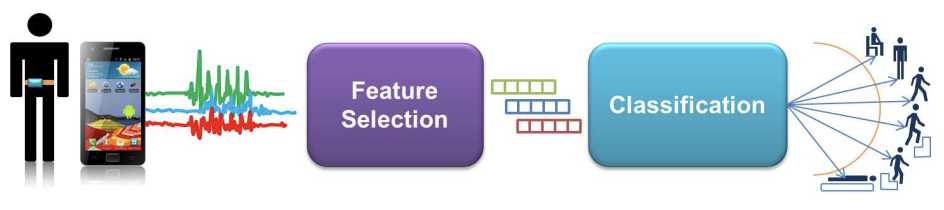
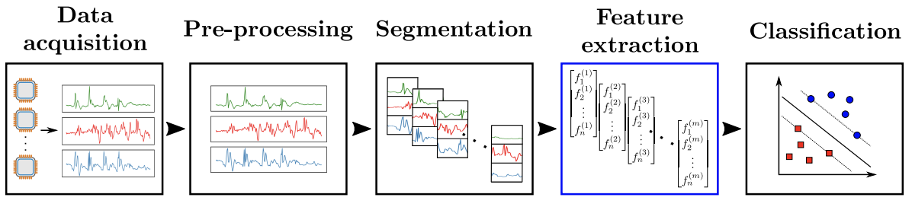
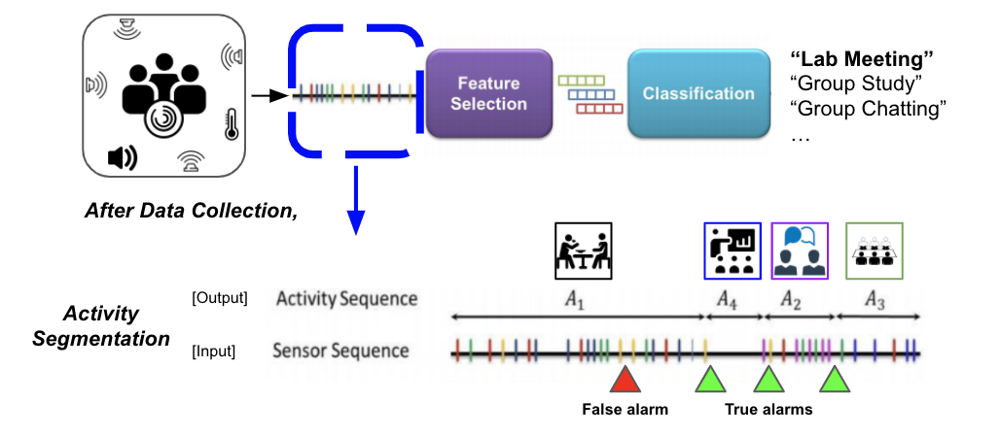

# 인간 행동 인지와 행동 분할
{: .no_toc }

## 목차
{: .no_toc .text-delta }

1. TOC
{:toc}

## 인간 행동 인지 (Human Activity Recognition, HAR)
---

&nbsp;

[_Image 1_], [_Image 2_]

사용자로부터 발생되는 데이터 (e.g. 비디오, 웨어러블 센서) 를 활용하여 사용자의 현재 행동 (`Human Activity`) 을 분류 및 인지 (`Recognition`) 하는 기술. 대략적인 과정은 다음과 같다.
* 데이터 습득 `Data acquisition`
    * 다양한 Sensor modal (예: 스마트 워치)로부터 데이터 (가속도계 데이터)를 수집
* 전처리 `Preprocessing`
    * 수집한 데이터로부터 Noise 또는 관련없는 데이터 제거
* 분할 `Segmentation`
    * 무한히 연결된 데이터를 __행동의 시작과 종료 지점까지 (달리기 시작 - 종료 시점) 분할__
* 특징 추출 `Feature extraction`
    * Recognition 모델 학습을 위해 분할된 데이터에서 특징 추출
    * 센서 발현 횟수, 값 등 (Handcrafted)
    * 딥러닝 모델의 경우 End-to-end 방식이므로 별도의 특징 추출 과정이 없음
* 인지 `Recognition (Classification)`
    * 추출된 Feature 학습된 인지 모델에서 가장 작은 Loss를 갖는 행동을 출력

[_Image 1_]: https://upcommons.upc.edu/bitstream/handle/2117/101769/IWAAL2012.pdf
[_Image 2_]: https://doi.org/10.3390/s18020679

## 행동 분할 (Activity Segmentation)
---

HAR의 `Segmentation` 과정. 
* __인지 모델 학습 및 추론 결과의 정확도를 높이기 위해서는 행동 분할의 결과가 중요__
    * 분할된 세그먼트에 2개의 행동이 들어있거나
    * 행동의 일부만 들어있게 되면 학습과 추론 과정에서 오류 발생